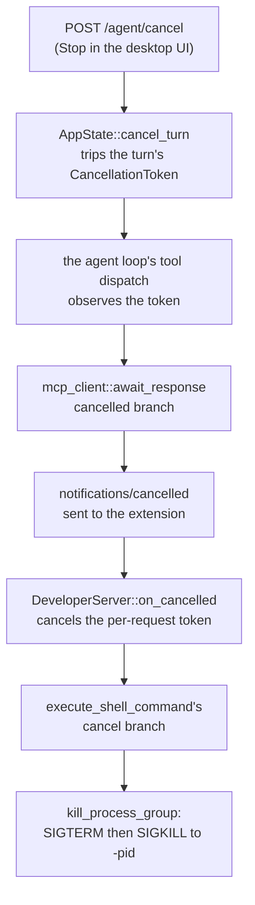

# Turn cancellation and process reaping

> **What this is.** The contract that makes Stop actually stop things: how a cancelled turn reaches a running OS process, why every link in that chain is cooperative, and the two rules a change to any link must not break.
> **Status:** Current. Describes the code as it ships — `routes/reply.rs`, `workspace/turn.rs`, `agents/stopped_turn.rs`, `agents/mcp_client.rs`, `agents/code_execution_extension.rs`, and `biorouter-mcp/src/developer/{shell,rmcp_developer}.rs`. Written up after [#72](https://github.com/BaranziniLab/biorouter/issues/72), where one link was severed and Stop left a filesystem scan running.
> **Audience:** anyone touching the cancel path, the MCP client, or how the Developer capability spawns processes.

## The chain

Stop is a **cooperative** signal all the way down. Nothing in this path is a forced abort, and that is deliberate — the only thing that can kill a child process is code that runs, and an aborted future does not run.

A nested call — the model runs `developer/shell` from inside a `code_execution` script — adds one hop. `code_execution` re-enters `ExtensionManager::dispatch_tool_call` from its own tool-handler task, so links C through H repeat *inside* that task, with the same token.

There is a second, independent trigger for F→H. `POST /agent/stop` does two things: it cancels the turn (the chain above) and it evicts the session, which drops the extension and closes its transport. Those race. rmcp gives every tool call a request-scoped `CancellationToken` descended from the serve loop's, and the running service holds a drop guard on that chain, so the token trips exactly when the connection goes away. The shell tool watches it alongside the notification-driven one, and either reaches the same kill. Relying on the notification alone left the command running whenever teardown won.

## Rule 1 — never abort a future that owes a cancellation downstream

The link that broke in #72 was C→D. `handle_execute_code` called `tool_handler.abort()` the instant the token tripped. The handler task was parked inside the nested dispatch, and that dispatch is the only thing that sends `notifications/cancelled` to the Developer capability. Aborting it dropped the future before it could send, so `on_cancelled` never fired and the command kept running with nobody waiting for it.

Both futures wake from the same token, so which one won was a scheduling race — roughly one orphan in four on a multi-threaded runtime, and every time on a single-threaded one. That is what "cancel does not *reliably* stop it" looks like in practice, and why an intermittent orphan is not a flake to be retried but a dropped link.

The shape that works: the cancelled side **stops taking new work** and returns on its own, and its owner **awaits it with a bound** rather than aborting it. `run_tool_handler` selects on the token at the top of its loop; `wind_down_tool_handler` waits `NESTED_CANCEL_GRACE` and only then aborts. In the normal case the wait is microseconds; the bound exists solely so a script that swallows the cancellation errors cannot hold Stop open.

## Rule 2 — killing a child does not kill its descendants

On Unix, signalling a pid signals that process only. `sh -c 'worker &'` leaves `worker` behind, reparented to init. This is why the shell tool spawns with `process_group(0)`: the shell's pid is also its process-group id, so one `kill(-pid, …)` takes the whole tree.

`tokio::process::Command::kill_on_drop(true)` does **not** do that — it signals the direct child only. It is a useful backstop against leaking one process, not a tree reaper. Two things close the gap:

- `kill_process_group` on the cooperative paths (cancellation, the foreground budget): SIGTERM, a grace pause, then SIGKILL, all to `-pid`.
- `ProcessGroupReaper`, an RAII guard armed around the child, for the paths where the tool's future is dropped without any cancellation — an outer layer giving up, a task aborted. It SIGKILLs the group from `Drop`, with no grace pause, because `Drop` must not sleep and nobody is left to read the output.

The guard is not a substitute for the token chain: an extension's request task is a detached `tokio::spawn`, so tearing the connection down does *not* drop its future. That path needs rule 1's cooperative token, which is why the shell watches rmcp's request-scoped one too.

The reaper is **disarmed** the moment the child has been waited on or explicitly killed. After a reap the pid can be recycled, and a negative-pid signal would then land on a stranger's process group. Any new exit path from `execute_shell_command` has to keep that pairing.

## What a regression looks like

An orphan is invisible from inside the process that created it: the turn ends, the UI goes idle, and the only trace is a running process and — as in the #72 report — a tool request in `logs/llm_request.*.jsonl` with no matching entry in `session.json`.

So the tests assert on the OS, not on the code. Each one runs a real command that forks a real grandchild which sleeps and then writes a marker file; the test cancels or drops, waits past the sleep, and asserts the marker never appears. A test that only checks the tool call returned quickly passes with the bug intact — the call returning is exactly what happens while the process keeps running.

- `crates/biorouter/tests/nested_shell_cancellation.rs` — both dispatch paths and the teardown trigger, end to end through a real `ExtensionManager`.
- `dropping_the_shell_future_reaps_the_whole_process_tree` (in `rmcp_developer.rs`) — the drop path, with no cancellation involved at all.
- `a_foreground_command_is_killed_when_it_blows_its_budget` — the budget path.

## What a stopped turn leaves in the transcript

Stopping the work is half of Stop; the other half is that the chat **remembers** it was stopped. Until release 1.90.4's QA (item 7) it did not: the reply loop writes an iteration's rows only when the iteration ends, and the detached runner (`workspace/turn.rs::drive_stream`) drops the reply stream the instant the token trips. So the half-reply the user had been reading was never stored, and the only sign of the interruption was a renderer-only "Stopped." line on a five-second timer. A reload, a second window and History all showed a chat ending on the user's message.

The runner now settles a stopped turn the way it already settled the steers the turn had accepted — it hands the agent what the dropped stream can no longer write, before the turn guard retires, in this order:

1. **The prose the reply had streamed** (`Agent::settle_stopped_reply`, deciding through `agents/stopped_turn.rs`). Only the text is kept: it is what the user read, and a Stop-and-Send correction needs the model to see what it corrects. Thinking blocks and tool calls from the unfinished iteration are dropped, because a provider refuses to replay a thinking block whose signature never arrived or a tool call with no result — the same line `SignedStreamTruncated` draws. A row the store already holds is never written twice.
2. **The steers the turn had accepted**, as before.
3. **A durable "Stopped." notice** (`Agent::record_turn_stopped`), stored exactly like the planning gate's verdicts through `Agent::durable_notice`: an inline system notification, visible to people and hidden from the model. It is published on the session bus, so a window following the chat live receives it.

`POST /agent/cancel` returns those rows as `stop_messages` when it cancelled a running turn and waited for it to settle. The desktop merges them into the transcript after abandoning the turn's stream, so the window that pressed Stop shows exactly what a reload will, whether or not the notice's own frame arrived first. The renderer draws a stored notice with `ChatTurnStopped`, the same line a confirmed Stop always drew; the transient `stopConfirmed` line remains only as the fallback for a cancel that returned no record.

Only a Stop records anything. A turn that finished before the token tripped has already left `drive_stream` and writes nothing, and the reach gate on `/agent/cancel` (SD-11) is unchanged. Tests: `a_stopped_turn_keeps_the_text_it_streamed_and_says_it_was_stopped` and `a_turn_that_finishes_on_its_own_records_no_stop` in `workspace/turn.rs`, `a_settled_cancel_hands_back_the_rows_the_stop_wrote` in `routes/reply.rs`, and the "a stopped reply stays marked (item 7)" battery in `chatStreamStore.test.ts`.

## Related documentation

- [Developer capability](../extensions/built-in/developer.md) — the user-facing rules for foreground vs background commands and the foreground budget.
- [Code Execution capability](../extensions/built-in/code-execution.md) — the nested-dispatch path that adds the extra hop.
- [Environment variables](../configuration/environment-variables.md#foreground-shell-budget) — `BIOROUTER_SHELL_FOREGROUND_TIMEOUT_SECS`.
- [Agent workspace control](designs/agent-workspace-control.md) — the plan of record for the `active_work` view that lists running work, including foreground commands.
