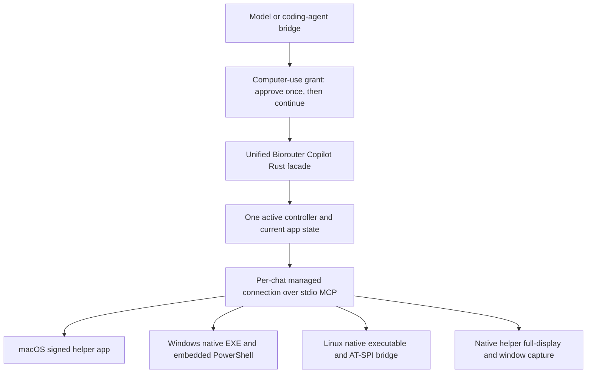

# Built-in Biorouter Copilot integration plan

Status: implementation in progress. Revised 2026-09-17 for the user-approved clean replacement: one native Biorouter Copilot capability, no legacy desktop tools or compatibility aliases. See [implementation status](computer-use-implementation-status.md) for evidence and remaining gates.

## Recommendation

Make Open Computer Use (OCU) the default desktop-automation engine of one unified **Biorouter Copilot** capability. Keep `computercontroller` as its internal capability ID, with an entirely native tool contract. Ship a pinned native helper with every release package. Users should not need npm, Node, Go, Swift, git, or an extension-install step to use the shipped feature.

Biorouter Copilot owns **all desktop observation and interaction**, including full-display/window screenshots currently in Developer. Move web/document/file-format tools into a separate built-in **Web & Documents** capability. Delete the old automation scripting and desktop-control implementations entirely, including Developer capture. No forwarding aliases, hidden replay routes, alternate screenshot backend, or script fallback remain. Biorouter Copilot must work with Developer and Web & Documents both disabled.

Use the user's real desktop with a separate logical runtime connection and observation state for each chat. Before the first computer-use operation, obtain an explicit grant to observe and control that computer. Once approved, continue the authorized work without asking again for each screenshot, click, or keystroke. Use more explicit disclosure for public models. Private-model and public-model chats must not share tool results, snapshots, accessibility trees, element mappings, or consent grants. Desktop control is sequential. No virtual desktop or separate filesystem workspace is required.

“Built-in” means installed and managed by BioRouter, even though OS automation executes in a separate native process. It does not mean rewriting Swift/Go accessibility code in Rust.

## Evidence and scope

Inspected the local BioRouter checkout at HEAD `6798273b036079e5bff53d3b9383cbbf399cd05d`, including current uncommitted files where relevant. Existing unrelated edits were not changed. Inspected OCU at `547b4ffb8ed731a8f16486e6d8a3b215484267d3` (runtime version 0.3.5). This is a source/architecture investigation, not a completed runtime integration or cross-platform GUI validation.

The target is all **future supported release artifacts**, including desktop, bundled CLI, Linux CLI packages, and browser-served operation. Existing published versions cannot acquire new packaged binaries without an update or an explicit backport. Windows/Linux ARM64 are supported by upstream OCU's build scripts but are not currently part of BioRouter's inspected release matrix; adding those BioRouter targets is separate work.

## Pre-replacement infrastructure (historical baseline)

| Area | Current behavior | Integration consequence |
| --- | --- | --- |
| `crates/biorouter-mcp/src/computercontroller/mod.rs` | Seven advertised tools: `automation_script`, `computer_control`, `web_scrape`, `xlsx_tool`, `docx_tool`, `pdf_tool`, `cache`. | Split responsibilities: desktop control belongs in Biorouter Copilot; web/document tools remain shipped in their own capability; old scripting is removed entirely. |
| `computercontroller/platform/{macos,windows,linux}.rs` | AppleScript through `osascript`, Windows PowerShell, Linux X11/Wayland command wrappers and generated Python. | Current interaction is largely model-authored scripting, without a shared typed accessibility/snapshot contract. |
| `developer/rmcp_developer.rs` | `screen_capture` uses xcap; supports displays/window matching and list-only discovery. macOS has explicit Screen Recording checks. | Move this functionality behind Biorouter Copilot and remove its advertised Developer entry. Delete its implementation and registration; capture belongs only to the native helper. |
| `biorouter-mcp/src/lib.rs` | `BUILTIN_EXTENSIONS` constructs `ComputerControllerServer` in process over duplex MCP transport. | Retain builtin registration and add a managed helper behind this server. |
| `agents/extension_manager.rs` | Connects builtins, prefixes tools, resolves trusted bundled status, dispatches calls, handles privacy-filtered rosters. | Keep the public entry path here; do not expose an ungoverned secondary endpoint. |
| `agents/extension.rs`, `agents/mcp_pool.rs` | Optional process-global pooling; builtin pool identity includes name/workdir but no session identity. Pooling is currently opt-in. | Exclude stateful Biorouter Copilot clients from generic pooling; keep a separate connection and consent grant for each chat, with sequential desktop control. |
| `agents/agent.rs` | Coding-agent bridge has an explicit Computer Controller allowlist containing the old seven tools. | Update the reviewed roster and parity tests or Codex/Claude Code providers will miss the new tools. |
| `agents/code_execution_extension.rs` | Imports effective tools for programmatic execution. | Test direct and nested JavaScript calls, images, the same start-of-use grant, and cancellation. |
| `security/sensitive_ops.rs` | Ambient screen/control approval recognizes `screen_capture`, `list_windows`, and `computer_control`; supports prefixed, bare, and nested calls. | Replace repeated ambient-tool escalation for this capability with a shared computer-use consent check. Direct and nested native calls consult the same grant. |
| Capability UI and bundled JSON | Computer Controller is default-on; UI sync adds builtin entries. `ConfigContext.tsx` also contains prior default-enabling migrations. | Preserve explicit disablement and centralize new default/bootstrap behavior in Rust so CLI-only users get it too. |
| `scripts/release.sh`, Forge, `packaging/biorouter-cli.yaml` | Four CPU/OS targets; desktop resources, updater ZIPs, and separate Linux CLI packages. | Add helper payloads to every path, with mandatory artifact checks. |

Two existing weaknesses influence the design: `computer_control_impl` bounds a `spawn_blocking` wait but does not itself terminate the underlying child on timeout; parts of the Linux legacy implementation can return empty success for unsupported commands. The new path must have bounded process lifetime and explicit unsupported/uncertain outcomes.

## Proposed architecture

Use one managed OCU connection per chat, created lazily after approval. On Windows/Linux, start separate helper processes for different chats; on macOS, the permission-bearing helper app may be shared only if its MCP connections have verified independent state. Upstream creates an MCP server per app-agent socket connection, so that is the starting point to validate. Keep consent and result routing bound to the originating chat in host dispatch. Native-runtime absence must not make unrelated capabilities fail or repeatedly open permission dialogs at startup.

Add a small `computer_use/` module in `biorouter-mcp` for the reviewed tool contract, helper transport, capture backend, manifest/path resolution, and lifecycle. Keep grant checking in the agent/dispatch layer, where the caller and model are known. If cross-crate use justifies it later, extract a crate; do not start with a second generic extension framework.

The facade exposes the nine OCU names: `list_apps`, `get_app_state`, `click`, `perform_secondary_action`, `scroll`, `drag`, `type_text`, `press_key`, `set_value`, plus **`screen_capture`** for full displays, individual windows, and list-only window/display discovery. Preserve upstream text/image content and error status. Pin the schemas and verify protocol/version and required tools during handshake.

Implement `screen_capture` inside the pinned native helper on every supported platform. It provides display/window capture and list-only discovery through the same permission-bearing runtime as app observations. Remove the xcap Developer implementation and dependency; do not extract or retain it as a second capture backend.

| Advertised capability | Responsibilities | Replacement contract |
| --- | --- | --- |
| Biorouter Copilot (`computercontroller`) | Ten native app, accessibility, screenshot, mouse and keyboard tools | Sole built-in desktop observation/control path; no aliases or old dispatch routes. |
| Developer (`developer`) | Existing code, shell and file editing tools | No desktop capture/control tool; no relocated legacy automation tool. |
| Web & Documents (`webdocuments`) | `web_scrape`, `xlsx_tool`, `docx_tool`, `pdf_tool`, `cache` and associated resources | Independent of native desktop availability. Update callers and workflows to the new identity; no old-name forwarding. |

Preserve stored utility data where possible without registering old executable tools or resource aliases. Obsolete persisted tool restrictions must fail clearly rather than silently expanding access. A capability disabled by the user must remain disabled.

### State, concurrency, cancellation

OCU actions depend on the preceding snapshot's element indexes, so preserve a persistent connection per chat. Combine data isolation with simple coordination of the shared physical desktop:

1. Allow one active computer-use task at a time on a desktop. Hold a lightweight ownership token while a task is actively controlling it. Another chat can wait or the user can switch control explicitly. Coordinate separate BioRouter backend processes with a local ownership lock as well.
2. Mark Biorouter Copilot non-poolable even when `BIOROUTER_SHARED_MCP_POOL` is enabled. Pass chat identity/cancellation context explicitly to builtin construction or its runtime manager. Do not key this state only by working directory or model name.
3. Keep screenshots, accessibility trees, element mappings, pending results, errors containing app data, and notifications private to the originating chat. Disable cross-chat caching of these values. Use chat-scoped temporary storage only when required and remove it on teardown. Do not publish captures through shared resource registries or generic diagnostics. Invalidate snapshot context on handoff or runtime restart and require `get_app_state` before the next action. Keep upstream tool schemas where possible; add generation checks internally and only extend the schema if needed to reject stale references reliably.
4. Serialize calls, retain current target/window information, and reject obviously stale/closed targets. A human can change the desktop at any time; inspect when state is uncertain.
5. Stop/revoke prevents new actions immediately and cancels active work where supported. Manage exact child process trees on Unix/Windows. macOS cancellation must reach the actual app-agent operation, not only its proxy. Do not promise to undo an action already delivered to the OS.
6. Never automatically replay a timed-out mutation. Report an uncertain outcome and inspect before continuing. Restart/handshake recovery should not require a new risk acknowledgement if the same grant is still valid, but must refresh app state.
7. Use a BioRouter installation/version namespace for the macOS helper socket to avoid accidentally reusing or terminating a separately installed OCU copy. Verify per-connection state, environment override serialization, and ownership of overlay cleanup in the shared macOS agent. If upstream connection isolation fails these tests, patch it before shipping or use separately launched helper agents with distinct namespaces.

**Isolation boundary:** one chat never receives another chat's stored tool observations or consent. The operating-system desktop, application state, clipboard, files, and app login sessions remain shared. A new screenshot can independently recapture material left visible by another chat. Per-chat helper isolation cannot guarantee that private information is absent from later public-model observations.

Before switching control from a private-model task to a public-model task, pause capture and offer a local handoff acknowledgement: “This chat uses [public provider]. Content left open by another task may be visible. Close or hide anything you do not want shared, then allow this chat to continue.” Do not take/send a model-facing screenshot before acknowledgement. If an on-device preview is provided, it stays local and is not added to either model conversation. Combine this with the initial public grant where possible. Repeat only on a relevant new handoff, not on each action. Do not automatically close or alter private applications. A guarantee about isolation of the desktop itself would require separate OS sessions/VMs, which is outside this design.

### Permissions and privacy

The primary user control is **informed approval before desktop control begins**, followed by continuous execution. Per-chat data isolation is retained as requested. It complements approval and does not add per-action prompts.

Keep three concepts separate in implementation, but present one coherent setup/start flow: installing the bundled helper as part of the authorized BioRouter install/update; obtaining OS Accessibility/Screen Recording or desktop-portal permissions when required; and approving this computer-use task with the selected model. OS prompts cannot be waived by a BioRouter checkbox. No repeated resource-install prompt is needed once the helper is installed. If repair needs extra system packages, present the concrete installation once and proceed after approval.

**Grant scope:** the current computer-use task in the current chat, on the named host/desktop, with the displayed model/provider. Store the grant in memory and reuse it across every tool turn within the current user request. Completion or dropping the active reply, Stop/revoke, chat close, or application restart ends the grant; a later user request starts a new task. Ordinary tool retries/read-only reconnects do not re-prompt. Do not silently authorize future scheduled jobs or unrelated chats; a user can explicitly approve unattended recurrence as a separate scope if that feature is later supported.

**Private-model approval example:** “Allow BioRouter to view and control this computer for this task using [model/provider]? It can read screenshots and app content, type, click, and make changes on your behalf. You can stop it at any time.” Show the actual deployment/destination; a Private classification does not necessarily mean on-device processing or harmless desktop actions.

**Public-model approval example:** “Allow Biorouter Copilot to control this computer with [model/provider]? Screenshots, open-window information, and app text may be sent to this provider, including sensitive information visible on this computer. BioRouter can type, click, and make changes on your behalf. Allow this task to continue until it finishes or you stop it?” Use an explicit “Allow control and sharing” action and a clear Cancel option. Treat an unknown classification with the public disclosure.

Always ask again if switching from private to public, changing the provider/data destination beyond what was approved, changing target computer, or expanding the grant scope. Revalidate the grant against the sampled provider used for each call, and prevent an in-flight result from being sent to a newly selected, unapproved destination. This is consent correctness, not a new segregation system.

Audit existing history, workspace-read, delegation, and provider-switch paths as well as live tool dispatch: computer-use observations must retain their originating chat's privacy protections. A model switch must not silently resend older private captures already in that chat's context. Either obtain explicit disclosure consent for that history or continue in a fresh appropriately scoped context using the existing privacy machinery. Do not claim helper isolation alone governs conversation-history transfer.

An active grant satisfies the Biorouter Copilot approval requirement for all ten tools, including screenshots returned after actions. Auto/Approve/SmartApprove must not repeatedly ask for each Biorouter Copilot action after this explicit task grant; the consent card clearly says that it authorizes continuing desktop control. Chat mode still runs no tools. Other capabilities keep their existing approval behavior. Declining or revoking this grant must not trigger a silent shell/script fallback.

Implement a narrow host-side `ComputerUseGrant` check keyed by chat, approved destination/target, and resolved built-in capability identity. Only the resolved native built-in tools can satisfy this check; removed names never dispatch. This avoids building a broad new effect-classification framework or classifying every tool named `list_apps` as desktop access (Agent Drafter has a different tool with that name). Direct calls, the coding-agent bridge, nested JavaScript, and any authorized delegation must consult the appropriate grant. Another visible chat gets its own approval and observation state. Delegation must not implicitly transfer captures or consent to a public-model child; an explicitly approved transfer is a separate operation.

Retain daemon-private-environment stripping for all helper descendants. Keep model credentials out of the helper. UI text is untrusted tool output; it should receive the same provenance/output handling as other external content. Do not log raw screenshots, accessibility trees, or typed secrets in ordinary diagnostics. A locally running helper does not mean its screenshots stay local: the selected model determines where results go.

Default-on means shipped and available, with consent obtained at first use. The approved task can use normal supported foreground/background desktop actions without method-by-method approval. Describe cursor/focus use in the initial acknowledgement. Unsupported methods still return honest errors. The grant does not add OS privileges or make an unavailable backend work.

### UX and model guidance

Rename the user-facing capability (now **Biorouter Copilot**; **Computer Use** when this plan was written) while keeping its internal `computercontroller` ID. Add **Web & Documents** for the extracted utilities. Settings, the composer, CLI, effective tool roster, and model guidance must agree. Biorouter Copilot reports runtime version, target host, desktop availability, OS permissions, and task-consent status. States distinguish ready, approval required, controlling, stopped, OS permission required, no desktop, unsupported environment/action, missing dependency, incompatible runtime, and busy.

Provide one Start/Allow flow, the model-appropriate acknowledgement, and a persistent visible “Biorouter Copilot active” indicator with Stop. Use the same approved grant throughout the task. Extend `biorouter doctor` with non-interactive diagnostics. Add authenticated status/consent/revoke/setup APIs for Electron and `serve`, plus CLI confirmation; the model cannot self-approve by calling these APIs. Generate OpenAPI/client types through existing tooling.

Install adapted builtin guidance: observe at the start of an interaction, prefer element actions, verify returned state, refresh stale references, avoid blind repeats, and use direct APIs/files where appropriate. All screenshots and desktop actions are reached through Biorouter Copilot, independently of Developer. Ensure non-vision providers receive usable accessibility text and explicit image limitations through existing provider adapters.

## Distribution and platform work

Use a source pin plus a small auditable BioRouter patch set. Build native runtime artifacts in CI/release preparation and record source SHA, patch digest, protocol version, platform/architecture, minimum OS, dependencies, and final signed-artifact hashes. Retain MIT notices. No runtime download of “latest” and no silent PATH fallback in production; development overrides should be explicit and reported by diagnostics.

| Current BioRouter output | Required addition |
| --- | --- |
| macOS ARM64 DMG and updater ZIP | Matching signed native helper app and manifest |
| macOS Intel DMG and updater ZIP | Intel helper app, separately exercised or verified under an appropriate Intel execution environment |
| Windows x64 ZIP | x64 OCU EXE, manifest, notices |
| Linux x64 desktop DEB/RPM | x64 helper plus declared distro accessibility dependencies |
| Linux x64 CLI DEB/RPM | Same helper under an FHS location such as `/usr/libexec/biorouter/computer-use/`, plus dependencies and locator support |
| Container/source/other distributions | Explicit companion payload build/install path and no-desktop behavior; audit any advertised distribution before including it in the support claim |

Place GUI helper resources in a dedicated `computer-use/` resource tree outside `app.asar`, with a common Rust locator relative to the installed executable/resources. Linux CLI packages require their explicit FHS fallback. Test symlinked CLI launch through `setup-path`, app relocation, spaces/non-ASCII paths, updater installation, and side-by-side development/release builds.

`stage_bin` deletes/rebuilds staging directories and platform preparation reuses staging across architectures. Prefer isolated per-target helper staging; explicitly reject stale/foreign-platform payloads. Extend release provenance to the actual helper bytes shipped after signing. App and helper update/rollback must be one versioned unit.

### macOS

Upstream requires macOS 14 and Swift 6.2 to build. Audit BioRouter's supported OS policy rather than silently raising the whole application's minimum. Below macOS 14, report unsupported OCU; if older OS support is a product requirement, a maintained compatible backend is required before promising the new default there.

Preserve the helper app architecture because that is the permission-bearing process. Assign a stable BioRouter-owned bundle identifier/display identity, sign nested components correctly with the release identity, and verify notarization and upgrade permission continuity in both DMG and updater ZIP installations. Existing BioRouter screen-capture grants do not automatically grant the new helper access.

Two concrete upstream details need release treatment: its build script copies a cursor PNG from a directory labeled as extracted official assets, and it offers a SkyLight-specific click implementation. Use original BioRouter artwork/procedural rendering for the shipped overlay and prefer public accessibility/app-targeted APIs initially. Treat `sky_click` as an explicitly unsupported/experimental method until separately validated; do not promise it as the cross-platform baseline.

### Windows

Build x64 now, with target-driven packaging ready for any future ARM64 BioRouter release. The helper invokes `powershell.exe` and .NET UI Automation. Probe availability and report enterprise policy failures clearly. Sign helper binaries through the Windows signing path when release signing is configured; test the resulting downloaded archive.

Desktop interaction requires the signed-in user's session. Do not auto-elevate or claim UAC/secure-desktop access. Validate native controls, Edge/Chromium, Electron, DPI scaling, multiple monitors, and focus preservation. Upstream screenshot capture uses screen pixels (`CopyFromScreen`); occluded/minimized windows need honest limitations or a tested replacement capture path. The upstream plan records Notepad success but leaves broader repeated GUI tests outstanding.

### Linux

The Go executable alone is insufficient: the embedded Python bridge imports `gi` and AT-SPI, with GDK for screenshots. Resolve exact dependencies against supported Debian/Ubuntu and RPM distributions and declare them in both desktop and CLI packages. Do not claim that an embedded script includes Python or its native libraries. If a portable archive is introduced, it needs a verified runtime bundle or an explicit dependency contract.

Validate X11 first using an accessibility-enabled desktop fixture and a real user D-Bus session. Separately validate GNOME/KDE Wayland. Current upstream coordinate input/capture is best-effort on Wayland; reliable full coverage may need consented desktop portals/PipeWire and compositor-supported input, or another maintained backend. Expose method availability and errors now. Full Wayland support is a release gate if the product promise includes it, not a packaging checkbox.

### CLI, serve, headless, and containers

Centralize default registration in backend configuration/bootstrap. The current Rust config injection is for platform extensions, whereas builtin sync is in the renderer; relying on opening Electron would leave fresh CLI installations inconsistent. Respect existing persisted disablement and available-tool restrictions. Register Biorouter Copilot and Web & Documents separately, with no duplicate advertised legacy tools.

The helper operates on the **host running BioRouter's backend**. A browser connecting to `biorouter serve` does not grant control of the browser user's machine. Show the host/session target. A server without a desktop should still start normally and return `desktop_unavailable` for computer-use operations. Authenticated remote server access and the same approve-once computer-use grant apply through existing routes. Controlling a different endpoint desktop would be a separate paired-agent design, outside this integration.

## Clean replacement and rollout

Keep the `computercontroller` capability ID and rename its display label to Biorouter Copilot. Replace its old roster with exactly the ten native tools. Remove the old scripting and control handlers, platform wrappers, Developer screenshot implementation, obsolete executable tests and compatibility aliases. Do not relocate old functionality into Developer or hide it behind replay dispatch. Update all active prompts, bridge rosters, docs, workflows, fixtures, and tool references to the new contract.

Register Web & Documents as its own capability. Preserve explicit disablement and restricted `available_tools` configurations. Do not translate a retired tool approval into a blanket Biorouter Copilot grant or quietly broaden a utility-only restriction to all desktop tools. Report obsolete restricted names with actionable guidance. Fresh installs receive the reorganized capabilities, but native Biorouter Copilot remains inactive until task approval.

The coding-agent bridge and code execution imports expose only current tools and apply the same grant as direct dispatch. Backend bootstrap owns defaults for CLI, Electron, and serve; UI bootstrap must never undo an explicit disablement. Historical investigations may retain old names only when clearly marked superseded and linked to the current contract.

## Implementation sequence and acceptance gates

1. **Pin and contract prototype.** Create upstream lock/manifest and patch layout, build the four current targets, validate stdio MCP initialization/tool schemas and error/image handling. Prove a signed macOS helper and a Windows interactive-session fixture before relying on packaging feasibility. No default switch yet.
2. **Capability split and managed adapter.** Create the unified ten-tool Biorouter Copilot surface, move full-screen capture out of Developer, extract Web & Documents, and delete all old scripting/control/capture paths. Add lazy helper startup, deterministic resolution, diagnostics, non-pooling, per-chat state, one-controller ownership, cancellation, process cleanup, and snapshot invalidation. Keep web/document functionality independent of desktop availability.
3. **Consent and dispatch parity.** Implement per-chat approve-once grants, distinct private/public disclosure, provider/target changes, private-to-public handoff, revoke/Stop, and nested execution/bridge parity. No repeated Biorouter Copilot tool prompts after approval. Test name collisions, post-action images, late results, and absence of cross-chat observation reuse. Keep ordinary approvals for unrelated capabilities unchanged.
4. **User setup and migration.** Add unified status/permission/consent UI and CLI confirmation/doctor output, target-host labeling, active indicator, builtin guidance, Rust defaults, and upgrade migration preserving opt-outs, stored utility data and restrictions, with no legacy callable routes. Generate OpenAPI when API changes land.
5. **All-package delivery.** Integrate helper staging into Forge, platform preparation, release phases, updater ZIPs, Linux CLI nfpm, relevant containers/install paths, and provenance verification. Missing/mismatched runtime must fail packaging. Verify installation with no development toolchain and no npm/network bootstrap.
6. **Platform hardening.** Establish repeatable native GUI fixtures and real-app cases on macOS ARM64/Intel, Windows x64, and Linux X11/Wayland. Resolve unsupported promised environments before declaring parity. Add macOS upgrade/TCC and Windows capture/focus tests.
7. **Default switch and release.** Verify legacy implementations and aliases are absent, make OCU the selected default on every supported target, run all gates against final source and final downloaded artifacts, then publish with precise OS/session requirements. Roll back app and helper together if necessary.

Steps 2–4 depend on the contract decisions from step 1. Packaging and fixture development can proceed independently once that contract is pinned. The default switch waits for all supported-platform gates; shipping the binary alone does not close the Windows/Wayland work.

## Validation plan

| Layer | Required evidence |
| --- | --- |
| Contract/unit | Nine upstream action/state tools plus full-screen capture; schema parity; malformed input; unsupported action; wrong executable/version; payload limits; image preservation; stale/window-mismatched references; non-pooling with pool on/off |
| Lifecycle | Timeout with real descendant cleanup; cancellation during input; app-agent cleanup; no mutation replay after ambiguous completion; restart invalidates references; no orphan helpers |
| Concurrency/data isolation | Private and public chats use the desktop sequentially; no reused screenshots, accessibility trees, element maps, logs, errors, pending results, or grants; two BioRouter processes coordinate control; no task interleaving; handoff invalidates state |
| Consent/policy | Initial private/public acknowledgements; no per-action re-prompts in Auto/Approve/SmartApprove after grant; Chat mode runs no tools; unknown provider gets public disclosure; destination change and private-to-public handoff pause before capture; Stop prevents new calls; direct/nested/bridged native tools use the same grant; Agent Drafter `list_apps` is unaffected |
| Fresh/upgrade installs | All packaged forms, no global OCU/npm, clean PATH, user opt-out and restricted tools preserved, stored utility data remains usable through its new capability; removed names fail, defaults available without renderer bootstrap, rollback and moved installation |
| Actual desktop | Discover fixture → inspect → target element → type/click/scroll/drag/key/set value → independently verify fixture state and screenshot; negative tests for denied permissions, no desktop, closed window, unsupported display server |
| Provider/UI | Direct tool-calling model, coding-agent provider, programmatic execution; image-capable and text-only model; Electron and serve; Biorouter Copilot works with Developer/Web & Documents disabled; desktop unavailable does not break chat/web/document work; developer tool roster no longer advertises capture |
| Release artifacts | Presence, target architecture, pinned version, final hashes/signatures, native loader/dependencies, protocol handshake, and interactive GUI evidence on supported environments |

Extend `biorouter-self-test.yaml` with a fixture-scoped computer-use scenario and explicit no-desktop outcome. Execute it against the rebuilt runtime. Run affected Rust/UI tests, `cargo fmt`, build, `./scripts/clippy-lint.sh`, generated OpenAPI checks, and `just check-everything`; include cross-target compilation and hosted CI. Extend `scripts/smoke-test-release-artifacts.sh` and `.github/workflows/release-artifact-smoke.yml`. Existing Windows startup/version smoke is insufficient proof of UI Automation: add an interactive Windows runner/VM test. Linux Xvfb startup alone does not establish AT-SPI or Wayland behavior.

The release evidence should identify source commit, helper pin/patch revision, package digest, OS/display environment, fixture results, and any explicitly unsupported operation. Never treat an empty window list or skipped GUI test as a successful Biorouter Copilot run.

## File-level work map

- **Core:** `crates/biorouter-mcp/src/computercontroller/mod.rs`; `crates/biorouter-mcp/src/developer/rmcp_developer.rs`; new `crates/biorouter-mcp/src/computer_use/` and `webdocuments/`; builtin registration in `crates/biorouter-mcp/src/lib.rs`.
- **Session/dispatch:** `crates/biorouter/src/agents/{extension.rs,extension_manager.rs,mcp_pool.rs,agent.rs,code_execution_extension.rs}`; lifecycle hooks and reviewed subagent/scheduled dispatch paths as identified during implementation.
- **Policy:** a host-side `ComputerUseGrant` service; `crates/biorouter/src/security/sensitive_ops.rs` ambient-control handling; resolved native builtin identity; approval UI/events; private-environment stripping tests; bridge policy and data-isolation tests.
- **Defaults/UX:** `crates/biorouter/src/config/extensions.rs`; CLI configure/doctor; `ui/desktop/src/components/ConfigContext.tsx`; capability metadata/section; bundled-extension metadata; authenticated server routes and generated clients.
- **Packaging:** new pin/build/verification scripts; `ui/desktop/scripts/prepare-platform-binaries.js`; `ui/desktop/forge.config.ts`; `scripts/release.sh`; `scripts/build-cli-linux-packages.sh`; `packaging/biorouter-cli.yaml`; relevant Docker/install paths.
- **Acceptance:** `biorouter-self-test.yaml`; release artifact smoke scripts/workflow; platform GUI fixtures and installation/upgrade checks.

## Source references

Local file paths in the tables are relative to the BioRouter root and were inspected for this plan. Upstream references are pinned:

- [Windows runtime and outstanding validation](https://github.com/iFurySt/open-codex-computer-use/blob/547b4ffb8ed731a8f16486e6d8a3b215484267d3/docs/exec-plans/active/20260422-windows-computer-use-runtime.md)
- [Windows bridge implementation](https://github.com/iFurySt/open-codex-computer-use/blob/547b4ffb8ed731a8f16486e6d8a3b215484267d3/apps/OpenComputerUseWindows/runtime.ps1)
- [Linux bridge implementation](https://github.com/iFurySt/open-codex-computer-use/blob/547b4ffb8ed731a8f16486e6d8a3b215484267d3/apps/OpenComputerUseLinux/runtime.py)
- [macOS app-agent connections and lifecycle](https://github.com/iFurySt/open-codex-computer-use/blob/547b4ffb8ed731a8f16486e6d8a3b215484267d3/apps/OpenComputerUse/Sources/OpenComputerUse/MacOSAppAgentProxy.swift)
- [macOS build, identity, and artwork](https://github.com/iFurySt/open-codex-computer-use/blob/547b4ffb8ed731a8f16486e6d8a3b215484267d3/scripts/build-open-computer-use-app.sh)
- [Platform package targets](https://github.com/iFurySt/open-codex-computer-use/blob/547b4ffb8ed731a8f16486e6d8a3b215484267d3/scripts/npm/build-packages.mjs)
- [Swift minimum OS/toolchain](https://github.com/iFurySt/open-codex-computer-use/blob/547b4ffb8ed731a8f16486e6d8a3b215484267d3/Package.swift)
