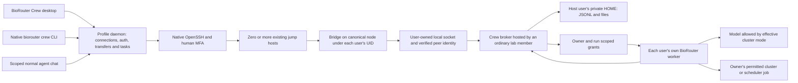

# BioRouter Crew implementation plan

Status: implementation in progress September 22, 2026 under the user's approved requirements. The rootless broker, saved SSH manager, native Crew view and built-in MCP capability are present in the development worktree; acceptance remains incomplete. See [the evidence ledger](implementation-status.md) for measured results rather than inferring readiness from this plan. This revision supersedes the earlier administrator-managed deployment recommendation. Research performed September 21, 2026 Pacific / September 22 UTC. Source baseline: `314f3b268c24663a8696dbbbd5aa76a171d0fab8` on `main`. Implementation branch: `codex/biorouter-crew` in `/Users/wgu/.codex/worktrees/biorouter-crew/BioRouter`.

## 1. Recommendation and scope

Build **BioRouter Crew with functionally equivalent native `biorouter crew` and desktop interfaces, plus a policy-aware built-in agent extension**, backed by a small, ordinary-user Linux collaboration process reached through existing SSH access. Installation, persistent data, configuration and user preferences are based in users' home directories; no sudo, new Unix service account, group creation or elevated access is required. Use the existing BioRouter agent runtime through separate, owner-scoped workers. The shared service handles people, teams, rooms, messages, files, permissions, history and audit; it does not execute everyone's tools as the hosting member.

Favor the user's requested simplicity: native OpenSSH, bounded JSON Lines streams, a broker-owned append-only JSON Lines journal, ordinary attachment files and rebuildable indexes. Human collaboration must work without a model provider, PostgreSQL, Redis, a container platform or a new externally exposed network listener. Additional compute isolation may be required for agents; the chat service itself must not depend on it.

Do not adopt any listed terminal chat project unchanged as the security foundation. `room` is the closest interaction/deployment reference; it is not sufficient proof of trustworthy Unix identity and protected multi-user storage. Matrix is the strongest protocol/platform alternative if reusing an entire collaboration server becomes more important than a small installation. Zulip is the strongest ready-made topic collaboration alternative. Both add a separate account/control plane and still need Crew's owner-agent and data-policy layers. See the [sourced platform comparison](platform-research.md).

The target is a lab of **2–3 through 30–50 people**, with a whole-team general chat and smaller channels containing selected members. A user can belong to multiple teams, and a desktop can hold multiple SSH workspaces. Keep identifiers, protocol versions and indexes extensible, but hundreds/thousands of participants, federation and multi-master storage are not first-release requirements. One ordinary user hosts each workspace's single-writer broker on a specific reachable cluster node. This user is a trusted application host, not a system administrator.

### Accepted decisions from September 22

| User decision | Implementation consequence |
|---|---|
| 1. No administrator or elevated access | Install binaries/configuration/state in ordinary homes; use existing accounts and user-owned processes. No mandatory service account, system service, new group, container runtime or privileged isolation setup. |
| 2. Lab teams of 2–50 | Whole-team general channel plus small membership-scoped channels; test 3 real users and exercise 30–50-client bounded scale. |
| 3. Synthetic data, including pretend-sensitive data | Maintain public-safe and explicitly private synthetic fixtures; private fixtures pass through the real policy path. No real PHI is needed for development or acceptance scenarios. |
| 4. User-controlled cluster Public/Private setting | Private blocks every public-model dispatch through that connection/workspace regardless of channel visibility. Public allows eligible public models; changing the setting does not declassify existing content. |
| 5. Generic authentication accommodating real workflows | Native OpenSSH, configurable routes, per-hop MFA/host verification and capability-specific compatibility results. |
| 6. Recommended context scope | Current channel by default, with saved, explicitly selected additional channels searchable automatically; explicit cross-workspace selection. |
| 7. Recommended posting authority | Grant an agent permission per task and destination channel; request additional approval when audience or permitted data boundary changes. |
| 8. Recommended disconnected execution | Continue already authorized work where user processes/jobs survive; pause new approval-dependent steps and honor expiry/revocation. |
| 9. Recommended files/local storage | Resumable ordinary attachments; remote references for large datasets; explicit policy-controlled downloads; protected offline history off initially. |
| 10. Recommended channel lifecycle | Archive first, retain required audit history, permit explicit current-owner-approved ownership transfer; physical deletion follows configured retention. |

The user also requires a three-account Linux AWS test environment, actual dev builds from this worktree, computer-use-driven collaboration, and conversational MCP tools that reuse saved Crew SSH connections. Section 13 defines that release gate. These decisions are recorded in this implementation document; they are not requests for additional confirmation.

### User requirements translated into invariants

| Requirement | Invariant |
|---|---|
| One SSH server feels like a Slack workspace | A stable service workspace UUID is discovered after authenticated SSH; aliases and jump paths can reach the same workspace. |
| SSH username is the identity | Broker derives the Unix UID from the kernel, resolves a verified enrolled account, and displays its SSH username. Nickname/avatar never confer authority. |
| Multiple teams and self-created channels | Every registered user may create a team when workspace policy permits; team memberships, invitations and channel memberships are explicit records. |
| Channel ownership and removal | Creator starts as owner; only current owner archives/removes or explicitly transfers ownership. Original creator remains immutable audit history. App-level quarantine is a separately audited role. |
| Human and agent work in the same room | Channel receives human messages and structured, policy-checked agent activity/events. Only an agent's owner may invoke, steer, approve or cancel it. |
| Arbitrary files, images and downloads | Durable opaque attachment objects, resumable transfers and membership checks; unsupported previews remain downloadable. |
| Context from other channels | Search only channels the actor and worker may access; retain provenance and all source restrictions through model calls and outputs. |
| Private/public boundaries always hold inside Crew | Effective cluster mode is enforced at tools, context and provider dispatch; Private denies public models. Public cannot override source labels or another user's/shared workspace restrictions. Host-account trust and available isolation are explicit. |
| MFA and jump gates | Use institutional OpenSSH configuration and interactive authentication, verify every host, and support reauthentication throughout the connection lifecycle. |
| Simple, broadly portable Linux stack | One small service binary, text protocol/storage, files, no required network database or container service for chat. Detect unsupported facilities and refuse the affected feature explicitly. |

## 2. What exists in BioRouter today

Detailed source references and limitations are in [architecture and privacy](architecture-privacy.md) and [SSH and UI integration](ssh-ui-architecture.md). All paths below are relative to the baseline repository.

| Area | Current seam | Crew work |
|---|---|---|
| Sidebar and navigation | `ui/desktop/src/components/BioRouterSidebar/AppSidebar.tsx`, `ui/desktop/src/App.tsx` | Add Crew page, workspace/team/channel navigation and connection status. Allow human chat before provider selection. |
| Agent extensions | `crates/biorouter/src/agents/extension.rs`, `extension_manager.rs` | Register a built-in Crew tool surface with admitted actor/run identity. Reuse MCP transport machinery where appropriate. |
| Local HTTP daemon | `crates/biorouter-server/src/auth.rs`, `routes/` | Add local Crew connection and UI APIs; do not expose the existing single-user daemon as a shared team server. |
| Sessions and streams | `session/session_manager.rs`, `routes/session_events.rs`, `routes/reply.rs` | Keep private owner sessions separate; project authorized events into Crew and use durable room cursors. |
| Privacy and affiliations | `crates/biorouter/src/privacy/` | Preserve classification and affiliation rules; add mandatory multi-user and compartment policy. |
| Agent invocation | `crates/biorouter-acp/src/server.rs` | ACP adapter per owner/compartment; no shared multi-user `Arc<Agent>`. |
| File handling | `routes/shell.rs`, `ui/desktop/src/hooks/useFileDrop.ts` | Reuse guard patterns/UI where suitable; add actual remote binary upload, download and artifact ACLs. |
| SSH | No first-class SSH/SFTP/ProxyJump manager found | Implement native SSH process management, authentication UX, transport, connection registry and failure states. |

Three blockers are substantive new work, not UI wiring:

1. Existing workspace session visibility intentionally allows same-tier local sessions to be controlled without an owner boundary. Add ownership and team/channel authorization before reusing these APIs.
2. The local daemon secret and a supplied provider header are not multi-user authentication or provider attestation. Never expose them as Crew authority.
3. The current shell sandbox permits broad filesystem reads. Private clusters categorically disable public models; a public-model agent cannot bypass this through a saved SSH tool. On a Public cluster, historical private material and human credentials still need isolation from model-controlled tools. Separate processes and file modes do not protect files from their owning UID. Rootless execution must restrict or withhold affected tools when the required boundary is unavailable.

## 3. Architecture without administrator support



Every member logs in as their own SSH account. The workspace creator initially hosts the broker as their normal Unix UID; nobody receives that account's SSH credentials. The broker stores collaboration records and enforces application permissions. It never executes another member's shell commands as the hosting account. Each member starts their worker under their own UID and keeps personal session/configuration state in their own home.

### Components

**Desktop Crew UI and ordinary agent chat:** share one saved-connection registry, verified cluster identity, authentication state and policy service. Crew adds people, teams, rooms, files and owned-agent activity. The existing conversation can use built-in MCP tools to select an admitted connection, work on permitted remote files/jobs, post to a room or retrieve authorized context. These are two interfaces to the same connection and policy, not independent SSH credential stores.

**Local connection manager:** a Rust module behind the local daemon API. Under the expanded parity contract, the daemon owns the authentication PTY and lifecycle; narrow terminal and Electron adapters supply human input, resize and presentation. The existing Electron-owned PTY is an implementation seam to migrate, not the target architecture. It owns exact SSH child PIDs/control sockets and keeps per-user/per-workspace transports, caches and grants separate. Reusing a connection never transfers another user's device authority or changes the normal local chat's provider silently.

**Home-installed executable:** place `biorouter-crew` under `~/.local/bin/` or a user-selected home subdirectory. Each account may install its own verified copy. Do not require other users to execute a file inside the host user's inaccessible home, or change HOME permissions to expose it.

**`biorouter-crew bridge --stdio`:** fixed-command protocol bridge, run via the member's existing SSH login on the canonical broker node. It connects locally to the broker socket, validates expected owner/workspace identity, and relays bounded JSONL. Message bodies and filenames never enter a constructed shell command. Diagnostics go to stderr. The bridge's UID is kernel-authenticated; it also supplies an enrolled-device/session credential or a limited worker grant.

**`biorouter-crew serve`:** ordinary host-owned process with private home storage. A dedicated, securely created node-local runtime directory (for example, a random short `/tmp/crew-<uid>-<nonce>/`) can be `0711`, with a socket accessible for connection (`0666`). The owner controls directory entries; peers cannot replace the socket. No chat data, tokens or keys live in that traversable directory. Private state remains `0700` directories/`0600` files in HOME. A `0700` runtime directory would prevent other users from reaching the socket, even if its mode were `0666`.

The socket permits an attempted connection, not record access. Broker admission checks kernel peer UID, enrollment, request capability and policy, with bounded unauthenticated work. Clients verify path ownership/no symlink substitution, broker peer identity and the pinned workspace public key; the broker also authenticates every client. These Linux socket primitives do not require creating groups or granting another user access to the host's private storage. [Linux unix(7)](https://man7.org/linux/man-pages/man7/unix.7.html).

**Owned worker adapter and built-in MCP capability:** per-owner BioRouter sessions, scoped model binding, remote tools and channel projections. Credentials remain with their owner. The local chat never receives raw SSH secrets, MFA codes or the broker's unscoped human-control credential. Sections 6 and 9 define enforcement and tool operations.

ACP remains useful within an owned agent adapter; MCP exposes Crew and saved-SSH operations to the user's conversation. Neither replaces identity, membership or durable chat semantics. Use BioRouter's supported protocol versions. [ACP transport specification](https://agentclientprotocol.com/protocol/v1/transports).

### Workspace discovery, joining and node placement

One shared workspace can host the whole lab and several teams. Its ordinary hosting user creates a workspace UUID, key and invitation descriptor. A descriptor contains the canonical broker node, expected host-account identity, workspace fingerprint and non-secret endpoint information; it does not contain a private key or executable SSH configuration. A recipient connects using their own SSH profile, verifies the descriptor, enrolls and then appears in that workspace's searchable people list. All enrolled, discoverable Crew members are visible as policy permits; invitations to teams/channels use this directory.

Save accepted descriptors in each member's home/local settings, so subsequent logins automatically rediscover the same workspace. Persist the chosen short runtime basename in the host manifest and invitation; reuse it on restart only after checking expected ownership/type. If a path is occupied by another UID or has been replaced, fail closed and require a verified descriptor update rather than unlinking someone else's files. Runtime relocation uses a signed generation update authenticated by the already pinned workspace key. A connection alone is not authority to scan other users' private homes or OS account lists. Optional cluster-wide discovery can publish minimal opt-in, account-owned announcements at a pre-existing mutually accessible location; validate filesystem owner and workspace identity and treat announcements only as discovery hints. No shared writable authoritative registry is required. If no suitable discovery location exists, joining once by invitation remains fully supported; do not create an insecure registry to imitate universal discovery.

All participating bridges must reach **one actual kernel/node** hosting the socket. Shared NFS homes do not make Unix sockets work across login nodes. Resolve generic aliases to an explicit reachable broker node and reuse the permitted SSH/jump route. If there is no mutually reachable node, report this deployment limitation. Do not silently substitute an unauthenticated TCP relay or multi-writer shared-file mailbox. A signed cross-node relay/mailbox could be a later protocol, with separate feasibility work.

### Process lifecycle and trust

Provide `crew start/status/stop` for exact owned processes, a foreground `serve` mode, and an optional user service only where it already works. No systemd system unit, `sudo`, `loginctl enable-linger`, account creation, new Unix groups or cluster-policy changes are prerequisites. A site may kill ordinary processes at logout, reboot or allocation expiry; `nohup`, terminal multiplexers and disowning cannot guarantee survival. Report observed capabilities and keep durable history even when the host process goes offline. Other members can reconnect but cannot restart a process as its owner.

A host migration is an explicit owner-authorized state/key transfer with verified writer shutdown and a new deployment generation. Never infer permission for another node to write from a missed heartbeat or stale PID file. Channel ownership transfer and workspace hosting transfer are distinct operations.

The hosting account **and unrestricted software running under that UID are trusted with plaintext, policy and availability**, including invite-only room contents. Application ACLs protect against other ordinary member accounts; they cannot protect the home-owned journal from its owner. Host root also remains outside an application-only confidentiality guarantee. This is the selected rootless deployment model, not an assertion that private channels are cryptographically hidden from the host. End-to-end encryption against the host would require a separate key/search/agent architecture and is outside this first plan.

Existing site rules on user processes and jobs still apply, but Crew does not require an administrator to provision new infrastructure. Heavy processing uses the user's existing scheduler permissions. Every rootless feature must have explicit supported/unsupported behavior rather than requesting elevated privileges behind the scenes.

## 4. SSH, MFA and multiple gates

Use the installed OpenSSH first. It already participates in institutional SSH config, key agents, hardware keys, certificates, PAM-backed keyboard-interactive challenges and jump routes. Avoid shipping a partial SSH implementation to simplify the first UI.

Example conceptual configuration, with placeholders rather than an assumption about either supplied server:

```sshconfig
Host crew-gate-a crew-gate-b crew-service
    ForwardAgent no
    ForwardX11 no
    StrictHostKeyChecking yes
    ControlMaster no
    ControlPath none

Host crew-gate-a
    HostName gate-a.institution.example
    User institutional-user

Host crew-gate-b
    HostName gate-b.internal.example
    User second-account

Host crew-service
    HostName collaboration.internal.example
    User cluster-account
    ProxyJump crew-gate-a,crew-gate-b
```

Each host has its own credentials, host-key checks, timeout and possible MFA challenge. OpenSSH supports ordered jump hosts; options for a destination are not automatically the correct configuration for every jump. See the [OpenSSH client manual](https://man.openbsd.org/ssh). The app must respect institutional restrictions on forwarding, exec channels, TTYs and `ForceCommand`; if the approved route cannot run the bridge, show an actionable incompatibility rather than attempting a bypass.

### Authentication state machine

`Disconnected → Resolve trusted profile → Verify host(s) → Await credentials/MFA → Start bridge → Verify workspace and policy → Connected`.

Failures transition to an explicit `Cancelled`, `Host identity changed`, `Authentication failed`, `MFA timed out`, `Route denied`, `Protocol incompatible` or `Reauthentication required` state. Reconnect resumes from a durable cursor only after fresh authorization. Presence changes are independent from message delivery.

Support multi-prompt keyboard-interactive exchanges, Duo push/menu, TOTP, password expiry/change flows, private-key passphrases, FIDO/security-key touch and institution-specific banners. Keyboard-interactive supports multiple exchanges and prompt echo flags; it must not be reduced to one password box. [RFC 4256](https://www.rfc-editor.org/rfc/rfc4256).

Use a dedicated authentication terminal as a compatibility surface; use askpass where the client/platform supports it. Keep authentication interaction separate from the non-PTY protocol stream. On platforms with supported multiplexing, establish a master through the auth surface and then open non-PTY exec channels. Otherwise use a tested persistent exec/askpass adapter. Never silently force BatchMode for a user connection that needs MFA. `BatchMode=yes` is only appropriate to the unattended probes and explicit automation profiles.

Authentication responses must never enter model prompts, chat messages, run event streams, logs, telemetry, saved config or agent-visible screenshots of the auth surface. Sanitize terminal control sequences and phishing-like prompt text; identify the verified endpoint and do not assert a particular hop when OpenSSH's prompt does not establish it. Do not auto-approve repeated push requests or cache OTPs. Cancellation kills only the connection's owned process tree.

Use existing trusted known_hosts or institution host certificates. First-use trust is a visible human decision using existing trusted fingerprints/host certificates; changed keys block. Never default to `StrictHostKeyChecking=no`, strip known_hosts, forward the user's SSH agent through all gates, or ingest an SSH config supplied in a team invitation. User-selected SSH config can contain executable `ProxyCommand`/`Match exec` directives and is trusted local configuration, not inert data.

The example disables inherited multiplexing on every hop. If Crew enables multiplexing, every hop must use an app-owned private control socket keyed by destination, user, route and policy realm. Do not inherit an unrelated user's or pre-existing bastion master. Bound idle persistence and independently enforce maximum authentication age **per hop**. Expiring only the final host can reuse an old bastion's MFA session; close/recreate the affected app-owned jump connections and their dependents. `ControlPersist` is an idle timeout, so an active chat can otherwise keep authentication alive indefinitely. Keepalive is liveness detection, not reauthentication. Effective host checking, delegation restrictions and control-socket policy must apply to all jump hosts, not just final-host command-line options. [OpenSSH configuration manual](https://man.openbsd.org/ssh_config).

A desktop disconnect must not silently cancel previously approved scheduler jobs. Show whether a run is attached, awaiting reauthentication, still executing remotely, or finished. Revoked access stops new work and new result delivery; already launched tools/jobs follow an explicit cancel/contain policy, with owner/application-manager audit. Long-lived workers cannot renew grants forever after their owner is offboarded.

### Required SSH acceptance matrix

| Scenario | Required outcome | This investigation |
|---|---|---|
| Existing noninteractive known-host access | Authenticated account, clean framed stream | Passed on Narrows and Leo; auth method/fresh-MFA assurance not established |
| Two gate chain, distinct host identities | Native jump routing and final UID binding | AWS fixture report; simulated topology, not institutional gates |
| Keyboard-interactive TOTP/Duo at each hop | Prompt sequence, echo policy, cancellation and timeout | Not yet exercised |
| Passphrase/security-key touch | Trusted UI, no secret persistence | Not yet exercised |
| Expired auth/cert; MFA required on reconnect | Suspend and ask human; no retry storm | Not yet exercised |
| Changed host key | Refuse until trusted rotation procedure | Production UX test pending |
| Forwarding disabled but approved exec available | Stdio bridge works if institution allows it | Requires target configuration fixture |
| Forced SFTP-only or prohibited exec | Refuse Crew bridge with explanation | Requires target configuration fixture |
| Windows/macOS/Linux client differences | Measured auth and process-lifecycle support | Current real-host probes were macOS OpenSSH only |

## 5. Identity, teams and authorization

Authoritative records live on the server. Use immutable opaque IDs; preserve usernames as user-facing identity, not as caller-controlled primary keys.

| Record | Key fields |
|---|---|
| Workspace | UUID, canonical cluster/node identity, hosting principal, identity realm, shared Public/Private baseline, deployment/enrollment generation, policy version, protocol range |
| Principal | UUID, verified UID, canonical username, account generation, status, discoverability |
| Profile | Principal ID, nickname, avatar attachment ID, preferences |
| Team | UUID, creator, name, policy, membership and invitation records |
| Channel | UUID, team ID, immutable created-by principal, current owner, name, visibility, data labels, status |
| Membership | Principal/team/channel, role, granted/revoked event, membership epoch |
| Event/message | Event UUID, journal order, channel message ID, actor kind/owner, body, revision, source labels, idempotency key |
| Attachment | Opaque ID, owner/channel, size, digest, media type, display name, labels, upload state |
| Agent/run | Owner principal, worker ID, originating channel, provider-policy ID, input-context manifest, permitted outputs, grant expiry |
| Approval/release | Exact request or payload digest, approving human, destination, labels, expiry, policy version |
| Audit | Actor, operation, object IDs, result, policy version and timestamp, without credentials or unnecessary message bodies |

Enrollment happens only after authenticated connection and acceptance of workspace policy. A user can belong to several teams. User discovery returns enrolled, discoverable accounts permitted by institutional policy; never scrape or publish all OS accounts. An invitation grants no SSH login entitlement and does not create an OS account. It has an inviter, target principal, role, expiry, acceptance state and audit record.

Require individual Unix accounts for individual attribution. If coworkers share one SSH login, the kernel cannot distinguish them; that deployment needs an institution-approved additional personal identity layer before Crew can promise per-person agent ownership.

Distinguish **visibility** (`team-visible`, `invite-only`, DM) from **data classification** (`public-safe`, `restricted` plus institution/project/dataset restrictions). Avoid the ambiguous phrase “public channel” for a room that is merely visible to a team.

| Operation | Default authority |
|---|---|
| Create team | Enrolled human, subject to workspace quota/policy |
| Invite to team | Team creator or delegated application manager; invitee accepts |
| Create channel | Team member if team policy permits |
| Invite to restricted channel | Current channel owner or explicitly assigned invite manager; invitee must be eligible for the team/data |
| Remove/archive/transfer channel | Current owner; creator is initial owner, transfer requires explicit owner approval and successor acceptance |
| Read/post/search/download | Active identity, appropriate memberships, object grants and data/device policy |
| Edit own message | Original human author, policy-permitted revision; preserve audit |
| Start/prompt/cancel/change/approve agent | That agent's owner only, through admitted owner action |
| Observe agent | Recipients authorized for that run's published channel projection |
| Emergency quarantine/retention hold | Named workspace application-manager role held by an ordinary member, separately audited; no OS administrator privilege |

Archive channels by default. The creator is the initial owner and may explicitly transfer ownership to an eligible member who accepts; subsequent transfers require the current owner. Preserve the immutable creator and full transfer history, and allow only the current owner to archive/remove. Transfer revokes old-owner capabilities, including invitations and pending owner approvals; retained access requires a separate explicit membership/delegation. The successor gains owner actions only when the transfer commits. If an owner disappears without transfer, the application manager may quarantine the orphan rather than impersonating its owner. Actual content deletion follows the configured retention/hold rules and is distinct from UI archival. All of these are application roles held by normal users, not elevated Unix accounts.

Membership revocation invalidates subscriptions, uploads, downloads, search results, context snapshots and queued worker grants at their next authorized action. Recheck before delivering each download chunk and before model dispatch. Do not promise to recall already downloaded or model-submitted bytes. Broker identity uses a UID plus enrollment generation because Unix accounts can be recycled; the hosting user and workspace managers maintain enrollment/offboarding records without requiring OS administration; ambiguous recycled identities require re-enrollment.

## 6. Agent ownership, context and private/public enforcement

### Invocation and activity

Use explicit composer actions: **Message channel** and **Ask my agent**. An admitted owner command creates a run. A coworker's message or `@alice-agent` mention does not. In one channel Alice and Bob may both run their agents; neither can prompt, stop, approve a tool call for, or change the other's agent/model. Shared “team agents” are deferred because they need an explicit owner/delegation model.

Human authority needs a concrete second layer beyond the Unix account, without administrator enrollment. The desktop generates a device key in its local credential/signer service. Through the user's SSH-authenticated bridge, the broker issues a short-lived challenge bound to the actual peer UID, workspace, enrollment generation, device public key and live connection. The desktop displays the verified identity and signs after human enrollment. A signature proves possession of that device key, not human intent by itself.

Avoid first-writer-wins enrollment: bind the invitation to the intended device-key fingerprint or have the hosting user/workspace manager confirm it through an already trusted interaction. This is ordinary application ownership. Additional devices and recovery require an existing enrolled device or an explicit, audited manager recovery using a verified recipient fingerprint. No privileged account or institution-provisioned identity service is required.

For sensitive approvals/authority changes, bind a nonce to exact operation, arguments/payload digest, workspace, run/channel, policy epoch and expiry. A trusted human UI invokes the signer; worker tools/PTY automation do not receive it. Hardware-backed keys are optional where supported. Workers get separate run-scoped credentials and cannot mint a human grant. All software under an already compromised host/user UID is outside this application's strong identity claim; an unrestricted remote process must not be treated as proof of a human approval.

Publish the requested task, intended commands/tool calls, status/progress, shareable output and artifact references as structured events. Match tool outcome events by their typed request ID; expose failures and successful response receipt without broadcasting raw tool payloads. An execution receipt is not job completion. Only a job-status result establishes the process outcome. Model summaries remain model-authored claims, and acceptance tests must compare them with actual tool results and artifact hashes. Keep full owner session state separate. Crew-scoped turns must not read or inject the desktop working directory, workspace map, local project hints, or unrelated platform context; use the approved SSH directory and explicit scoped tools. This applies when a preexisting personal chat receives a Crew grant as well as to a new owned task. Credential prompts, environment secrets, raw provider internals and hidden reasoning are not indiscriminately broadcast. If results include additional restrictions from another channel, send them only to recipients permitted by all sources; a broader-audience room can receive a non-sensitive status when policy allows it.

Workers execute as the invoking user's Unix identity and scheduler allocation, never through a different member's hosting account. On Narrows, expensive processing belongs in Slurm rather than an interactive login daemon. The controller records job IDs and exit status, reattaches logs under the same identity, and supports explicit cancellation. No Slurm job was submitted in the feasibility probes.

### Cluster Public/Private toggle and mandatory policy

On adding a saved SSH connection, the human explicitly declares whether the cluster hosts Private or Public information. Default an unclassified connection to **Private**. Define a client-managed canonical `cluster_connection_id` separately from remote `workspace_id`: it groups the user's saved aliases and verified destination-node identities for that cluster. Pin host identities through the existing SSH trust flow and require explicit association for additional nodes/aliases; a broker-supplied workspace UUID or display name cannot create a new Public cluster identity. Persist the personal mode against `cluster_connection_id`, so all its aliases, additional workspaces, Crew UI, normal chats and scheduled work share that floor. Each workspace also has its independent shared baseline. Host-key/identity changes suspend reuse until resolved.

**Private means no public models on that connection/workspace.** Channel discoverability, a public-safe message or a model's popularity cannot override this. Public means public providers may be considered, not that all stored material is public. Apply the same rule to embeddings, OCR, transcription, summaries, titles, plugins and other Crew-managed model calls. No silent fallback to a public provider.

For shared collaboration keep both a personal connection setting and a host-owned shared workspace baseline. The workspace creator selects its initial baseline. An enrolled human may tighten their connection to Private; a workspace policy change to Private is an explicit shared change, available to an authorized ordinary workspace manager. Lowering the shared baseline requires the current workspace owner/manager's human action, not a member's personal preference or an agent. This is an application permission, requiring no system administrator. The UI always displays effective mode and explains when a Private workspace overrides a personal Public selection.

An agent's admission rule is:

`identity ∩ membership ∩ object ACL ∩ workspace baseline ∩ personal connection mode ∩ source restrictions ∩ pinned run policy ∩ approved endpoint/tool scope`.

Every denial wins. Bind these inputs and their policy epoch to the run/worker grant and recheck on reads, provider dispatch and publication. Missing/unknown labels and endpoint identity fail restricted/denied. Never trust a request's `provider: private`, permit a local privacy-off switch to bypass Crew, or use a second SSH tool path with weaker rules.

| User action/state | Required behavior |
|---|---|
| New connection, classification not yet resolved | Effective Private; no public-provider call. |
| Private connection or Private shared workspace | Public providers unavailable for Crew and saved-SSH tools, regardless of channel visibility. |
| Public connection in Public workspace | Public providers allowed only for authorized public-safe inputs and tools. |
| Public → Private | Persist a new policy epoch, revoke incompatible grants, block queued/new public requests and cancel/detach incompatible active work where supported. Bytes already submitted cannot be recalled; report that honestly. |
| Private → Public | Explicit human change; invalidate old grants and start fresh policy-compatible runs. Existing private messages/files/caches/context remain private. |
| Conflicting member preferences | The more restrictive setting governs that member's work; personal Public never lowers a shared Private baseline. |
| Reconnect, another workspace on the same cluster, alias change or stale offline grant | Resolve the same canonical `cluster_connection_id` and current shared baseline before any read, model call, upload or publication; a new workspace ID does not reset the cluster mode. |

Every contribution made in a Private context receives a private-processing label, so another member cannot send it to a public model after the original author disconnects. Reject posting it into a destination that cannot preserve this restriction. Private→Public does not automatically rewrite history or enable public-model filesystem access to retained private state. Initially require a fresh public run/channel context containing only public-safe data; retained protected files remain inaccessible to public tools. The rootless isolation limitations below still apply.

Provider classification is for the actual configured endpoint/deployment. A private model must satisfy the permitted data compartments; merely being local or sharing a vendor brand does not grant access. The plan retains BioRouter's existing endpoint/affiliation checks while making the cluster Private setting an additional non-bypassable denial of public providers. Synthetic testing uses private-classified fixtures and controlled endpoints rather than assuming an endpoint is approved for real data.

Desktop-to-cluster collaboration traffic stays inside SSH. Cluster-to-model traffic is a separate leg using the configured protected endpoint/egress route, normally authenticated TLS; SSH does not authorize that leg automatically. Network restrictions enforced by Crew apply to Crew-managed tools/dispatch. Without OS administration, the app cannot impose a host-wide firewall on unrelated user software.

### Cross-channel context without accidental disclosure

Default context is the current channel's authorized history window plus selected artifacts. Save an owner-selected set of additional channels that the agent may search automatically for that task or explicitly saved preference. Cross-workspace retrieval always requires explicit selection and compatible policy; do not default to all joined rooms. Search filters run before scoring, counts, snippets and pagination; fetch rechecks permissions. Scope ambiguity requires a visible workspace/channel selector, not a guessed post destination.

Record a context manifest of exact source event/file versions and the policy epoch. Derived context and outputs inherit the union of source restrictions. An agent “learning” across channels means authorized retrieval and session context; it does not mean silently training a model, pooling all team memories, or retaining revoked data in a global memory index.

If a private run reads channels A and B, its summary cannot be posted to A unless all A recipients may receive B's information as well. Preserve source-ACL dependencies on the derived event and attachments; evaluate them for **every future reader**, including new members, search, replay and cached-context reuse. Joining A later does not grant B's permissions. Invitations, role changes and visibility changes must not expand access to retained B-derived content; refuse the change or keep that content individually restricted without leaking inaccessible source details. Labels cover text, filenames, images, thumbnails, metrics, search results and embeddings. A copied attachment or paraphrase is not declassification. Cross-workspace context is off by default; explicit selection still must pass both institutions' policies.

Initially prohibit private-to-public export in restricted workspaces. A later controlled release flow can present exact text/files and provenance for human/institutional approval, bound to destination, digest, expiry and policy. Approval of one release never changes the source channel's label or grants standing release rights. Do not reuse a generic first-crossing-per-session consent for PHI.

### Rootless worker isolation and boundary limits

Same-UID authentication proves an account, not human intent, provider clearance or a safe process. Every worker, including private-model workers, must be separated from the desktop's human signing authority and must use scoped broker credentials. A raw SSH/broker connection does not acquire a human credential automatically. A private-model worker is not authorized to change memberships, approve its own sensitive actions or alter the cluster mode.

Private clusters categorically deny public models, so there is no same-host public-model exception based on a channel's label or a supposedly stronger sandbox. Public-model sessions using the ordinary chat's built-in SSH tools are denied access to a Private connection before remote retrieval. Private derived context cannot flow to a Public connection merely because the user changed the selected connection.

On Public clusters, scoped tool implementations should allow only selected remote paths/operations and hide Crew stores, SSH/control sockets, human credentials and previously private artifacts. Use an already available unprivileged isolation mechanism if it has been tested on that host; do not require sudo, privileged containers, new accounts, sysctl changes or newer kernel features to make human chat work. If sufficient isolation for arbitrary shell or unrestricted file tools is unavailable, expose only the supported broker-mediated operations and report those tools unavailable. [Linux Landlock documentation](https://docs.kernel.org/userspace-api/landlock.html) is a compatibility reference, not a universal dependency.

An unrestricted agent running under the **hosting user's UID** can otherwise read/modify all plaintext Crew state in that home. Ordinary file permissions cannot prevent this. Consequently, unrestricted software under the host account is part of the trusted base; rootless Crew does not claim to withstand a malicious host or arbitrary same-UID code. Test and document this limitation rather than calling file modes a sandbox. Where the required authority/data isolation is unavailable, human collaboration and narrowly scoped supported agent actions remain usable; withhold the affected arbitrary execution features.

Do not attempt system-wide network/credential controls that require elevated privileges. The release claim is enforced routing, provenance and authorization in the shipped Crew/SSH capability under the stated trusted-account model, with explicit tool restrictions. Any stronger protection against the hosting user would be a separate encryption/isolation project.

## 7. Simple text storage with explicit durability

Suggested home-based layout, repeated separately for each hosting or participating account:

```text
~/.local/bin/biorouter-crew
~/.config/biorouter/crew/connections.json
~/.local/share/biorouter-crew/workspaces/<workspace-id>/
  manifest.json
  policy.json
  journal/000000000001.jsonl
  snapshots/<sequence>.json
  blobs/<opaque-prefix>/<opaque-id>
  uploads/<opaque-id>.part
  derived/                         # disposable indexes
  audit-checkpoints/
~/.local/share/biorouter-crew/owned-runs/<run-id>/
~/.local/state/biorouter-crew/      # private logs and lifecycle records
/tmp/crew-<uid>-<random>/broker.sock # ephemeral local IPC only
```

The host account owns workspace files; members keep their own connection references, preferences and owned-run state in their own homes. `manifest.json` records workspace identity, host account, canonical writer node and deployment generation. `policy.json` is managed through authorized human application actions and changes appear in the canonical journal; a worker cannot overwrite policy through a tool. Snapshots/config views do not independently override journaled policy.

Use private state directories/files (`0700`/`0600`) without changing permissions of the entire home. No newly created Unix group, ACL grant on HOME, writable shared history folder, `/var/lib` installation or privileged `/run` directory is required. Peers use the socket API, not the host's data files. Encryption/backup properties depend on the available user/storage environment; rootless installation does not establish at-rest encryption by itself. A user-managed encrypted backup can be supported without claiming protection from the running host account.

Use **one canonical ordered journal per workspace initially**. A record is a single versioned mutation or atomic batch: sequence, unique event ID, operation, actor, target, timestamp, policy/membership epoch, idempotency information, payload and checksum over defined serialized bytes. Do not duplicate memberships in a second independently committed store. Snapshots and room/search views are derived. A future segmented/partitioned design must preserve authorization ordering explicitly.

### Commit and replay contract

1. Admit and validate bounded input; check actor, labels, quotas, expected object version and idempotency key.
2. Under the one-writer serialization point, recheck current authorization and assign the journal order.
3. Append the entire newline-terminated record, flush and `fsync`. On failure, stop mutation acceptance; never acknowledge a partial write.
4. Update the in-memory view and acknowledge with stable event identity only after durable commit. A crash after commit but before acknowledgement is resolved by the same idempotency key; a reused key with different bytes is a conflict.
5. Replay verifies schema, sequence continuity, checksums and mutation invariants. A demonstrably incomplete final record may be quarantined/truncated under exclusive ownership. A complete record with a bad checksum or interior corruption stops recovery; never skip a membership revocation to make startup succeed.
6. Snapshots use a temp file, flush/fsync, same-filesystem atomic rename and directory fsync. Include the committed journal sequence/digest; keep old generations until recovery and backup verification complete.

The process must have exclusive ownership of the store and fail if another broker is active. Pin the writer to the manifest's canonical node and deployment generation; verify locking on the actual filesystem. Only the hosting account can restart its broker, and a stale timestamp or failed heartbeat cannot authorize a second node to write. No automatic failover in v1. Lock semantics depend on local/NFS configuration, so tests must cover the selected mount rather than assuming `flock` is universal fencing. [Linux flock(2)](https://man7.org/linux/man-pages/man2/flock.2.html).

HOME is the default persistent location, including clusters where HOME is NFS. Qualify that exact user-writable mount for single-writer locking, file/directory fsync, atomic replacement, restart recovery, quota failures and disconnect behavior before treating it as supported. Prior Narrows probes used XFS temporary storage, so they do **not** establish this. If the required primitives fail or stall, suspend writes with an actionable filesystem limitation; do not request sudo, silently move canonical history to `/tmp`, or acknowledge undurable operations. A user may select another existing permitted home/project location after the same checks. Backups are user-owned exports/snapshots to an available permitted destination; do not assume institution-managed backup service. [Linux fsync(2)](https://man7.org/linux/man-pages/man2/fsync.2.html).

A simple in-memory keyword index rebuilt from authorized events is enough for the first deployment. Apply ACL filters before returning results. Optional derived indexes may later improve restart/search time, but canonical recovery must not depend on them. Avoid vector search until provider/embedding permissions and provenance deletion are implemented.

Audit reads, downloads, model dispatch, approvals, exports, mode/membership changes, transfers and application-manager actions according to configured retention. If a required audit write fails, deny the action. A checksum chain plus independently retained signed checkpoints can expose some alteration, but the host account can rewrite its own store. Do not call this administrator-proof or immutable compliance logging. Offer user-controlled checkpoint exports/backup verification and state the actual trust/retention properties.

Text logs do entail more recovery code than SQLite. This is a deliberate preference tradeoff, not a claim that hand-built journals are intrinsically safer. Keep the journal small and single-writer, test power-loss boundaries, and revisit storage only if those tests or deployment needs justify added machinery.

## 8. Text streaming and attachments

Use one UTF-8 JSON object per line with a small versioned envelope. Illustrative requests, not final public schema:

```json
{"v":1,"request_id":"r1","op":"channel.post","channel_id":"c1","idempotency_key":"m1","body":"Synthetic example"}
{"v":1,"request_id":"r2","op":"channel.subscribe","channel_id":"c1","after_cursor":"opaque-server-issued-cursor"}
{"v":1,"request_id":"r3","op":"attachment.chunk","upload_id":"u1","offset":0,"base64":"AAEC"}
```

Actor, effective clearance and durable order are server-derived. Reject unknown required fields/versions and oversized/invalid UTF-8 frames with actionable errors. The handshake negotiates protocol range, workspace ID, authenticated principal, policy digest, features and limits. Invitations cannot override the expected workspace identity.

Provisional defaults: 1 MiB maximum encoded frame, 256 KiB raw attachment chunk, smaller message-body limits and bounded queue depth. These are tunable design defaults, not benchmark results. Base64's roughly one-third wire overhead is acceptable for a simple text-first version. Files remain binary on disk, not embedded in the journal. Support incremental hashing and constant-size buffers so a multi-GB file does not need to fit in memory.

Subscribe using authorized opaque cursors or channel-scoped sequence positions. Do not expose a global journal counter that leaks activity in inaccessible rooms. Slow consumers get an explicit resync instruction and durable cursor; do not silently drop chat messages. Presence/typing are ephemeral and rate-limited. Prioritize control/events over attachment chunks; use an additional exec channel only when server session limits and auth policy permit it.

Every mutating request has a persisted idempotency key scoped to actor/workspace/operation. This provides retry-safe admission, not magical exactly-once external commands. Agent actions have durable run IDs and explicit pending/started/unknown/completed states; reconnection never blindly repeats a shell command after an uncertain acknowledgement.

Define a retry horizon before journal compaction: retain each operation's key, payload digest and stable result through that horizon and all still-live runs/uploads. An expired key receives an explicit expiry/resolution response rather than being accepted as an unseen mutation. Snapshot/compaction must preserve this deduplication state.

### File lifecycle

1. `attachment.begin`: authorize destination, label, quota and expected size; allocate an opaque upload ID.
2. `attachment.chunk`: verify owner/grant/current policy and offset, write to broker-owned staging, acknowledge durable progress at documented checkpoints.
3. `attachment.commit`: verify length/digest; fsync bytes, rename within the blob filesystem, fsync directory, then append the durable attachment event.
4. Publish the authorized attachment reference only after commit. A crash can leave an orphan blob but must not expose a half-file; sweep orphaned uploads/blobs only after manifest/recovery checks and a grace period.
5. `attachment.read`: authorize every request/range/chunk against current membership and policy. Download via SSH to a user-chosen path with safe overwrite handling and final digest verification.

All kinds of files may be stored subject to institutional quotas/content rules. Render only safe supported previews. Never execute HTML/SVG/scripts or fetch external resources merely because someone posted them. Images/avatars are bounded, sanitized or served without active content; private previews/OCR must stay in approved processing destinations. Use opaque filenames internally; user-supplied names are display metadata. Reject traversal, symlink/hardlink escapes, special files and archive expansion attacks. No public pre-signed object URLs or inline external image URLs for restricted attachments.

For very large datasets offer **shared file reference** separately from **uploaded snapshot**. A reference describes a version/digest and intended target; the recipient/worker accesses it under its own Unix permissions. The broker does not use the hosting member's account to read arbitrary submitted paths or change Unix ACLs. An uploaded snapshot is an explicit sharing operation and new protected object. Moving between two SSH workspaces is an explicit policy-checked transfer, never an automatic local download/upload shortcut.

## 9. UI and agent tools

The Crew tab contains a saved SSH connection/workspace switcher; a visible, user-changeable Public/Private control showing effective mode; connection/MFA status; teams; a whole-team general channel and smaller channels/DMs; people; files; and a room timeline. Display `workspace / team / channel`, the verified SSH username, room visibility and data policy independently. Include accessible reconnect/error states and a context-scope picker. Authentication problems must not look like an empty room.

The composer selects ordinary message vs owned-agent invocation. Agent activity cards show owner, model endpoint policy, status, commands and artifacts. Only the owner sees enabled run controls. A room can host parallel runs without sharing their private session state. Human-only collaboration must work before selecting a model provider or enabling agent extensions.

Profiles, nickname/avatar, team memberships, room settings, read position and notification preferences live server-side. Local aliases, trusted connection references, pins, layout and last selection live locally. Secrets use the OS credential facility or institutional SSH agent. Restricted content caching and notification previews are off by default; an institution may permit a scoped encrypted cache with expiry/lock/offboarding behavior. Previously downloaded files are governed by endpoint policy and cannot be remotely “unseen.”

Also gate **local agent session persistence**, not just the Crew UI cache. Existing BioRouter sessions persist tool results/conversations locally; allowing `crew.read` to return restricted content to a local private-model chat could write it into that ordinary session store. Default restricted context delivery to the approved remote worker. Deliver it to a local agent only when the endpoint and the actual session/log/blob/backup persistence paths are approved and protected. A private model choice or disabled Crew offline cache does not establish this. Human rendering on an approved desktop is intentional endpoint access; it does not authorize copying the same content into every local agent store, crash report or plugin.

Suggested tool/command surface:

| Tool | Behavior |
|---|---|
| `crew.list_workspaces`, `crew.list_channels` | Return only already admitted/authorized scopes |
| `crew.read`, `crew.search` | Membership-filtered history with provenance and explicit context scope |
| `crew.post` | Destination-explicit message with same publication policy and configured approval as UI |
| `crew.attach`, `crew.download` | Authorized object transfer, never raw service-account path reads |
| `crew.create_channel`, `crew.invite` | Permissioned mutations through deterministic handlers |
| `crew.run_agent`, `crew.cancel_agent` | Only admitted owned runs, no cross-owner authority |
| `/crew send`, `/crew context`, `/crew files`, `/crew agent` | Human-friendly discovery over the same typed operations |

A local conversation is not posted simply because a channel is selected. The user can grant posting permission for a particular task and destination channel, avoiding a confirmation for every ordinary in-scope message. Widening the audience or permitted data boundary requires a new explicit approval, and forbidden private-to-public flows remain denied. Sharing creates a bounded, provenance-carrying payload. A coworker's message cannot manufacture a slash-command invocation or an owner approval event.

### Built-in MCP Crew and SSH manager in ordinary conversations

Ship a built-in, discoverable MCP tool surface, enabled through BioRouter's existing extension/capability machinery. A thin in-process/platform adapter may implement the registered tools, but users and acceptance tests must invoke them through the normal agent tool-dispatch path. The remote collaboration stream remains the versioned JSONL protocol. No separately configured external MCP server or duplicated SSH credentials are prerequisites.

Both the Crew page and this extension use the **same connection IDs, credentials broker, live transports, known-host verification, effective cluster mode, reconnect lifecycle and permission engine**. A saved connection is available to the user's other chats by explicit selection, subject to that chat's provider clearance and grants. Selecting it binds remote working directory and allowed operations to that conversation/run; it must not globally change another chat's connection or treat remote paths as local paths. Supporting multi-connection work does not authorize automatic data transfer between connections.

Proposed typed operations (final registered names can follow repository naming conventions):

| Capability | Required behavior |
|---|---|
| `crew.list_connections`, `crew.connection_status` | List the current user's admitted saved connections and effective mode/status without credentials or inaccessible workspace metadata. |
| `crew.connect`, `crew.use_connection` | Resolve an explicit saved connection ID, request human MFA in the trusted UI when necessary, and bind a scoped lease to this chat/run. Never answer an authentication prompt through the model. |
| `crew.list_remote_files`, `crew.read_remote_file` | Access only permitted remote paths as the selected SSH user; check provider/cluster mode before retrieving bytes; label returned content for persistence and subsequent model calls. |
| `crew.execute_remote`, `crew.job_status`, `crew.cancel_job` | Execute permitted actions as the owner, reuse existing sensitive-operation approvals, respect tool/scheduler scope and available isolation, and persist invocation IDs so uncertain execution is not blindly retried. |
| `crew.upload`, `crew.download`, `crew.attach` | Explicit scoped transfer with digest, policy, quota and destination checks; distinguish local files, remote references and uploaded snapshots. |
| `crew.list_channels`, `crew.read`, `crew.search` | Use membership-filtered data and current/selected-channel context with provenance. |
| `crew.post`, `crew.check_updates` | Post only under a task/channel grant; read real updates using a scoped cursor. Do not silently mark human messages read merely because a background agent checked them. |
| `crew.run_agent`, `crew.cancel_agent` | Control only the caller's owned agents; a room mention or another user's request is not authority. |

Natural language and slash commands resolve to these same operations. Acceptance examples include “Using my saved Leo connection, inspect my synthetic project folder,” “Send this result to my lab's analysis channel,” and “Check that channel for updates since my last request.” Ambiguous workspace/channel names require a selection instead of guessing. If the current chat uses a public model and the saved connection is Private, reject before remote context/file retrieval and explain that an allowed private model/session is needed. Do not silently switch provider, launch a raw `ssh` tool outside the manager, or create a second less-restricted connection to satisfy the prompt.

Publication from a normal chat follows the accepted task/channel permission grant. Reading a room, saving a connection or selecting a workspace is not permission to copy the rest of the local conversation there. Returned remote data follows the local session-persistence restrictions above. Tool results and UI report actual observed success/failure; the agent's claim to have sent a message or run a job is not evidence that it occurred.

## 10. Linux portability and packaging

Use a dedicated small Rust domain/service crate rather than shipping the full Electron app or a Python environment to every cluster. Reuse the repository's Rust/serde patterns. Keep the Python stdlib probes as evidence only. Package a standalone Linux executable for x86_64 and aarch64 with an explicitly tested old-enough glibc floor; explore a musl build only after checking institution identity resolution. Static musl is not a guarantee of SSSD/LDAP/NSS compatibility. Kernel UID plus invitation/device enrollment is the authority; display-name lookup must match the site's identity system.

`crew doctor` should inspect protocol compatibility, executable architecture/runtime, socket support, UID resolution, selected storage semantics, permissions, supervisor readiness and worker isolation capabilities. Report feature-level outcomes: chat ready, uploads ready, private worker approved, public execution unavailable, and so on. Do not report “HIPAA compliant” from a feature probe.

Support foreground operation and user-owned start/status/stop with explicit home/config/runtime paths. An optional `systemd --user` unit is used only if already supported; installation never enables linger or installs a system service. An ordinary user must complete every install, upgrade, migration and recovery operation. Upgrades use verified signed/hash-pinned artifacts, schema compatibility checks, maintenance mode and a restorable backup. Client/server version negotiation supports a bounded rolling-upgrade window. Do not auto-download and execute a binary from a room message or a model tool result.

## 11. Implementation sequence and delivery gates

The phase table below is the original delivery breakdown. Section 15 adds mandatory daemon-owned CLI/GUI parity to every relevant phase and supersedes any GUI-only completion interpretation; these historical effort ranges do not estimate parity progress.

Effort ranges below are planning estimates, not commitments: the earlier roughly 20–32 engineering person-weeks remains provisional pending the rootless bootstrap and full dev-app test spikes, with overlap possible across independent UI/protocol/security lanes. A useful synthetic human-chat preview comes earlier; broad Linux and desktop MFA parity plus protected multi-user agents is the larger scope. Validate estimates after Phase 1.

| Phase | Deliverable | Exit evidence | Approximate effort |
|---|---|---|---|
| 0 — This investigation | Source map, alternatives, SSH probes, isolated worktree, design | Reproducible results with explicit gaps | Completed research artifacts; no product code |
| 1 — Rootless contract and threat model | Home-only install, socket/bootstrap, canonical node, JSONL recovery, cluster-mode contract | Three ordinary UIDs; no sudo/group changes; home/NFS qualification; review of host trust, mode transitions and enrollment | 2–3 person-weeks |
| 2 — SSH connection foundation | Native process manager, MFA surface, jumps, host trust, reconnect, doctor | Real 2-user/2-hop tests; simulated and actual approved MFA; macOS/Linux/Windows lifecycle matrix | 3–5 person-weeks |
| 3 — Human collaboration | User-hosted broker, general/small channels, profiles, teams/invites, timeline, archive/ownership transfer | Three isolated dev app sessions; natural conversation, denied channel access, revocation and restart | 4–6 person-weeks |
| 4 — Files and usability | Resumable files/images, downloads, safe previews, threads/reactions/search/preferences | Large-file interruption, disk-full, digest/path attacks, ACL checks and accessibility | 3–4 person-weeks |
| 5 — Owned agents and shared SSH tools | Per-user workers, ACP adapter, built-in MCP Crew/SSH manager, slash/natural-language actions | Real conversation tool calls on saved connections; own UID/jobs; other-user denials; disconnected continuation | 3–5 person-weeks |
| 6 — Mandatory data boundary | Cluster Public/Private toggle, provider/context/tool policy, source labels and restricted caches | Synthetic public/private datasets; spy endpoints verify denial; toggle/reconnect/alias tests across UI and MCP; real approved endpoints where available | 3–5 person-weeks |
| 7 — Lab pilot and release | Home-only packaging, user-owned backup/restore, migration, monitoring and offboarding | Actual worktree dev-app computer-use suite, 3-user AWS evidence, 30–50-client checks, rootless install/restore and regression closure | 2–4 person-weeks |

Security infrastructure starts in Phase 1 and gates every phase. Phase 6 is integration/acceptance completion, not permission to postpone authorization until after implementation. Early phases use synthetic data. A PHI pilot cannot start merely because human chat and model calls work.

### Proposed repository units

- New `crates/biorouter-crew/`: domain types, policy, journal/recovery and remote broker/bridge lifecycle. The human CLI belongs in `crates/biorouter-cli/` as `biorouter crew`, using the shared daemon client. Add dependencies with `cargo add`; do not hand-edit dependency/version files.
- `crates/biorouter/src/agents/crew_extension.rs` plus registry integration: admitted agent operations, no direct unfiltered disk access.
- `crates/biorouter-server/src/routes/crew.rs` and a connection manager module: local UI API and event bridge. Generate OpenAPI with `just generate-openapi`.
- `ui/desktop/src/components/crew/` and Crew hooks/state: navigation, auth, timeline, files, owned agents and accessibility.
- `crates/biorouter-crew/tests/`: actual broker/process/authorization/recovery tests; fixtures use two real Linux UIDs where needed.
- Deployment assets: home installer, user-owned lifecycle examples, `crew doctor`, compatibility matrix, packaging/integrity checks and lab-hosting-user docs. No mandatory privileged service provisioning.

Reviewable PR order: protocol/domain → journal/recovery → broker identity/ACL → SSH/auth → human UI → attachments → owned workers → context/provider isolation → operations/packaging. Split by actual dependency boundaries, not parallel edits of the same registry/router files.

For implementation PRs run targeted meaningful tests and repository-required `cargo fmt`, `./scripts/clippy-lint.sh`, generated-schema checks, desktop lint/tests, version/brand/privacy registries and `just check-everything` before pushing. Update and exercise `biorouter-self-test.yaml` for added capabilities. Independent adversarial review precedes a draft PR. Research-only artifacts in this worktree do not require a full Rust/Electron rebuild and make no claim about one.

## 12. Feasibility evidence and remaining work

See [smoke-test report](feasibility-report.md), [institutional raw results](institutional-host-smoke.json), and [AWS fixture evidence](aws-identity-smoke-report.md). The institutional probes use synthetic bytes and short-lived private temporary directories; they do not install a daemon, submit compute jobs, enumerate users or read patient/research records.

The most important remaining tests are not throughput benchmarks:

1. Real institutional MFA, renewed MFA after expiry, restrictive jump-gate policies and every supported desktop client.
2. Three actual Unix accounts with separate homes and SSH usernames, installing/running Crew without elevated access; UID/NSS, enrollment, host-account trust and offboarding.
3. Fault injection around home-based journal/blob fsync/rename/ack, storage exhaustion, rootless restore and the actual NFS HOME semantics; no automatic cross-node writer failover.
4. Concurrent revocation during search, context construction, uploads/downloads and queued/running model work.
5. Public-model denial on Private connections through both Crew and ordinary chat SSH tools; attempted reads of synthetic private history/caches after a Public toggle; same-UID tool/credential boundaries and malicious room input.
6. Real institution-approved private endpoint routing, no private-to-public provider fallback, and policy on OCR/embeddings/telemetry.
7. Installed macOS/Windows/Linux desktop behavior and packaged remote binary compatibility. Source/unit tests alone are insufficient evidence.

The security target is support for an institution's HIPAA-controlled deployment, not a certification inferred from SSH. HHS identifies access control, auditability, integrity, authentication and transmission safeguards alongside administrative and physical controls. [HHS Security Rule summary](https://www.hhs.gov/hipaa/for-professionals/security/laws-regulations/index.html). Hosting/provider agreements, risk analysis, retention, operational controls and approved endpoints remain deployment decisions; encryption alone does not settle them. [HHS cloud guidance](https://www.hhs.gov/hipaa/for-professionals/special-topics/health-information-technology/cloud-computing/index.html).

### Remaining deployment facts, not unanswered product choices

The rootless deployment, team scale, synthetic-sensitive testing, cluster mode, context/posting defaults, disconnected work, file policy and channel transfer/archival are now settled above. Implementation should discover actual home filesystem semantics, permitted canonical node/process lifetime, current MFA routes, available user-level isolation, model configurations, quotas and backup destinations. Do not invent these facts or turn discovery into an administrator-support prerequisite. Real PHI use remains a later deployment decision; development and the cohesive acceptance workflow use synthetic records throughout.

## 13. Cohesive testing and validation in the actual development app

This is a required implementation acceptance track, integrated with the phases above. It will run the actual BioRouter Electron development application built from the Crew worktree, with computer-use agents operating the visible UI as three coworkers. It is planned work; the existing Python/SSH feasibility probes do not satisfy it. Protocol tests and deterministic fixtures support this track, but neither a mocked Crew page nor successful API calls count as a completed user workflow.

### Test environment and provenance

Provision a disposable AWS Linux fixture with three real Unix accounts, for example `crew_alice`, `crew_bob` and `crew_carol`, with different UIDs, home directories, SSH credentials and private fixture files. A fixture provisioner may create those OS accounts and configure test sshd/MFA gateways. After provisioning, every Crew install, broker start, helper, agent, upgrade and recovery action must run as one of those ordinary accounts, from user-writable paths, without sudo, a new system account, a new Unix group, global installation or changes to system SSH policy. Alice hosts the rootless broker in her home; all three use their own SSH identities to reach its canonical node. Evidence must separate privileged fixture setup from the privilege-free product workflow.

Use synthetic research inputs with known results: three small CSVs with different ownership, a text readme, PNG, PDF and an arbitrary binary file containing every byte value. Give each input a recorded digest and use conspicuous, unique synthetic canaries for restricted content. Include a shared uploaded snapshot and a same-named file with different content in each user's home, so path/identity confusion has an observable result. No patient data, personal credentials or real institutional MFA responses belong in fixture recordings.

The SSH fixture needs direct access, an approved multi-hop configuration, and configurable authentication failures. If several gate sshd processes run on one VM, identify that as a simulated topology; do not report it as independent hosts or institutional MFA validation. Add a controlled keyboard-interactive challenge fixture for repeatable prompt/cancel/expiry tests, then perform a separate approved institutional MFA run with human-entered credentials. The computer-use driver must hand off secret entry and suppress authentication recording; fixture prompt testing must not weaken production host verification or MFA handling.

Run three separate Electron main processes and three local daemon processes, one per coworker. Each requires its own Electron userData/session/cache/log directories, BioRouter config/data/state, session store, settings, credential namespace or fixture-only credential store, extension/MCP process pool, SSH connection registry/control sockets, temporary attachment staging and connection identity. Multiple windows in one app are not three isolated users. Shared immutable build artifacts are acceptable; shared mutable profiles, daemon secrets or authenticated MCP clients are not.

Current source already supplies `BIOROUTER_PATH_ROOT` for Rust config/data/state (`crates/biorouter/src/config/paths.rs:18-27`) and a configurable CDP port (`ui/desktop/src/main.ts:749-753`). These do not by themselves prove Electron userData or credential isolation. The Windows/Linux single-instance lock (`main.ts:789-796`) also needs a verified isolated-profile launch path. Add a narrow development-test launcher if needed, or use separate desktop OS sessions; verify the resulting runtime paths rather than assuming environment variables are sufficient. Do not repurpose the operator's actual home or credentials.

The verified build/launch starting points are `cargo build`, `just copy-binary debug`, and `npm run start-gui` from `ui/desktop`; the latter generates the client and invokes Electron Forge (`justfile:293-311`, `ui/desktop/package.json`). Build/generate once and launch three isolated instances through the reproducible test launcher, avoiding concurrent writes to the same generated files or build outputs. Distinct debug ports and explicit PID/window ownership let each computer-use driver select the intended coworker. If all clients share one physical desktop, serialize input ownership; three drivers must not race for global keyboard/mouse focus.

Before any scenario, record an evidence manifest containing the worktree path, commit plus uncommitted patch digest, Rust/Node/Electron versions, build commands/results, renderer/main/preload artifact digests, actual daemon executable path/hash, all main/daemon PIDs, per-profile storage paths and remote helper/broker/agent binary hashes. The dev resolver prefers `target/debug`, then release and staged binaries (`ui/desktop/src/biorouterd.ts:544-554`), so a source checkout or UI title alone does not establish the running backend's provenance. Confirm all three clients show a unique profile sentinel and remote username, and that a local draft, setting change and session created in one do not appear in either other profile. This gate must pass before interpreting collaboration results.

### One coherent three-person collaboration exercise

Use a written scenario with seeded data and expected results, but let the computer-use agents navigate the actual application, read the screen, compose normal messages and operate controls. Each driver has a coworker role and records its actions/outcomes. API/journal reads may corroborate effects after UI actions; they must not pre-create the teams, inject messages, click via hidden application functions or bypass the interactions being accepted. The product's BioRouter agents doing the work are separate from the computer-use drivers operating the application.

| Step | Actual UI action and example conversation | Required observed outcome |
|---|---|---|
| 1. Connect and enroll | Alice, Bob and Carol independently open Crew, save their own SSH connection and authenticate. Alice creates the workspace/team and invites the other two; each accepts and sets nickname/avatar. | All three execute as their actual remote UID. Enrollment and invitation state are visible; no shared key or copied application secret substitutes for individual identity. Human chat works before selecting an LLM. |
| 2. Start a project | The lab first uses its automatically created whole-team `general` channel; Alice then creates `analysis` and invites Bob and Carol. Bob: “I uploaded the synthetic samples. Alice, can you check the counts? Carol, please review the plot.” Carol joins the discussion from her own app. | Each human message appears once, with correct author, ordering, unread/read state and useful timestamps in all authorized clients. A same nickname does not merge identities. Each user can create their own channel and belong to multiple teams. |
| 3. Share real files | Bob drags the CSV and PNG into the composer, sends them, then Alice downloads the CSV and Carol previews the PNG. Repeat with PDF and arbitrary binary content. | UI shows upload progress, completion, preview/download affordances and actionable errors. Downloads match seeded digests; unsupported content remains downloadable without execution. No local path is misread as another user's remote file. |
| 4. Invoke owned agents | Alice selects “Ask my agent”: “Count the rows in Bob's uploaded CSV and put the totals here.” Bob separately asks his agent to generate a simple plot in his own work directory. Carol then invokes her own agent to validate the totals and checksums and discusses its findings. | At least two real owner agents run concurrently and all three users invoke their own real agents during the scenario. Commands, progress and artifacts are attributable to the correct owner and visible only in the authorized room projection. Recorded OS/job ownership matches each invoking user; generated results match the fixture oracle. Other members cannot steer, approve, cancel or replace either agent. |
| 5. Reuse Crew from ordinary chat | In Alice's normal BioRouter chat, type: “Using my saved Crew connection to the test cluster, list my synthetic project folder and summarize samples.csv.” Then: “Send that summary to analysis,” followed by “Check analysis for Bob's latest update.” Repeat the supported slash-command equivalent. | Built-in MCP tools resolve the already saved connection and explicit destination, use the same SSH manager/identity/policy, and report results truthfully. Reuse the valid transport where the server supports it, without redundant credential prompts; server channel limits and expiry still invoke explicit connection handling or normal reauthentication. The room sees the actual post and Alice's ordinary chat reads the actual update. Tool traces identify the connection/workspace/channel IDs; this must not be implemented as model-generated ad hoc `ssh` shell strings or a second connection registry. |
| 6. Execute via the saved connection | From Bob's ordinary agent chat: “On my saved test-cluster connection, compute the column totals in my project folder, save totals.csv, and attach it to analysis.” | A real permitted remote command runs as Bob, output files remain in the intended remote scope, and the final attachment is downloadable by authorized teammates. Remote command failure, cancellation and retry are represented accurately; no success is inferred from the agent's prose. |
| 7. Control context | Alice creates `methods` with Bob but without Carol. Alice explicitly asks her agent to use `methods` and `analysis`, then requests a summary in `analysis`. Carol tries to discover/read the restricted context. | Retrieval identifies source channels/events and respects membership. Because Carol cannot read `methods`, its restricted content cannot be published into the all-three `analysis` room without an allowed release. Carol receives no hidden channel names, counts, snippets, filenames or bytes. A current-channel-only request does not silently gather every team channel. |
| 8. Exercise ownership and permissions | Bob attempts to remove Alice's channel; Alice removes/archives it through the proper UI. Separately revoke Carol while she is viewing a channel, downloading a file or waiting on a context query. | Non-owner removal is refused; owner archival succeeds subject to retention. Then explicitly transfer a separate channel to Bob: Bob gains owner and invitation controls, Alice loses those controls and stale capabilities, and immutable creator/transfer history remain correct. Any retained invite delegation must be explicitly recorded. Revocation closes or denies future authorized deliveries without pretending already downloaded bytes can be recalled. Pending UI state resolves into a clear permission change, not an indefinite spinner. |
| 9. Prove the cluster privacy floor | Set the cluster to Private, then attempt a public-model invocation from a public-safe channel and from an ordinary local agent chat using the saved remote connection. Then use an explicit user-approved transition of the fixture connection to Public with fresh public-safe context and retained restricted history; test one allowed public-safe request and one denied restricted request. A concurrent test may instead use a separately provisioned Public-declared cluster. | Private blocks public destinations on every shipped entry path regardless of room labels. Public mode remains constrained by source labels and provider policy. Denials happen before model dispatch or tool exposure. Changing the toggle does not relabel history/files; local privacy-off settings cannot bypass the Crew floor. |
| 10. Recover without duplicates | Interrupt one user's SSH connection during message acknowledgement and file upload; close/reopen a dev app; restart the ordinary-user broker after a committed event; reconnect an approved running agent job where the host permits survival. | Messages and blobs recover with correct digests, cursor ordering and no duplicate admitted action. Uncertain command execution is inspected, never blindly replayed. MFA/host-key/permission failures are distinct from empty history. The UI distinguishes a disconnected observer, a running remote job and a terminated worker. |

Include a genuine short natural conversation after the scripted steps: the three drivers plan a small analysis, ask each other clarifying questions, exchange two revisions, invoke their respective agents and agree on a final artifact. Assess what each person understood from the interface, including whether sender/agent ownership, current destination, privacy state and remote/local file location were clear without consulting debug logs. Record observed friction as bugs, including misleading success, unclear permission explanations, focus loss, empty-looking reconnect states, clipped content, inaccessible controls and contradictory activity indicators.

### Evidence and negative-test gates

For each scenario retain the exact natural-language/slash prompt, driver action timeline, sanitized screenshots or video of meaningful states, all participating session/run/channel/event IDs, relevant sanitized application/broker logs and fixture checks. A successful conversational tool call requires three agreeing observations: the correct tool/connection was invoked, the intended remote or broker effect occurred, and the user saw an accurate result in the real UI. “The model said it posted” is insufficient. Do not capture OTPs, passphrases, private keys or credential-bearing process environments.

Use deterministic local provider sinks with synthetic canaries for precise negative assertions, then run a separate allowed real-model integration pass through the actual BioRouter provider path. A denied request must produce zero forbidden payload bytes at the designated public sink; also inspect tool, preview, title/summary and context-transfer paths. A fake provider is valid for an exact dispatch-denial test, but cannot establish real institution-hosted model compatibility or real agent behavior. Identify each provider and test mode in the report. Rootless operation also does not prove protection from hostile software already running as the broker owner; keep that documented threat boundary intact.

Add focused tests below the UI for cases difficult to reproduce safely by hand: forged owner/channel IDs, duplicated request keys, invalid framed input, traversal/symlink attempts, corrupt/torn journal tails, policy changes between search and fetch, revocation between file chunks, stale owner capabilities, and direct other-user requests absent from the UI. Check server denials and absence of mutation as well as disabled controls. Every security refusal expected in a scenario must be distinguishable from a broken connection or unavailable feature.

Require explicit pass/fail/blocked/not-run status for each gate, with the exact evidence location. A blocked real MFA prompt, unsupported process survival or untested client OS remains visible as such. These statuses do not turn green because the lower-level fixture passed. Keep tests self-contained so the profile sentinels, fixture checksums, unique event IDs and failure injection seeds make replay deterministic enough to diagnose regressions.

### Bug-to-fix loop and capacity expansion

When a scenario fails, record its first failing user-visible step, expected/actual behavior, evidence and owning component. Fix the implementation, add a focused regression at the smallest level that catches the defect, rerun that regression, then replay the failed UI scenario with the same three actors. Replay dependent scenarios when the fix touches shared identity, SSH pooling, policy, journal/recovery or attachment handling. Before accepting a milestone, run the complete three-person exercise on the final worktree revision; do not combine green fragments from different revisions. Follow the repository's required formatting/lint/schema checks and use independent adversarial review for ownership and privacy changes.

Expand in stages: first two users establish transport and messaging; three real dev-app users exercise collaboration and owner isolation; then 10, 30 and 50 independently authenticated Unix participants exercise bounded capacity. Extra accounts are created only by fixture provisioning, never by Crew. Keep the three real UI clients active during load so typing, scrolling, unread state, agent controls, upload progress and reconnect remain observable. Additional participants may be headless protocol clients using separate principals and the same production bridge/protocol; explicitly report that their traffic is load evidence, not 50 graphical users or 50 real LLM runs.

Record message-commit/delivery percentiles, reconnect catch-up time, upload throughput and integrity, broker CPU/RSS/open files, journal growth/replay time, per-principal fairness and UI responsiveness. Define the workload and acceptance budgets before execution; a reasonable initial target is a 30-minute 50-user soak with a documented mixture of room messages, presence, small files, one larger resumable upload and a few concurrent owner jobs. No lost acknowledged events, duplicate admitted actions, cross-user leakage or unbounded queues is acceptable. Performance budgets are provisional until the selected fixture size and baseline are measured; do not infer production scale from one successful send.

Resource-check the local Mac before launching three applications plus drivers or expanding load, cap actual model jobs, and serialize expensive builds. Test load should run chiefly on the disposable fixture rather than spawning dozens of Electron instances on the operator's desktop. The final evidence bundle includes reproducible provisioning/build/launch/replay commands, fixture and test revisions, outcomes/bugs/retests, sanitized UI evidence, and verification that cloud resources and temporary credentials were removed. Real macOS, Windows and Linux desktop runs remain separate compatibility gates; the macOS three-app run cannot stand in for Windows OpenSSH/MFA/process-lifecycle behavior.

### Explicit privacy-state and rootless regression matrix

The natural workflow must be supplemented by reproducible policy-transition cases using fake-sensitive canaries:

| Case | Required evidence |
|---|---|
| Private cluster + public provider through Crew UI, slash command or natural-language SSH tool | Denial before protected bytes reach the provider or remote context is exposed to that public agent; zero canary bytes in the public sink. |
| Public cluster + public-safe fixture | Real allowed tool/model activity as the correct owner; positive controls ensure denials are not merely a broken provider. |
| Public cluster + restricted source/file or Private-origin contribution | Deny the public consumer even when it knows object IDs; no hidden snippets, filenames, preview requests or summaries. |
| Private → Public with existing history, attachments and a resumed chat | Old labels/context remain restricted; stale worker grants cannot dispatch; a new public-safe run works only with permitted inputs. |
| Public → Private while work is queued/streaming | New policy epoch blocks subsequent public dispatch and publication; UI reports cancellation/unknown already-submitted work without claiming recall. |
| Member Public preference against shared Private baseline | Effective Private across UI, ordinary conversation, saved aliases, additional workspace IDs on the same cluster connection, reconnect and background jobs. |
| New member joins after a cross-channel-derived artifact was posted | Original source-ACL dependencies still gate that future reader; invitation does not grant unrelated source permissions. |
| Owner application closes; owner SSH/MFA credential expires | Already approved remote computation survives only where measured; new model calls/tools/publication requiring a renewed grant pause. No endless retries or duplicate jobs. |
| Ordinary-user installation and recovery | Home-only writes except dedicated node-local runtime IPC; broker/worker/helper UIDs are non-root; no privilege request, group creation, global service or broad HOME chmod. |
| Rootless NFS HOME and broker host loss | Probe the actual persistent mount; replay/corruption/lock/disk-full tests; never start a competing writer on another node from a stale heartbeat. |
| Protected user-home artifacts and broker-host account | Other accounts cannot read private store files directly. Tests document the hosting account's own access instead of claiming protection against its owner. |

In fault-injection tests, force failures before and after journal/blob flush, fsync, rename, commit acknowledgement and snapshot replacement; verify recovery against a deterministic record/digest oracle. Inject full disk/quota and interrupted home-mount I/O only in controlled disposable fixtures, not against institutional data. Include malformed frames, non-owner tool requests, replayed approvals, unsigned/mismatched enrollment keys, prompt injection in other users' messages, symlink/filename attacks and archive/active-content previews. Confirm refusal on the server and absence of unauthorized effects, not only a disabled button.

### AWS fixture operation and completion gates

Use a current supported Linux image and a fixture size adequate for three users and a lightweight broker; start small and right-size using measured resource pressure rather than assuming the earlier `t3.micro` proves real-agent capacity. LLM inference may use approved remote endpoints; do not accidentally buy GPU capacity for this exercise. Require encrypted delete-on-termination volumes, IMDSv2, short-lived fixture keys, strict host-key trust established through the cloud control plane, and SSH-only ingress limited to the tester's source address or approved private route. Give each coworker a different key/account; never copy one user's provider credential into another profile. Establish runtime/cost limits and tag the fixture before launch.

Record a capability matrix for real/direct SSH, simulated multi-hop, separately hosted gates when needed, controlled MFA and actual institutional MFA. Test the whole rootless lifecycle on the initial fixture; additional node/NFS failure fixtures may be provisioned later as a bounded, specifically justified scenario. Their results remain separate from ordinary single-node success.

A milestone is complete only when the same final worktree revision passes the required code checks and the real three-user dev-app workflow, all critical/high security or data-loss defects are fixed and replayed, and remaining limitations have explicit blocked/not-run results. Do not claim every possible vulnerability is eliminated; retain the independent review, threat boundary and reproducible regression evidence. Keep substantive UI defects and authorization/provider inconsistencies as tracked failures rather than accepting a polished screenshot as completion.

Finally terminate the test instance(s), remove temporary volumes/security groups/keys and user-profile credentials created for the fixture, and independently verify cleanup. Preserve only sanitized source, scripts and evidence in the worktree. Historical contract checkpoint: this paragraph originally introduced the execution plan before implementation. Current scoped execution and open gates are recorded in §15 and the acceptance ledger.

Documentation revision review: two independent reviewers checked the no-admin/home-storage design, shared privacy floor, SSH/MFA lifecycle, conversational MCP manager and real-app test plan. Their corrections are included above: invitation authority and stale capabilities move with current ownership, and canonical cluster connection identity is distinct from workspace IDs so a Private preference survives aliases/additional workspaces. This records a document review, not implementation or test completion.


## 14. Implementation decisions and acceptance handoff

Product source is authored by GPT-6 Astra. Test cases, builds, checks and visible app driving are assigned to GPT-5.6 Luna. Changes remain on the dedicated Crew worktree until the reviewed pull request is ready. This section records implemented design choices; the linked acceptance ledger distinguishes passing checks from pending execution.

- `crates/biorouter-crew` contains the home-installed Linux broker and own-UID bridge. The broker uses signed device enrollment, kernel peer UIDs, private ordinary files and a checksummed single-writer JSONL journal. Version 2 journal entries encode state changes rather than repeating the complete history. Complete corrupt records stop replay; an incomplete final record is quarantined. No public listener or privileged product service is introduced.
- `crates/biorouter/src/crew` owns saved SSH connections and scoped worker grants. The broker proves its pinned workspace key with a fresh signed challenge. A signed node identity merges aliases reaching the same physical node; an explicit canonical cluster identifier remains necessary across distinct nodes. The most restrictive personal mode follows aliases. A workspace UUID alone is not a cluster identity.
- The desktop uses native OpenSSH through a dedicated human authentication terminal, then bounded JSONL over a non-PTY bridge. Private control sockets remain under the connection manager. Credentials stay outside messages and model inputs. Unknown/changed host trust must be resolved through independently verified known-host material; no automatic host-key acceptance is used.
- Crew's built-in MCP tools and `/crew` grant flow reuse the saved connection. The daemon creates real BioRouter agent sessions for owned tasks. A human grants destination, context channels, remote directory and execution scope. Ordinary-chat grants require an idle turn; prior private context remains restricted. Regranting cannot silently change destination, resolved model or retained source channels. Provider binding can be restored for viewing/renewal, while actual dispatch still requires a live grant.
- Mandatory scope checks cover the shared tool dispatcher, provider calls and generic conversation recall/ingestion. Crew transcripts cannot be copied, exported or declassified into an unscoped session. Non-human session lists, history search, activity and event streams exclude Crew data, even when general privacy tiers are disabled. Billing aggregates require the human surface because deleted-session totals no longer retain enough source identity for channel filtering.
- Remote operations execute under the member's SSH UID. Public models receive no arbitrary remote file/job access. Private remote execution requires a selected ordinary directory, full Linux Landlock confinement and a restrictive syscall filter; there is no weaker execution fallback. The initial runner supports bounded single-process analysis, not arbitrary shell pipelines or general scheduler submission. Unsupported kernels/runtime behavior must be reported in the capability matrix rather than treated as a passing compute path.
- The daemon now owns streaming transfer capabilities, durable receipts and resume; the former 64 MiB renderer-buffered upload was an earlier desktop checkpoint superseded by §15. Remote references retain restricted, opaque semantics with no implicit fetch/execute. Recovery metadata excludes file contents, paths and conversation history. Downloads verify SHA-256 and only supported raster formats preview; full memory, replacement and fault qualification remains required. History paging rechecks current authorization.

Current limitations requiring explicit qualification include network-filesystem homes, genuinely separate gateway hosts and per-hop authentication expiry, real institutional MFA, unsupported client OpenSSH multiplexing, and broader scheduler workflows. The Linux broker currently refuses known network filesystems pending a qualified fencing/storage design; it never silently puts the canonical journal in temporary storage. Application permissions do not hide the journal from its hosting Unix account or host root.

Historical AWS checkpoint: a three-account fixture was provisioned, but product-source transfer was rejected by automatic approval review. The fixture was independently cleaned up at 13:40 UTC without product validation. The user now explicitly approves verified-binary and synthetic-data transfer to disposable AWS; a fresh fixture and execution are pending, without a broader source-export claim. Local work remains available and no AWS product workflow is claimed. See [desktop handoff](desktop-integration-handoff.md), [wire/storage contract](protocol-contract.md) and [acceptance results](implementation-status.md).


### Live host qualification and remaining compatibility work

The current strict, read-only SSH probes reached both requested hosts with the saved identities and pinned host keys. Narrows reports Linux 4.18 with an NFS home; Leo reports Linux 5.15 with a ZFS home. These observations establish connectivity and storage/kernel metadata only. No MFA challenge occurred, and neither target has passed a deployed Crew workflow. See `institutional-ssh-compatibility.md` for Luna's exact commands and results.

Narrows is currently refused by the persistent-storage guard. Supporting qualified NFS chat needs a separate node-local lifetime writer lock, writer-node validation before **any** replay repair, and an explicitly qualified NFSv4/TCP hard mount with durable server acknowledgements. Retain the NFS lock as an additional guard and do not introduce automatic failover. NFS byte-range locks can be lost after partitions; a single lock on a remote lock file is insufficient fencing. Rootless probes can test contention, restart and observed fsync behavior, but cannot establish a server's export policy or power-loss durability. This qualification remains incomplete; no filesystem refusal is being removed based on a connectivity probe. [Linux flock](https://man7.org/linux/man-pages/man2/flock.2.html), [NFS semantics](https://man7.org/linux/man-pages/man5/nfs.5.html), [server export durability](https://man7.org/linux/man-pages/man5/exports.5.html).

The remote runner separately requires full Landlock ABI 3 support and the syscall filter. Report actual kernel capability results rather than inferring support from a distribution name or silently falling back to unrestricted execution. Narrows may also lack the pidfd-based safe stop path. The local Linux test container validates its own kernel and storage configuration; it does not qualify either institutional host.

Configured optional hooks are withheld from Crew sessions because command hooks and alternate prompt providers would create independent access paths. Required managed hook policies, forced project hooks and unreadable/unparseable trusted managed policy instead cause explicit Crew admission and resume refusal. Crew never disables a required institutional hook to make a task run. Existing MCP transports are bound to trusted local session identity and cannot request unsolicited sampling for Crew; server-supplied session labels are not authority.


### Delivery evidence and historical checkpoint

The implementation is on `codex/biorouter-crew` in
[draft PR #366](https://github.com/BaranziniLab/biorouter/pull/366). The
[acceptance ledger](implementation-status.md), [repository validation](validation-report.md),
[actual app workflow](crew-ui-acceptance-report.md), and
[requirement coverage map](regression-coverage-map.md) are the evidence indexes
for this plan. Current merged source is `3dac3695`; prior production artifacts are `4a2e190b`, after transfer checkpoint `67a32a07`; earlier validated artifacts are
`906bf68b`, workflow/tests `0fb6cd13` and documentation `808e891f`. Hosted checks cover only the older published head;
current local and live evidence is scoped in §15. A draft PR is not completion.

An actual local-model task supplied an invented connection ID and local path;
the scope guard rejected it before file access. The agent interface now
resolves an omitted connection ID from its already approved conversation,
continues to reject an explicitly wrong ID, and supplies destination and
relative-remote-path guidance. This removes a discovery burden without giving
the model any additional authority. This was an earlier implementation
checkpoint; scoped discovery/tool tests and subsequent CLI execution now have
recorded passes. Broader current-artifact and graphical acceptance remain
separate in §15. A failed tool call and a subsequent model-written summary are
recorded separately; the summary is not evidence of file processing.


### Linux delivery qualification

The broker must be shipped through the repository's existing pinned Linux x86_64 build and CLI packages, with the same glibc and runtime-dependency checks as the other executables. Development ARM64 binaries built in `rust:latest` are fixture artifacts: the observed GLIBC_2.39 failure on Debian 11 showed why they cannot be described as portable releases. The packaging integration now includes Crew explicitly, rejects an invalid individual ELF even when other binaries inspect successfully, and exercises the shipped broker's help/version entry points in package and oldest-distro checks. See [Linux portability](linux-portability.md) for the explicit Bash recipe, exact artifact results, rootless installation and remaining kernel/filesystem limits. Native macOS daemon, ARM64 Linux collaboration fixture, and x86_64 Linux package evidence remain distinct.

Injected journal write/fsync failures now test preservation of prior acknowledged records, refusal of further physical mutations while storage recovery is required, and exact replay after restart. A blob involved in an uncertain commit must remain available for possible recovered journal references; automatic orphan sweeping is not implemented. These checks and the wire-framing negatives are recorded in [adversarial validation](adversarial-validation.md). They do not establish power-loss durability or qualify NFS.

### Conversational navigation, context discovery and cancellation

The exact `/crew` command is local navigation. Enter, Send and slash-menu selection must work without a configured model and must not dispatch, steer or queue a model request. If files, images or reference chips accompany the command, keep the draft and explain how to open Crew separately. Clear a consumed command synchronously before navigation so it cannot reappear when a new-chat draft remounts. A new personal chat has no session to grant until its first message creates one; the initial implementation explains the non-sensitive first-message or existing-conversation path. Navigation alone grants nothing.

An admitted task receives the destination's recent history and the IDs of its explicitly authorized source channels. The connection-discovery tool exposes the same metadata for personal conversations and revalidates the local grant before returning it. Additional history is retrieved explicitly through `context.manifest` (at most 200 recent visible messages across the selected sources) or a per-channel `messages.search`. Metadata is not fresh broker authorization: retrieval and provider dispatch still enforce live policy and membership. A model-written answer without retrieved source evidence is not a successful cross-channel test.

Cancellation reserves the local stop token and status under the same ledger lock used by completion and progress. Late events cannot turn a reserved or finished cancellation back into running or completed work. The API and final stream event report the stored outcome; an already completed task remains completed. Persist failures remain `outcome_not_durable`; failed remote grant revocation remains `cancellation_unconfirmed`. The owner can explicitly retry pending/unconfirmed, interrupted and non-durable outcomes. Revoking a grant and stopping a local model turn do not prove that an already-started remote process terminated.

Required follow-up tests exercise both cancellation/completion orderings, late progress, failed persistence, failed revocation with explicit recovery, independent event identities under parallel tests, and the same controls through the actual app. Agent-processing acceptance must match the requested executable/arguments, terminal job status, actual generated bytes/digest and attached object. A prevalidated synthetic program may isolate the existing-program workflow from a small model's code-generation failures; its fixture-check output must remain separate from the output created by the app's agent.


### Opaque history cursors

Room history, search, context manifests, post/projection acknowledgments and read positions expose random message UUID tokens. They never expose the workspace journal counter, including through cached mutation replies. A paging token must still name a currently visible message in the requested channel. Unknown, wrong-channel or newly inaccessible tokens receive the same `stale_cursor` refusal; the client refreshes authorized history. Numeric anchors are rejected. Internal ordering and read watermarks remain durable numeric state, so existing journals need no rewrite. Focused acceptance must interleave inaccessible rooms and same-room messages with hidden source provenance, then verify paging, read counts, cached replies and restart without numeric-counter or hidden-anchor disclosure.


### Native SSH hop admission

Before authentication or opening a Crew bridge, evaluate the actual final OpenSSH invocation and every implicit ProxyJump child with bounded `ssh -G` calls. Final-host options do not protect jump processes automatically. Refuse weak hop host checking, credential forwarding/delegation, local commands, inherited jump masters, custom proxy commands, cycles and unsupported shell-sensitive route/configuration syntax with host-specific remediation. Preserve native user/site configuration, identities and MFA; do not reconstruct configuration from the lossy diagnostic output or silently choose another route. See the [hop policy](ssh-hop-policy.md) for the safe Host stanza and compatibility limits. This validates trusted user/admin configuration; it is not isolation from malicious same-UID configuration or concurrent edits. Maximum authentication age is not implemented, and idle ControlPersist is not an MFA lifetime. Explicit Close and server closure remain the current lifetime contract.


## 15. Daemon-owned workflows and CLI/GUI parity

The user expanded the completion requirement on September 22: Crew must be usable through both the native `biorouter crew` CLI and the desktop. The earlier GUI-first implementation and percentage estimates do not establish this broader completion. The active implementation goal references this document; its completion criteria now include the parity work below, in addition to the existing privacy, rootless, SSH and collaboration gates.

The daemon owns connection/authentication state, transfer/resume orchestration, task lifecycles, durable receipts, authorization and recovery. The broker remains authoritative for workspace identity, membership, policy, messages and attachments. GUI and CLI are adapters for human input, file selection, terminal display, progress and presentation; neither implements a second authorization or transfer state machine. The remote `biorouter-crew` executable remains the small broker/bridge, while the human command family belongs in `biorouter crew`.

| Capability | Shared owner | CLI/GUI completion requirement |
|---|---|---|
| Profile/daemon attachment and human authorization | Daemon launch/authentication services | Headless operation and reuse of a running profile without treating API credentials, local UID, discovery metadata or an arbitrary PTY as human proof |
| Saved connections, host trust, enrollment and identity | Crew manager and broker | Both interfaces create/update/list/connect/disconnect the same saved connections and use the same identity verification |
| Native SSH/MFA/jump lifecycle | Daemon-owned PTY and connection service | Both interfaces display the same human-only authentication stream, resize/input/cancel it, and report errors without logging or sending secret bytes to models |
| Teams, channels, invitations, ownership, profile and privacy | Broker with typed daemon adapters | Both interfaces perform the same authorized operations; every denial remains authoritative |
| History, search, context and watching updates | Shared daemon query/watch service | Opaque scoped cursors, consistent ACL refresh, unread behavior and reconnect recovery |
| Human messages, files and references | Shared daemon mutation/transfer services | Stable retry identities, bounded streaming, hash verification, pause/resume and authorized atomic download publication |
| Owned agents and personal-chat grants | Existing daemon task/session service | Start, inspect, follow, steer/cancel where supported and grant/revoke through the same scoped provider/tool policy |
| Recovery and lifecycle | Profile-owned daemon services | GUI exit, CLI exit, SSH interruption and daemon restart have explicit outcomes without duplicate admitted actions |

The human-action gate must remain intact. A supported terminal controller needs an explicit trusted bootstrap and separately held human-approval capability, using the existing protected startup/proof mechanism where possible. A missing human key must remain a refusal. Do not equate `isatty`, a model-created PTY, a general daemon bearer token or a same-UID discovery file with human approval. Never expose controller secrets to worker environments, tools, transcript streams, command arguments or logs. The accepted bootstrap and credential contract below preserves this gate; implementation and independent security acceptance remain required.

For transfers, the trusted human adapter registers a narrowly scoped local source/destination capability. The daemon owns hashing, chunking, broker offsets, stable idempotency keys, metadata-only durable receipts, cancellation and resume. File selection and approved overwrite intent remain explicit user-interface actions. On restart, require file reselection and identity/hash verification unless the user granted persistent local access. Keep memory bounded and preserve arbitrary binary data. A generic authenticated path parameter must not become an agent-accessible filesystem bypass.

The daemon captures whether a download target is absent or is a specific existing file, including its identity and change stamp. Native selection registers an inactive capability before the Replace dialog; confirmation activates that exact capability through a Proven-only endpoint, without recapturing the pathname. CLI selection captures the same authority during registration. A new file at a previously absent target never gains implicit overwrite permission. Revalidate the target and held partial descriptor before the publication marker, immediately before publication, and verify the final file identity afterward. A known pre-publication mismatch permits fresh explicit reselection; an uncertain publication remains unconfirmed. Start replay returns only the original receipt and cannot authorize resume or new writes. Cleanup retains its independent receipt-bound directory/name authority.

Implementation sequence: first agree typed service/authority contracts; extract daemon authentication and transfer workflows; add a typed CLI client and command family; adapt the GUI to those same services; remove duplicate renderer/Electron business logic; regenerate OpenAPI through the repository command; then run parity and security acceptance on the resulting artifacts. Product code remains GPT-6 Astra work; all test code, execution and computer-use driving remain GPT-5.6 Luna work.

Required acceptance additions:

1. Run the supported CLI workflow with all Crew Electron clients closed and no Electron dependency in its process tree. Create or attach a headless profile, authenticate with native terminal MFA, connect/enroll, create/join rooms, invite members, exchange/search/watch messages, upload/resume/download files, invoke an owned agent, inspect/cancel work and reconnect after restart.
2. Run mixed GUI/CLI collaboration with three distinct Unix accounts and separate identities. A CLI post/upload/task must appear correctly in the GUI; GUI actions must be visible through CLI history/watch and file download. Compare exact message IDs, file hashes, run ownership, scoped context and policy outcomes.
3. Exercise the same negative matrix through both interfaces: absent/wrong human proof, worker attempting human operations, another user's run, restricted context sent to a public sink, stale grants/cursors, revoked transfers and changed SSH host keys. Refusal means no forbidden remote mutation or provider payload.
4. Verify transfer interruption/restart without duplicate publication or corrupt files, bounded memory on large binary attachments, source/destination replacement and symlink/reparse negatives, and refusal of unauthorized overwrite.
5. Verify auth prompt echo/cancel/reconnect and daemon/controller teardown without secret recording. Native UI-specific access approval gaps remain separate from headless terminal evidence.
6. Record exact final commit/artifact hashes, CLI help/commands, daemon/API schemas, test counts and mixed-interface traces. The final PR and goal cannot be marked complete from the earlier GUI-only evidence.


### Accepted bootstrap and credential design

These contracts are accepted and the principal shared services are committed in `8d6c2ae4`. Bounded native CLI lifecycle, authentication, collaboration and file evidence is recorded in the ledger. Full CLI-only and mixed-interface acceptance remain incomplete; later corrections retain their own review/test status.

The explicit trusted headless launcher receives a separately held human secret through no-echo input or an explicitly selected secret stdin/file descriptor. It passes only the SHA-256 digest through the existing one-shot startup pipe with `EXPECTED=1`, then validates daemon readiness. It never automatically obtains the secret from argv, environment, a discovery descriptor or desktop settings. A missing or invalid proof continues to fail the existing Proven-only gate; having the daemon API secret is insufficient.

The default credential backend is the operating-system keyring. Linux may explicitly opt into an encrypted vault using Argon2id and XChaCha20Poly1305 with bounded, fixed version-1 parameters, associated data bound to the stable expected profile, and a fresh nonce for each encryption. The vault has a separate passphrase; initialization and unlock require human proof. It starts locked on every daemon start, holds unlocked material in zeroizing memory, and atomically publishes ciphertext with fsync durability. There is no automatic fallback, plaintext development-store promotion or equivalence between a vault passphrase and human approval.

Discovery binds profile, daemon instance and endpoint under a lifetime lock. The client must authenticate server identity before transmitting any human proof or vault secret. The implementation committed in `8d6c2ae4` (published ancestry) uses a private Unix-domain socket with peer-UID and same-socket HTTP identity checks before proof. Shared IPC is Unix-only; Windows keeps the legacy GUI path and shared native CLI is unavailable there. Bounded native lifecycle and authentication checks pass on this transport; the complete parity acceptance matrix remains open. A descriptor alone is not authenticated server identity or human authority.

### Current source milestone and unresolved review

Current HEAD `ae103eb5` has all required hosted CI checks passed and PR #366 remains draft. `dd70051e` is the prior test-only portability checkpoint after product `7ab40c81`. Focused integration 42/42, core 22/22 and the full local gate pass. Hosted Rust run `35818114269` passes Windows, Ubuntu and macOS, both cross-checks, serving and guards; the frontend workflow also passes. The `7ab40c81` native pair passes supported SSH and exact Unicode-history smoke; its daemon is byte-identical to `532c3b7d`. The [status ledger](implementation-status.md) separates source, artifact hashes and hosted results. No history rewrite or source-equivalence statement requalifies a binary.

Established `532c3b7d` subsets include native/Linux lifecycle; actual natural-model Crew discovery/history/projection and three-user receipt visibility; completed upload/post/download with matched hashes; 60-message observer replay without loss/duplicates, concurrent fairness and released-slot admission; membership/derived-source visibility controls and pre-provider revocation; and actual PTY leave/abandon/takeover. Earlier target-approval, replay, replacement, 32 MiB restart/resume and actual-partial cleanup retain their original scopes. [Native acceptance](evidence/shared-daemon-532c3b7d-20260923.md), [Linux evidence](evidence/linux-532c3b7d-20260923.md) and [validation](validation-report.md) retain exact traces and excluded attempts.

These are bounded CLI-only passes, not complete G10/G11 acceptance. Remaining work includes mixed GUI/CLI and native Save, native Windows, the complete queued-derived-observer race and broader privacy/provider/storage-fault/resource/recovery matrices and consistent final artifacts. Any subsequent published head needs its own hosted result. Shared IPC remains Unix-only; default local conversations remain separate. Packaged QA launch was guard-refused; no completed GUI readiness is established; the user has explicitly approved native QA app control and verified-binary plus synthetic-data transfer to disposable AWS. Execution is underway; no new acceptance pass is claimed. Source/text publication is complete while all visuals and the history backup remain local-only. Historical unproven failure causes and failed model/fixture attempts remain explicit in the evidence.

Observer correction `702e9e7a` is committed/pushed and independently reviewed; fatal startup logging is committed in `dc09f28f`. Fifteen focused observer tests, strict server Clippy, native build and the full local gate pass; schema generation has no tracked diff. After adding the live module, strict Clippy including tests, formatting and socket census for all 17 production targets also pass. Those focused unit tests cover missing-Proven queued-frame admission and injected terminal-error priority; the separate live run below covers real source revocation. The real-source-ACL module now compiles; the complete focused observer filter reports 15 passed and one ignored. The [live queued source-ACL test](evidence/queued-source-acl-20260923.md) now passes against the disposable AWS broker: one queued frame is reauthorized after source revocation, the pending frame is withheld/drained, a cache-clearing error and EOF follow, and destination membership remains usable. The asserted error alternatives and conditional epoch check are recorded exactly; no unprinted numeric epoch or specific selected error is claimed. This uses test-only human-proof setup and supported development credentials, so it does not qualify HTTP authentication or encrypted-vault behavior. The refreshed Linux ordinary non-test pair builds and passes version/help from this dirty snapshot using source-pinned Rust 1.92.0, not the image default 1.98.1. Exact refreshed-pair transfer and UID 10001 headless lifecycle now pass (hash match, wrong-proof 403, correct stop 200, stable-profile/new-instance restart and final stop); broader collaboration remains pending; hashes and toolchain provenance are in [validation](validation-report.md).

Approved AWS execution has bounded provisioning, verified binary installation for three ordinary users, rootless broker restart and cross-owner state-read refusal passes; this is three users, not three UIs or a collaboration acceptance pass. The instance remains live under persistent cleanup supervisor 84843 with an absolute 2026-09-23 09:00:00 UTC deadline (replacing supervisor 7908); cleanup is not yet verified. The packaged QA launch was refused by the intended installed-build development-profile guard. The supported stock-Electron development shell is selected; the first-run osascript prompt timed out after 180 seconds and detached child reaping was observed. The actual Alice Electron UI is now reachable through the supported Playwright CDP driver; native Save and mixed-interface acceptance remain open.

The native source fix in this checkpoint restores the original error dialog and writes a guarded fatal-only synchronous append before showing it; ordinary logging remains asynchronous. Exact Electron 39.8.10 parentless `showMessageBox` still calls `NSAlert.runModal`, so the earlier asynchronous-dialog explanation is superseded. Logger/prompt focused tests pass 8/8 and the full local gate passes. Full Forge build main SHA-256 is `94a0f12cdb9d0fe332098da32ec8a7e29140d14f18ee7f4105edd1c6501a9cdb`. CUA refuses `/usr/bin/osascript` as “Invalid app”; the user entered both dialogs for the successful native-home19 profile, with no additional approval needed. Root verified Electron PID 51007, renderer 51246 and daemon 51244 running since 07:35:25, API port 61630, matching process arguments and a clean home19 Electron main log. Home18 was not the successful profile: its log recorded an invalid-secret refusal at 07:33. Startup is verified. Native CUA selection hung for the bundle-ID/path selectors and rejected the display-name selector; this is separate from bootstrap. A controlled restart enabled the supported Playwright CDP driver, which successfully operated the actual Crew sidebar, workspace preparation and connection form. Supplying the isolated profile with its synthetic SSH configuration fixed Connect; the actual UI connected and bootstrapped its workspace. The daemon remained PID 51244 across the Electron restart; only the local proxy port changed from 61630 to 63070. Full collaboration remains unqualified while first observer-frame delivery is investigated: an authenticated snapshot succeeds, but a separate eight-second stream probe returned no headers or bytes before cancellation.

The apparent native SSH source bug is ruled out: fresh logs used the current short path, while the saved socket contained a 33-hex typo against the actual 32-hex path. A supported connection update fixed Alice’s connection. Prior 64-hex/control-master conclusions are excluded. The live queued source-ACL test now passes with clean profiles; see its scoped evidence above. AWS cleanup remains pending under absolute 09:00:00 UTC supervisor 84843.

The explicit `run`/`session --shared-daemon` branch precedes local session/provider/Agent/project-bridge creation. `--create-only` obtains a real daemon session ID before a separate human Crew grant; resume requires the exact ID and unsupported local flags are refused. It reuses GUI agent/reply/session services with identity-before-proof SSE, bounded parsing, attach-only `from_seq`, exact-turn cancellation, typed approvals and no automatic resubmission. Human proof never reaches local workers; no duplicate transport/vault authority is introduced. Provider/model pairs are validated and constructed before a new session row.

The shared elicitation route remains Proven-only, exact-session, ordinary-type and bounded-data. It claims the waiter once before persistence; the adopted-UID answer and `MessagesPersisted` event precede delivery. Cancellation records only a user receipt. Typed 409 `unknown` performs no write and alone is a CLI no-op; 409 `recorded_not_delivered` means persistence succeeded after the waiter ended, and 500 `persistence_failed` delivers no answer or success events. Source review is closed for these contracts; runtime parity is not.

Observer identity/mode remains authoritative. GUI mutations and optional CLI `--expected-mode` bind expectations without changing saved mode; private-origin limits remain independent and cleanup remains receipt-bound. Existing typed observation, bounded framing/queues, buffered ACL revalidation, exchange-drain and draft-preservation requirements remain in force. Required tests include grants before/after conversation startup, locked local vault, revocation, wrong-owner/privacy denial and exact session/tool outcomes; daemon-backed session-send and owned-task evidence cannot substitute.

### Remaining contract acceptance

The accepted contracts below are implemented and independently reviewed. Bounded CLI checks pass; the complete runtime, graphical and platform matrix remains incomplete. The [feature ledger](implementation-status.md#feature-and-interface-parity-ledger) records exact evidence. The [CLI source inventory](cli-parity-source-plan.md) remains historical design context.

| Contract | Required property | Established subset and remaining acceptance |
|---|---|---|
| Human-controller bootstrap and pairing | Accepted no-echo/explicit secret input, digest-only startup pipe and Proven-only contract above | Source review and isolated CLI bootstrap/wrong-proof refusal pass. Broader proof replay, pairing/revocation and GUI reopening/mixed-controller cases remain open. |
| Credential storage | Accepted OS-keyring default and explicit Linux encrypted-vault contract above | Vault review closed; isolated init/lock/unlock, wrong-passphrase refusal and locked restart pass. Broader corruption/substitution, platform keyring and mixed-GUI qualification remain open. |
| Shared daemon discovery and lifetime | Accepted profile/instance/endpoint descriptor under lifetime lock; authenticate server before any proof/vault secret | Reviewed Unix UDS implementation and bounded CLI stop/restart, stable-profile/new-instance and owner-lock checks pass. Wider concurrent launch/attach, fault/shutdown/recovery, GUI reuse and missing Windows shared transport remain open. |
| Native authentication sessions | Daemon owns SSH/PTY lifecycle; prompts and secrets stay outside models and durable transcripts | Source review and bounded CLI two-hop/encrypted-key/PAM, wrong-secret/cancel, retained connection and secret-sweep checks pass. Controller exclusivity/re-attachment, broader MFA/expiry, graphical and cross-platform cases remain open. |
| Local file capabilities and transfers | Narrow human-selected source/destination authority, bounded binary streaming, durable metadata receipts and atomic verified publication | Earlier source reviews closed for their recorded scope; the two P2 overwrite/partial-replacement corrections are committed in `67a32a07`, independently reviewed and covered by bounded focused tests and live confirmation/replay on `9a3957d6` with the same transfer source. Focused guards, 43-byte cross-user transfer and corrected 32 MiB restart/resume retain their bounded passes. Broader overwrite/path-replacement, resource/fault/reselection, graphical and Windows runtime matrices remain open. |
| Ordinary terminal conversations | Reuse daemon agent/reply/session services and scoped grants; never forward human proof to local workers | Explicit shared-daemon deterministic and natural-model Crew tool/revocation cases pass on `5455ebf9`. Standalone local mode remains separate. Committed `532c3b7d` continuation recovery has valid CLI 11/daemon-client 16 regression passes and a passing full gate/native pair; actual PTY leave/abandon/takeover now passes on the new pair; broader runtime and mixed-GUI matrix remain open. |
| Typed commands, watching and grants | One shared schema and service behavior; broker authorization remains authoritative | Source review, focused tests/schema generation and bounded matched-artifact CLI watch/detach, context/MCP and revocation checks pass. Pinned-current-artifact replay, full backpressure/fault coverage and mixed GUI runtime acceptance remain open. |

API credentials, same UID, terminal discovery, `isatty`, SSH authentication and an arbitrary PTY are never substitutes for human proof. Host-account trust and SSH access do not establish HIPAA compliance. No remaining acceptance gap authorizes weaker admission.

### Parity completion evidence

Track G10–G15 in the [acceptance ledger](implementation-status.md#release-gates) and P01–P10 in the [parity regression map](regression-coverage-map.md#daemon-owned-parity-regressions). They supplement G01–G09 and I01–I24. A feature is complete only when its shared service, native CLI adapter, GUI adapter and applicable CLI-only/mixed-interface/security evidence agree on the final revision. Existing GUI, broker/helper CLI and SSH-probe evidence remains useful under its original scope and cannot close native `biorouter crew` acceptance.
