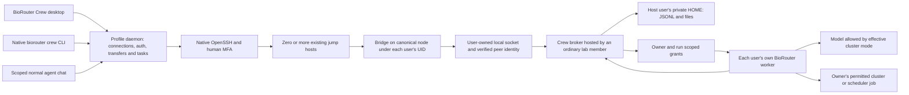

# BioRouter Crew implementation plan

> **What this is.** The plan for BioRouter Crew: SSH-reached, rootless lab collaboration with owned agents and mandatory Private/Public boundaries, covering architecture, identity, privacy enforcement, storage, transfers, UI and agent tools, packaging, testing, and the requirements and work packages added when work resumed (§16).
> **Status:** Current. Implementation in progress on branch `codex/biorouter-crew`; §16 was last updated on 2026-09-24. A requirement written here is not evidence: measured results are in the [status ledger](implementation-status.md), and live package status and the dated decisions log are in the [resume handoff](handoff-2026-09-24.md).
> **Audience:** Implementers, reviewers and testers of Crew, and the maintainers who decide its scope.

Status: implementation in progress September 22, 2026 under the user's approved requirements. The rootless broker, saved SSH manager, native Crew view and built-in MCP capability are present in the development worktree; acceptance remains incomplete. See [the evidence ledger](implementation-status.md) for measured results rather than inferring readiness from this plan. This revision supersedes the earlier administrator-managed deployment recommendation. Research performed September 21, 2026 Pacific / September 22 UTC. Source baseline: `314f3b268c24663a8696dbbbd5aa76a171d0fab8` on `main`. Implementation branch: `codex/biorouter-crew` in `/Users/wgu/.codex/worktrees/biorouter-crew/BioRouter`.

Resumed scope, 2026-09-23: the Crew GUI redesign and human-readable identity requirements are acceptance requirements in [§16](#16-resumed-scope-gui-redesign-and-human-readable-identity-2026-09-23). Live workstream status and standing instructions are in the [resume handoff](handoff-2026-09-24.md#resumed-2026-09-23--live-status).

## 1. Recommendation and scope

Build **BioRouter Crew with functionally equivalent native `biorouter crew` and desktop interfaces, plus a policy-aware built-in agent extension**, backed by a small, ordinary-user Linux collaboration process reached through existing SSH access. Installation, persistent data, configuration and user preferences are based in users' home directories; no sudo, new Unix service account, group creation or elevated access is required. Use the existing BioRouter agent runtime through separate, owner-scoped workers. The shared service handles people, teams, rooms, messages, files, permissions, history and audit; it does not execute everyone's tools as the hosting member.

Favor the user's requested simplicity: native OpenSSH, bounded JSON Lines streams, a broker-owned append-only JSON Lines journal, ordinary attachment files and rebuildable indexes. Human collaboration must work without a model provider, PostgreSQL, Redis, a container platform or a new externally exposed network listener. Additional compute isolation may be required for agents; the chat service itself must not depend on it.

Do not adopt any listed terminal chat project unchanged as the security foundation. `room` is the closest interaction/deployment reference; it is not sufficient proof of trustworthy Unix identity and protected multi-user storage. Matrix is the strongest protocol/platform alternative if reusing an entire collaboration server becomes more important than a small installation. Zulip is the strongest ready-made topic collaboration alternative. Both add a separate account/control plane and still need Crew's owner-agent and data-policy layers. See the [sourced platform comparison](platform-research.md).

The target is a lab of **2–3 through 30–50 people**, with a whole-team general chat and smaller channels containing selected members. A user can belong to multiple teams, and a desktop can hold multiple SSH workspaces. Keep identifiers, protocol versions and indexes extensible, but hundreds/thousands of participants, federation and multi-master storage are not first-release requirements. One ordinary user hosts each workspace's single-writer broker on a specific reachable cluster node. This user is a trusted application host, not a system administrator.

### Accepted decisions from September 22

| User decision | Implementation consequence |
|---|---|
| 1. No administrator or elevated access | Install binaries/configuration/state in ordinary homes; use existing accounts and user-owned processes. No mandatory service account, system service, new group, container runtime or privileged isolation setup. |
| 2. Lab teams of 2–50 | Whole-team general channel plus small membership-scoped channels; test 3 real users and exercise 30–50-client bounded scale. |
| 3. Synthetic data, including pretend-sensitive data | Maintain public-safe and explicitly private synthetic fixtures; private fixtures pass through the real policy path. No real PHI is needed for development or acceptance scenarios. |
| 4. User-controlled cluster Public/Private setting | Private blocks every public-model dispatch through that connection/workspace regardless of channel visibility. Public allows eligible public models; changing the setting does not declassify existing content. |
| 5. Generic authentication accommodating real workflows | Native OpenSSH, configurable routes, per-hop MFA/host verification and capability-specific compatibility results. |
| 6. Recommended context scope | Current channel by default, with saved, explicitly selected additional channels searchable automatically; explicit cross-workspace selection. |
| 7. Recommended posting authority | Grant an agent permission per task and destination channel; request additional approval when audience or permitted data boundary changes. |
| 8. Recommended disconnected execution | Continue already authorized work where user processes/jobs survive; pause new approval-dependent steps and honor expiry/revocation. |
| 9. Recommended files/local storage | Resumable ordinary attachments; remote references for large datasets; explicit policy-controlled downloads; protected offline history off initially. |
| 10. Recommended channel lifecycle | Archive first, retain required audit history, permit explicit current-owner-approved ownership transfer; physical deletion follows configured retention. |

The user also requires a three-account Linux AWS test environment, actual dev builds from this worktree, computer-use-driven collaboration, and conversational MCP tools that reuse saved Crew SSH connections. Section 13 defines that release gate. These decisions are recorded in this implementation document; they are not requests for additional confirmation.

### User requirements translated into invariants

| Requirement | Invariant |
|---|---|
| One SSH server feels like a Slack workspace | A stable service workspace UUID is discovered after authenticated SSH; aliases and jump paths can reach the same workspace. |
| SSH username is the identity | Broker derives the Unix UID from the kernel, resolves a verified enrolled account, and displays its SSH username. Nickname/avatar never confer authority. |
| Multiple teams and self-created channels | Every registered user may create a team when workspace policy permits; team memberships, invitations and channel memberships are explicit records. |
| Channel ownership and removal | Creator starts as owner; only current owner archives/removes or explicitly transfers ownership. Original creator remains immutable audit history. App-level quarantine is a separately audited role. |
| Human and agent work in the same room | Channel receives human messages and structured, policy-checked agent activity/events. Only an agent's owner may invoke, steer, approve or cancel it. |
| Arbitrary files, images and downloads | Durable opaque attachment objects, resumable transfers and membership checks; unsupported previews remain downloadable. |
| Context from other channels | Search only channels the actor and worker may access; retain provenance and all source restrictions through model calls and outputs. |
| Private/public boundaries always hold inside Crew | Effective cluster mode is enforced at tools, context and provider dispatch; Private denies public models. Public cannot override source labels or another user's/shared workspace restrictions. Host-account trust and available isolation are explicit. |
| MFA and jump gates | Use institutional OpenSSH configuration and interactive authentication, verify every host, and support reauthentication throughout the connection lifecycle. |
| Simple, broadly portable Linux stack | One small service binary, text protocol/storage, files, no required network database or container service for chat. Detect unsupported facilities and refuse the affected feature explicitly. |

## 2. What exists in BioRouter today

Detailed source references and limitations are in [architecture and privacy](architecture-privacy.md) and [SSH and UI integration](ssh-ui-architecture.md). All paths below are relative to the baseline repository.

| Area | Current seam | Crew work |
|---|---|---|
| Sidebar and navigation | `ui/desktop/src/components/BioRouterSidebar/AppSidebar.tsx`, `ui/desktop/src/App.tsx` | Add Crew page, workspace/team/channel navigation and connection status. Allow human chat before provider selection. |
| Agent extensions | `crates/biorouter/src/agents/extension.rs`, `extension_manager.rs` | Register a built-in Crew tool surface with admitted actor/run identity. Reuse MCP transport machinery where appropriate. |
| Local HTTP daemon | `crates/biorouter-server/src/auth.rs`, `routes/` | Add local Crew connection and UI APIs; do not expose the existing single-user daemon as a shared team server. |
| Sessions and streams | `session/session_manager.rs`, `routes/session_events.rs`, `routes/reply.rs` | Keep private owner sessions separate; project authorized events into Crew and use durable room cursors. |
| Privacy and affiliations | `crates/biorouter/src/privacy/` | Preserve classification and affiliation rules; add mandatory multi-user and compartment policy. |
| Agent invocation | `crates/biorouter-acp/src/server.rs` | ACP adapter per owner/compartment; no shared multi-user `Arc<Agent>`. |
| File handling | `routes/shell.rs`, `ui/desktop/src/hooks/useFileDrop.ts` | Reuse guard patterns/UI where suitable; add actual remote binary upload, download and artifact ACLs. |
| SSH | No first-class SSH/SFTP/ProxyJump manager found | Implement native SSH process management, authentication UX, transport, connection registry and failure states. |

Three blockers are substantive new work, not UI wiring:

1. Existing workspace session visibility intentionally allows same-tier local sessions to be controlled without an owner boundary. Add ownership and team/channel authorization before reusing these APIs.
2. The local daemon secret and a supplied provider header are not multi-user authentication or provider attestation. Never expose them as Crew authority.
3. The current shell sandbox permits broad filesystem reads. Private clusters categorically disable public models; a public-model agent cannot bypass this through a saved SSH tool. On a Public cluster, historical private material and human credentials still need isolation from model-controlled tools. Separate processes and file modes do not protect files from their owning UID. Rootless execution must restrict or withhold affected tools when the required boundary is unavailable.

## 3. Architecture without administrator support



Every member logs in as their own SSH account. The workspace creator initially hosts the broker as their normal Unix UID; nobody receives that account's SSH credentials. The broker stores collaboration records and enforces application permissions. It never executes another member's shell commands as the hosting account. Each member starts their worker under their own UID and keeps personal session/configuration state in their own home.

### Components

**Desktop Crew UI and ordinary agent chat:** share one saved-connection registry, verified cluster identity, authentication state and policy service. Crew adds people, teams, rooms, files and owned-agent activity. The existing conversation can use built-in MCP tools to select an admitted connection, work on permitted remote files/jobs, post to a room or retrieve authorized context. These are two interfaces to the same connection and policy, not independent SSH credential stores.

**Local connection manager:** a Rust module behind the local daemon API. Under the expanded parity contract, the daemon owns the authentication PTY and lifecycle; narrow terminal and Electron adapters supply human input, resize and presentation. The existing Electron-owned PTY is an implementation seam to migrate, not the target architecture. It owns exact SSH child PIDs/control sockets and keeps per-user/per-workspace transports, caches and grants separate. Reusing a connection never transfers another user's device authority or changes the normal local chat's provider silently.

**Home-installed executable:** place `biorouter-crew` under `~/.local/bin/` or a user-selected home subdirectory. Each account may install its own verified copy. Do not require other users to execute a file inside the host user's inaccessible home, or change HOME permissions to expose it.

**`biorouter-crew bridge --stdio`:** fixed-command protocol bridge, run via the member's existing SSH login on the canonical broker node. It connects locally to the broker socket, validates expected owner/workspace identity, and relays bounded JSONL. Message bodies and filenames never enter a constructed shell command. Diagnostics go to stderr. The bridge's UID is kernel-authenticated; it also supplies an enrolled-device/session credential or a limited worker grant.

**`biorouter-crew serve`:** ordinary host-owned process with private home storage. A dedicated, securely created node-local runtime directory (for example, a random short `/tmp/crew-<uid>-<nonce>/`) can be `0711`, with a socket accessible for connection (`0666`). The owner controls directory entries; peers cannot replace the socket. No chat data, tokens or keys live in that traversable directory. Private state remains `0700` directories/`0600` files in HOME. A `0700` runtime directory would prevent other users from reaching the socket, even if its mode were `0666`.

The socket permits an attempted connection, not record access. Broker admission checks kernel peer UID, enrollment, request capability and policy, with bounded unauthenticated work. Clients verify path ownership/no symlink substitution, broker peer identity and the pinned workspace public key; the broker also authenticates every client. These Linux socket primitives do not require creating groups or granting another user access to the host's private storage. [Linux unix(7)](https://man7.org/linux/man-pages/man7/unix.7.html).

**Owned worker adapter and built-in MCP capability:** per-owner BioRouter sessions, scoped model binding, remote tools and channel projections. Credentials remain with their owner. The local chat never receives raw SSH secrets, MFA codes or the broker's unscoped human-control credential. Sections 6 and 9 define enforcement and tool operations.

ACP remains useful within an owned agent adapter; MCP exposes Crew and saved-SSH operations to the user's conversation. Neither replaces identity, membership or durable chat semantics. Use BioRouter's supported protocol versions. [ACP transport specification](https://agentclientprotocol.com/protocol/v1/transports).

### Workspace discovery, joining and node placement

One shared workspace can host the whole lab and several teams. Its ordinary hosting user creates a workspace UUID, key and invitation descriptor. A descriptor contains the canonical broker node, expected host-account identity, workspace fingerprint and non-secret endpoint information; it does not contain a private key or executable SSH configuration. A recipient connects using their own SSH profile, verifies the descriptor, enrolls and then appears in that workspace's searchable people list. All enrolled, discoverable Crew members are visible as policy permits; invitations to teams/channels use this directory.

Save accepted descriptors in each member's home/local settings, so subsequent logins automatically rediscover the same workspace. Persist the chosen short runtime basename in the host manifest and invitation; reuse it on restart only after checking expected ownership/type. If a path is occupied by another UID or has been replaced, fail closed and require a verified descriptor update rather than unlinking someone else's files. Runtime relocation uses a signed generation update authenticated by the already pinned workspace key. A connection alone is not authority to scan other users' private homes or OS account lists. Optional cluster-wide discovery can publish minimal opt-in, account-owned announcements at a pre-existing mutually accessible location; validate filesystem owner and workspace identity and treat announcements only as discovery hints. No shared writable authoritative registry is required. If no suitable discovery location exists, joining once by invitation remains fully supported; do not create an insecure registry to imitate universal discovery.

> **Note.** Naming decision D8 (§16, [naming design](naming-design.md#joining-a-workspace-s3a)) replaces the hand-copied descriptor as the designed primary way to join: the host sends one `brcrew1:` invitation line carrying the same verified fields plus the workspace's privacy mode and institution, and the joiner is admitted when the host approves a code the joiner's own desktop computed. Discovery, including the opt-in announcements above, is deferred to slice S4 pending its own review and a maintainer decision on where the workspace key's trust comes from (D10). The descriptor remains the path for scripted saves.

All participating bridges must reach **one actual kernel/node** hosting the socket. Shared NFS homes do not make Unix sockets work across login nodes. Resolve generic aliases to an explicit reachable broker node and reuse the permitted SSH/jump route. If there is no mutually reachable node, report this deployment limitation. Do not silently substitute an unauthenticated TCP relay or multi-writer shared-file mailbox. A signed cross-node relay/mailbox could be a later protocol, with separate feasibility work.

### Process lifecycle and trust

Provide `crew start/status/stop` for exact owned processes, a foreground `serve` mode, and an optional user service only where it already works. No systemd system unit, `sudo`, `loginctl enable-linger`, account creation, new Unix groups or cluster-policy changes are prerequisites. A site may kill ordinary processes at logout, reboot or allocation expiry; `nohup`, terminal multiplexers and disowning cannot guarantee survival. Report observed capabilities and keep durable history even when the host process goes offline. Other members can reconnect but cannot restart a process as its owner.

A host migration is an explicit owner-authorized state/key transfer with verified writer shutdown and a new deployment generation. Never infer permission for another node to write from a missed heartbeat or stale PID file. Channel ownership transfer and workspace hosting transfer are distinct operations.

The hosting account **and unrestricted software running under that UID are trusted with plaintext, policy and availability**, including invite-only room contents. Application ACLs protect against other ordinary member accounts; they cannot protect the home-owned journal from its owner. Host root also remains outside an application-only confidentiality guarantee. This is the selected rootless deployment model, not an assertion that private channels are cryptographically hidden from the host. End-to-end encryption against the host would require a separate key/search/agent architecture and is outside this first plan.

Existing site rules on user processes and jobs still apply, but Crew does not require an administrator to provision new infrastructure. Heavy processing uses the user's existing scheduler permissions. Every rootless feature must have explicit supported/unsupported behavior rather than requesting elevated privileges behind the scenes.

## 4. SSH, MFA and multiple gates

Use the installed OpenSSH first. It already participates in institutional SSH config, key agents, hardware keys, certificates, PAM-backed keyboard-interactive challenges and jump routes. Avoid shipping a partial SSH implementation to simplify the first UI.

Example conceptual configuration, with placeholders rather than an assumption about either supplied server:

```sshconfig
Host crew-gate-a crew-gate-b crew-service
    ForwardAgent no
    ForwardX11 no
    StrictHostKeyChecking yes
    ControlMaster no
    ControlPath none

Host crew-gate-a
    HostName gate-a.institution.example
    User institutional-user

Host crew-gate-b
    HostName gate-b.internal.example
    User second-account

Host crew-service
    HostName collaboration.internal.example
    User cluster-account
    ProxyJump crew-gate-a,crew-gate-b
```

Each host has its own credentials, host-key checks, timeout and possible MFA challenge. OpenSSH supports ordered jump hosts; options for a destination are not automatically the correct configuration for every jump. See the [OpenSSH client manual](https://man.openbsd.org/ssh). The app must respect institutional restrictions on forwarding, exec channels, TTYs and `ForceCommand`; if the approved route cannot run the bridge, show an actionable incompatibility rather than attempting a bypass.

### Authentication state machine

`Disconnected → Resolve trusted profile → Verify host(s) → Await credentials/MFA → Start bridge → Verify workspace and policy → Connected`.

Failures transition to an explicit `Cancelled`, `Host identity changed`, `Authentication failed`, `MFA timed out`, `Route denied`, `Protocol incompatible` or `Reauthentication required` state. Reconnect resumes from a durable cursor only after fresh authorization. Presence changes are independent from message delivery.

Support multi-prompt keyboard-interactive exchanges, Duo push/menu, TOTP, password expiry/change flows, private-key passphrases, FIDO/security-key touch and institution-specific banners. Keyboard-interactive supports multiple exchanges and prompt echo flags; it must not be reduced to one password box. [RFC 4256](https://www.rfc-editor.org/rfc/rfc4256).

Use a dedicated authentication terminal as a compatibility surface; use askpass where the client/platform supports it. Keep authentication interaction separate from the non-PTY protocol stream. On platforms with supported multiplexing, establish a master through the auth surface and then open non-PTY exec channels. Otherwise use a tested persistent exec/askpass adapter. Never silently force BatchMode for a user connection that needs MFA. `BatchMode=yes` is only appropriate to the unattended probes and explicit automation profiles.

Authentication responses must never enter model prompts, chat messages, run event streams, logs, telemetry, saved config or agent-visible screenshots of the auth surface. Sanitize terminal control sequences and phishing-like prompt text; identify the verified endpoint and do not assert a particular hop when OpenSSH's prompt does not establish it. Do not auto-approve repeated push requests or cache OTPs. Cancellation kills only the connection's owned process tree.

Use existing trusted known_hosts or institution host certificates. First-use trust is a visible human decision using existing trusted fingerprints/host certificates; changed keys block. Never default to `StrictHostKeyChecking=no`, strip known_hosts, forward the user's SSH agent through all gates, or ingest an SSH config supplied in a team invitation. User-selected SSH config can contain executable `ProxyCommand`/`Match exec` directives and is trusted local configuration, not inert data.

The example disables inherited multiplexing on every hop. If Crew enables multiplexing, every hop must use an app-owned private control socket keyed by destination, user, route and policy realm. Do not inherit an unrelated user's or pre-existing bastion master. Bound idle persistence and independently enforce maximum authentication age **per hop**. Expiring only the final host can reuse an old bastion's MFA session; close/recreate the affected app-owned jump connections and their dependents. `ControlPersist` is an idle timeout, so an active chat can otherwise keep authentication alive indefinitely. Keepalive is liveness detection, not reauthentication. Effective host checking, delegation restrictions and control-socket policy must apply to all jump hosts, not just final-host command-line options. [OpenSSH configuration manual](https://man.openbsd.org/ssh_config).

A desktop disconnect must not silently cancel previously approved scheduler jobs. Show whether a run is attached, awaiting reauthentication, still executing remotely, or finished. Revoked access stops new work and new result delivery; already launched tools/jobs follow an explicit cancel/contain policy, with owner/application-manager audit. Long-lived workers cannot renew grants forever after their owner is offboarded.

### Required SSH acceptance matrix

| Scenario | Required outcome | This investigation |
|---|---|---|
| Existing noninteractive known-host access | Authenticated account, clean framed stream | Passed on Narrows and Leo; auth method/fresh-MFA assurance not established |
| Two gate chain, distinct host identities | Native jump routing and final UID binding | AWS fixture report; simulated topology, not institutional gates |
| Keyboard-interactive TOTP/Duo at each hop | Prompt sequence, echo policy, cancellation and timeout | Not yet exercised |
| Passphrase/security-key touch | Trusted UI, no secret persistence | Not yet exercised |
| Expired auth/cert; MFA required on reconnect | Suspend and ask human; no retry storm | Not yet exercised |
| Changed host key | Refuse until trusted rotation procedure | Production UX test pending |
| Forwarding disabled but approved exec available | Stdio bridge works if institution allows it | Requires target configuration fixture |
| Forced SFTP-only or prohibited exec | Refuse Crew bridge with explanation | Requires target configuration fixture |
| Windows/macOS/Linux client differences | Measured auth and process-lifecycle support | Current real-host probes were macOS OpenSSH only |

## 5. Identity, teams and authorization

Authoritative records live on the server. Use immutable opaque IDs; preserve usernames as user-facing identity, not as caller-controlled primary keys.

| Record | Key fields |
|---|---|
| Workspace | UUID, canonical cluster/node identity, hosting principal, identity realm, shared Public/Private baseline, deployment/enrollment generation, policy version, protocol range |
| Principal | UUID, verified UID, canonical username, account generation, status, discoverability |
| Profile | Principal ID, nickname, avatar attachment ID, preferences |
| Team | UUID, creator, name, policy, membership and invitation records |
| Channel | UUID, team ID, immutable created-by principal, current owner, name, visibility, data labels, status |
| Membership | Principal/team/channel, role, granted/revoked event, membership epoch |
| Event/message | Event UUID, journal order, channel message ID, actor kind/owner, body, revision, source labels, idempotency key |
| Attachment | Opaque ID, owner/channel, size, digest, media type, display name, labels, upload state |
| Agent/run | Owner principal, worker ID, originating channel, provider-policy ID, input-context manifest, permitted outputs, grant expiry |
| Approval/release | Exact request or payload digest, approving human, destination, labels, expiry, policy version |
| Audit | Actor, operation, object IDs, result, policy version and timestamp, without credentials or unnecessary message bodies |

Enrollment happens only after authenticated connection and acceptance of workspace policy. A user can belong to several teams. User discovery returns enrolled, discoverable accounts permitted by institutional policy; never scrape or publish all OS accounts. An invitation grants no SSH login entitlement and does not create an OS account. It has an inviter, target principal, role, expiry, acceptance state and audit record.

> **Note.** How a name resolves is settled by §16's naming criterion 4: team and channel invitations resolve `@username` against the workspace's enrolled principals, and a workspace invitation resolves it with one host-only account point lookup on the broker node. OS accounts are never enumerated. No searchable directory beyond the caller's own snapshot is built; discovery is deferred (D10).

Require individual Unix accounts for individual attribution. If coworkers share one SSH login, the kernel cannot distinguish them; that deployment needs an institution-approved additional personal identity layer before Crew can promise per-person agent ownership.

Distinguish **visibility** (`team-visible`, `invite-only`, DM) from **data classification** (`public-safe`, `restricted` plus institution/project/dataset restrictions). Avoid the ambiguous phrase “public channel” for a room that is merely visible to a team.

| Operation | Default authority |
|---|---|
| Create team | Enrolled human, subject to workspace quota/policy |
| Invite to team | Team creator or delegated application manager; invitee accepts |
| Create channel | Team member if team policy permits |
| Invite to restricted channel | Current channel owner or explicitly assigned invite manager; invitee must be eligible for the team/data |
| Remove/archive/transfer channel | Current owner; creator is initial owner, transfer requires explicit owner approval and successor acceptance |
| Read/post/search/download | Active identity, appropriate memberships, object grants and data/device policy |
| Edit own message | Original human author, policy-permitted revision; preserve audit |
| Start/prompt/cancel/change/approve agent | That agent's owner only, through admitted owner action |
| Observe agent | Recipients authorized for that run's published channel projection |
| Emergency quarantine/retention hold | Named workspace application-manager role held by an ordinary member, separately audited; no OS administrator privilege |

Archive channels by default. The creator is the initial owner and may explicitly transfer ownership to an eligible member who accepts; subsequent transfers require the current owner. Preserve the immutable creator and full transfer history, and allow only the current owner to archive/remove. Transfer revokes old-owner capabilities, including invitations and pending owner approvals; retained access requires a separate explicit membership/delegation. The successor gains owner actions only when the transfer commits. If an owner disappears without transfer, the application manager may quarantine the orphan rather than impersonating its owner. Actual content deletion follows the configured retention/hold rules and is distinct from UI archival. All of these are application roles held by normal users, not elevated Unix accounts.

Membership revocation invalidates subscriptions, uploads, downloads, search results, context snapshots and queued worker grants at their next authorized action. Recheck before delivering each download chunk and before model dispatch. Do not promise to recall already downloaded or model-submitted bytes. Broker identity uses a UID plus enrollment generation because Unix accounts can be recycled; the hosting user and workspace managers maintain enrollment/offboarding records without requiring OS administration; ambiguous recycled identities require re-enrollment.

## 6. Agent ownership, context and private/public enforcement

### Invocation and activity

Use explicit composer actions: **Message channel** and **Ask my agent**. An admitted owner command creates a run. A coworker's message or `@alice-agent` mention does not. In one channel Alice and Bob may both run their agents; neither can prompt, stop, approve a tool call for, or change the other's agent/model. Shared “team agents” are deferred because they need an explicit owner/delegation model.

Human authority needs a concrete second layer beyond the Unix account, without administrator enrollment. The desktop generates a device key in its local credential/signer service. Through the user's SSH-authenticated bridge, the broker issues a short-lived challenge bound to the actual peer UID, workspace, enrollment generation, device public key and live connection. The desktop displays the verified identity and signs after human enrollment. A signature proves possession of that device key, not human intent by itself.

Avoid first-writer-wins enrollment: bind the invitation to the intended device-key fingerprint or have the hosting user/workspace manager confirm it through an already trusted interaction. Joining by invitation (§16, D8) meets this rule the second way: the host approves a device code the joiner's own desktop computed from its key, and the broker binds only a key whose code matches. This is ordinary application ownership. Additional devices and recovery require an existing enrolled device or an explicit, audited manager recovery using a verified recipient fingerprint. No privileged account or institution-provisioned identity service is required.

For sensitive approvals/authority changes, bind a nonce to exact operation, arguments/payload digest, workspace, run/channel, policy epoch and expiry. A trusted human UI invokes the signer; worker tools/PTY automation do not receive it. Hardware-backed keys are optional where supported. Workers get separate run-scoped credentials and cannot mint a human grant. All software under an already compromised host/user UID is outside this application's strong identity claim; an unrestricted remote process must not be treated as proof of a human approval.

Publish the requested task, intended commands/tool calls, status/progress, shareable output and artifact references as structured events. Match tool outcome events by their typed request ID; expose failures and successful response receipt without broadcasting raw tool payloads. An execution receipt is not job completion. Only a job-status result establishes the process outcome. Model summaries remain model-authored claims, and acceptance tests must compare them with actual tool results and artifact hashes. Keep full owner session state separate. Crew-scoped turns must not read or inject the desktop working directory, workspace map, local project hints, or unrelated platform context; use the approved SSH directory and explicit scoped tools. This applies when a preexisting personal chat receives a Crew grant as well as to a new owned task. Credential prompts, environment secrets, raw provider internals and hidden reasoning are not indiscriminately broadcast. If results include additional restrictions from another channel, send them only to recipients permitted by all sources; a broader-audience room can receive a non-sensitive status when policy allows it.

Workers execute as the invoking user's Unix identity and scheduler allocation, never through a different member's hosting account. On Narrows, expensive processing belongs in Slurm rather than an interactive login daemon. The controller records job IDs and exit status, reattaches logs under the same identity, and supports explicit cancellation. No Slurm job was submitted in the feasibility probes.

### Cluster Public/Private toggle and mandatory policy

On adding a saved SSH connection, the human explicitly declares whether the cluster hosts Private or Public information. Default an unclassified connection to **Private**. Define a client-managed canonical `cluster_connection_id` separately from remote `workspace_id`: it groups the user's saved aliases and verified destination-node identities for that cluster. Pin host identities through the existing SSH trust flow and require explicit association for additional nodes/aliases; a broker-supplied workspace UUID or display name cannot create a new Public cluster identity. Persist the personal mode against `cluster_connection_id`, so all its aliases, additional workspaces, Crew UI, normal chats and scheduled work share that floor. Each workspace also has its independent shared baseline. Host-key/identity changes suspend reuse until resolved.

**Private means no public models on that connection/workspace.** Channel discoverability, a public-safe message or a model's popularity cannot override this. Public means public providers may be considered, not that all stored material is public. Apply the same rule to embeddings, OCR, transcription, summaries, titles, plugins and other Crew-managed model calls. No silent fallback to a public provider.

For shared collaboration keep both a personal connection setting and a host-owned shared workspace baseline. The workspace creator selects its initial baseline. An enrolled human may tighten their connection to Private; a workspace policy change to Private is an explicit shared change, available to an authorized ordinary workspace manager. Lowering the shared baseline requires the current workspace owner/manager's human action, not a member's personal preference or an agent. This is an application permission, requiring no system administrator. The UI always displays effective mode and explains when a Private workspace overrides a personal Public selection.

An agent's admission rule is:

`identity ∩ membership ∩ object ACL ∩ workspace baseline ∩ personal connection mode ∩ source restrictions ∩ pinned run policy ∩ approved endpoint/tool scope`.

Every denial wins. Bind these inputs and their policy epoch to the run/worker grant and recheck on reads, provider dispatch and publication. Missing/unknown labels and endpoint identity fail restricted/denied. Never trust a request's `provider: private`, permit a local privacy-off switch to bypass Crew, or use a second SSH tool path with weaker rules.

| User action/state | Required behavior |
|---|---|
| New connection, classification not yet resolved | Effective Private; no public-provider call. |
| Private connection or Private shared workspace | Public providers unavailable for Crew and saved-SSH tools, regardless of channel visibility. |
| Public connection in Public workspace | Public providers allowed only for authorized public-safe inputs and tools. |
| Public → Private | Persist a new policy epoch, revoke incompatible grants, block queued/new public requests and cancel/detach incompatible active work where supported. Bytes already submitted cannot be recalled; report that honestly. |
| Private → Public | Explicit human change; invalidate old grants and start fresh policy-compatible runs. Existing private messages/files/caches/context remain private. |
| Conflicting member preferences | The more restrictive setting governs that member's work; personal Public never lowers a shared Private baseline. |
| Reconnect, another workspace on the same cluster, alias change or stale offline grant | Resolve the same canonical `cluster_connection_id` and current shared baseline before any read, model call, upload or publication; a new workspace ID does not reset the cluster mode. |

Every contribution made in a Private context receives a private-processing label, so another member cannot send it to a public model after the original author disconnects. Reject posting it into a destination that cannot preserve this restriction. Private→Public does not automatically rewrite history or enable public-model filesystem access to retained private state. Initially require a fresh public run/channel context containing only public-safe data; retained protected files remain inaccessible to public tools. The rootless isolation limitations below still apply.

Provider classification is for the actual configured endpoint/deployment. A private model must satisfy the permitted data compartments; merely being local or sharing a vendor brand does not grant access. The plan retains BioRouter's existing endpoint/affiliation checks while making the cluster Private setting an additional non-bypassable denial of public providers. Synthetic testing uses private-classified fixtures and controlled endpoints rather than assuming an endpoint is approved for real data.

Desktop-to-cluster collaboration traffic stays inside SSH. Cluster-to-model traffic is a separate leg using the configured protected endpoint/egress route, normally authenticated TLS; SSH does not authorize that leg automatically. Network restrictions enforced by Crew apply to Crew-managed tools/dispatch. Without OS administration, the app cannot impose a host-wide firewall on unrelated user software.

### Cross-channel context without accidental disclosure

Default context is the current channel's authorized history window plus selected artifacts. Save an owner-selected set of additional channels that the agent may search automatically for that task or explicitly saved preference. Cross-workspace retrieval always requires explicit selection and compatible policy; do not default to all joined rooms. Search filters run before scoring, counts, snippets and pagination; fetch rechecks permissions. Scope ambiguity requires a visible workspace/channel selector, not a guessed post destination.

Record a context manifest of exact source event/file versions and the policy epoch. Derived context and outputs inherit the union of source restrictions. An agent “learning” across channels means authorized retrieval and session context; it does not mean silently training a model, pooling all team memories, or retaining revoked data in a global memory index.

If a private run reads channels A and B, its summary cannot be posted to A unless all A recipients may receive B's information as well. Preserve source-ACL dependencies on the derived event and attachments; evaluate them for **every future reader**, including new members, search, replay and cached-context reuse. Joining A later does not grant B's permissions. Invitations, role changes and visibility changes must not expand access to retained B-derived content; refuse the change or keep that content individually restricted without leaking inaccessible source details. Labels cover text, filenames, images, thumbnails, metrics, search results and embeddings. A copied attachment or paraphrase is not declassification. Cross-workspace context is off by default; explicit selection still must pass both institutions' policies.

Initially prohibit private-to-public export in restricted workspaces. A later controlled release flow can present exact text/files and provenance for human/institutional approval, bound to destination, digest, expiry and policy. Approval of one release never changes the source channel's label or grants standing release rights. Do not reuse a generic first-crossing-per-session consent for PHI.

### Rootless worker isolation and boundary limits

Same-UID authentication proves an account, not human intent, provider clearance or a safe process. Every worker, including private-model workers, must be separated from the desktop's human signing authority and must use scoped broker credentials. A raw SSH/broker connection does not acquire a human credential automatically. A private-model worker is not authorized to change memberships, approve its own sensitive actions or alter the cluster mode.

Private clusters categorically deny public models, so there is no same-host public-model exception based on a channel's label or a supposedly stronger sandbox. Public-model sessions using the ordinary chat's built-in SSH tools are denied access to a Private connection before remote retrieval. Private derived context cannot flow to a Public connection merely because the user changed the selected connection.

On Public clusters, scoped tool implementations should allow only selected remote paths/operations and hide Crew stores, SSH/control sockets, human credentials and previously private artifacts. Use an already available unprivileged isolation mechanism if it has been tested on that host; do not require sudo, privileged containers, new accounts, sysctl changes or newer kernel features to make human chat work. If sufficient isolation for arbitrary shell or unrestricted file tools is unavailable, expose only the supported broker-mediated operations and report those tools unavailable. [Linux Landlock documentation](https://docs.kernel.org/userspace-api/landlock.html) is a compatibility reference, not a universal dependency.

An unrestricted agent running under the **hosting user's UID** can otherwise read/modify all plaintext Crew state in that home. Ordinary file permissions cannot prevent this. Consequently, unrestricted software under the host account is part of the trusted base; rootless Crew does not claim to withstand a malicious host or arbitrary same-UID code. Test and document this limitation rather than calling file modes a sandbox. Where the required authority/data isolation is unavailable, human collaboration and narrowly scoped supported agent actions remain usable; withhold the affected arbitrary execution features.

Do not attempt system-wide network/credential controls that require elevated privileges. The release claim is enforced routing, provenance and authorization in the shipped Crew/SSH capability under the stated trusted-account model, with explicit tool restrictions. Any stronger protection against the hosting user would be a separate encryption/isolation project.

## 7. Simple text storage with explicit durability

Suggested home-based layout, repeated separately for each hosting or participating account:

```text
~/.local/bin/biorouter-crew
~/.config/biorouter/crew/connections.json
~/.local/share/biorouter-crew/workspaces/<workspace-id>/
  manifest.json
  policy.json
  journal/000000000001.jsonl
  snapshots/<sequence>.json
  blobs/<opaque-prefix>/<opaque-id>
  uploads/<opaque-id>.part
  derived/                         # disposable indexes
  audit-checkpoints/
~/.local/share/biorouter-crew/owned-runs/<run-id>/
~/.local/state/biorouter-crew/      # private logs and lifecycle records
/tmp/crew-<uid>-<random>/broker.sock # ephemeral local IPC only
```

The host account owns workspace files; members keep their own connection references, preferences and owned-run state in their own homes. `manifest.json` records workspace identity, host account, canonical writer node and deployment generation. `policy.json` is managed through authorized human application actions and changes appear in the canonical journal; a worker cannot overwrite policy through a tool. Snapshots/config views do not independently override journaled policy.

Use private state directories/files (`0700`/`0600`) without changing permissions of the entire home. No newly created Unix group, ACL grant on HOME, writable shared history folder, `/var/lib` installation or privileged `/run` directory is required. Peers use the socket API, not the host's data files. Encryption/backup properties depend on the available user/storage environment; rootless installation does not establish at-rest encryption by itself. A user-managed encrypted backup can be supported without claiming protection from the running host account.

Use **one canonical ordered journal per workspace initially**. A record is a single versioned mutation or atomic batch: sequence, unique event ID, operation, actor, target, timestamp, policy/membership epoch, idempotency information, payload and checksum over defined serialized bytes. Do not duplicate memberships in a second independently committed store. Snapshots and room/search views are derived. A future segmented/partitioned design must preserve authorization ordering explicitly.

### Commit and replay contract

1. Admit and validate bounded input; check actor, labels, quotas, expected object version and idempotency key.
2. Under the one-writer serialization point, recheck current authorization and assign the journal order.
3. Append the entire newline-terminated record, flush and `fsync`. On failure, stop mutation acceptance; never acknowledge a partial write.
4. Update the in-memory view and acknowledge with stable event identity only after durable commit. A crash after commit but before acknowledgement is resolved by the same idempotency key; a reused key with different bytes is a conflict.
5. Replay verifies schema, sequence continuity, checksums and mutation invariants. A demonstrably incomplete final record may be quarantined/truncated under exclusive ownership. A complete record with a bad checksum or interior corruption stops recovery; never skip a membership revocation to make startup succeed.
6. Snapshots use a temp file, flush/fsync, same-filesystem atomic rename and directory fsync. Include the committed journal sequence/digest; keep old generations until recovery and backup verification complete.

The process must have exclusive ownership of the store and fail if another broker is active. Pin the writer to the manifest's canonical node and deployment generation; verify locking on the actual filesystem. Only the hosting account can restart its broker, and a stale timestamp or failed heartbeat cannot authorize a second node to write. No automatic failover in v1. Lock semantics depend on local/NFS configuration, so tests must cover the selected mount rather than assuming `flock` is universal fencing. [Linux flock(2)](https://man7.org/linux/man-pages/man2/flock.2.html).

HOME is the default persistent location, including clusters where HOME is NFS. Qualify that exact user-writable mount for single-writer locking, file/directory fsync, atomic replacement, restart recovery, quota failures and disconnect behavior before treating it as supported. Prior Narrows probes used XFS temporary storage, so they do **not** establish this. If the required primitives fail or stall, suspend writes with an actionable filesystem limitation; do not request sudo, silently move canonical history to `/tmp`, or acknowledge undurable operations. A user may select another existing permitted home/project location after the same checks. Backups are user-owned exports/snapshots to an available permitted destination; do not assume institution-managed backup service. [Linux fsync(2)](https://man7.org/linux/man-pages/man2/fsync.2.html).

A simple in-memory keyword index rebuilt from authorized events is enough for the first deployment. Apply ACL filters before returning results. Optional derived indexes may later improve restart/search time, but canonical recovery must not depend on them. Avoid vector search until provider/embedding permissions and provenance deletion are implemented.

Audit reads, downloads, model dispatch, approvals, exports, mode/membership changes, transfers and application-manager actions according to configured retention. If a required audit write fails, deny the action. A checksum chain plus independently retained signed checkpoints can expose some alteration, but the host account can rewrite its own store. Do not call this administrator-proof or immutable compliance logging. Offer user-controlled checkpoint exports/backup verification and state the actual trust/retention properties.

Text logs do entail more recovery code than SQLite. This is a deliberate preference tradeoff, not a claim that hand-built journals are intrinsically safer. Keep the journal small and single-writer, test power-loss boundaries, and revisit storage only if those tests or deployment needs justify added machinery.

## 8. Text streaming and attachments

Use one UTF-8 JSON object per line with a small versioned envelope. Illustrative requests, not final public schema:

```json
{"v":1,"request_id":"r1","op":"channel.post","channel_id":"c1","idempotency_key":"m1","body":"Synthetic example"}
{"v":1,"request_id":"r2","op":"channel.subscribe","channel_id":"c1","after_cursor":"opaque-server-issued-cursor"}
{"v":1,"request_id":"r3","op":"attachment.chunk","upload_id":"u1","offset":0,"base64":"AAEC"}
```

Actor, effective clearance and durable order are server-derived. Reject unknown required fields/versions and oversized/invalid UTF-8 frames with actionable errors. The handshake negotiates protocol range, workspace ID, authenticated principal, policy digest, features and limits. Invitations cannot override the expected workspace identity.

Provisional defaults: 1 MiB maximum encoded frame, 256 KiB raw attachment chunk, smaller message-body limits and bounded queue depth. These are tunable design defaults, not benchmark results. Base64's roughly one-third wire overhead is acceptable for a simple text-first version. Files remain binary on disk, not embedded in the journal. Support incremental hashing and constant-size buffers so a multi-GB file does not need to fit in memory.

Subscribe using authorized opaque cursors or channel-scoped sequence positions. Do not expose a global journal counter that leaks activity in inaccessible rooms. Slow consumers get an explicit resync instruction and durable cursor; do not silently drop chat messages. Presence/typing are ephemeral and rate-limited. Prioritize control/events over attachment chunks; use an additional exec channel only when server session limits and auth policy permit it.

Every mutating request has a persisted idempotency key scoped to actor/workspace/operation. This provides retry-safe admission, not magical exactly-once external commands. Agent actions have durable run IDs and explicit pending/started/unknown/completed states; reconnection never blindly repeats a shell command after an uncertain acknowledgement.

Define a retry horizon before journal compaction: retain each operation's key, payload digest and stable result through that horizon and all still-live runs/uploads. An expired key receives an explicit expiry/resolution response rather than being accepted as an unseen mutation. Snapshot/compaction must preserve this deduplication state.

### File lifecycle

1. `attachment.begin`: authorize destination, label, quota and expected size; allocate an opaque upload ID.
2. `attachment.chunk`: verify owner/grant/current policy and offset, write to broker-owned staging, acknowledge durable progress at documented checkpoints.
3. `attachment.commit`: verify length/digest; fsync bytes, rename within the blob filesystem, fsync directory, then append the durable attachment event.
4. Publish the authorized attachment reference only after commit. A crash can leave an orphan blob but must not expose a half-file; sweep orphaned uploads/blobs only after manifest/recovery checks and a grace period.
5. `attachment.read`: authorize every request/range/chunk against current membership and policy. Download via SSH to a user-chosen path with safe overwrite handling and final digest verification.

All kinds of files may be stored subject to institutional quotas/content rules. Render only safe supported previews. Never execute HTML/SVG/scripts or fetch external resources merely because someone posted them. Images/avatars are bounded, sanitized or served without active content; private previews/OCR must stay in approved processing destinations. Use opaque filenames internally; user-supplied names are display metadata. Reject traversal, symlink/hardlink escapes, special files and archive expansion attacks. No public pre-signed object URLs or inline external image URLs for restricted attachments.

For very large datasets offer **shared file reference** separately from **uploaded snapshot**. A reference describes a version/digest and intended target; the recipient/worker accesses it under its own Unix permissions. The broker does not use the hosting member's account to read arbitrary submitted paths or change Unix ACLs. An uploaded snapshot is an explicit sharing operation and new protected object. Moving between two SSH workspaces is an explicit policy-checked transfer, never an automatic local download/upload shortcut.

## 9. UI and agent tools

The Crew tab contains a saved SSH connection/workspace switcher; a visible, user-changeable Public/Private control showing effective mode; connection/MFA status; teams; a whole-team general channel and smaller channels/DMs; people; files; and a room timeline. Display `workspace / team / channel`, the verified SSH username, room visibility and data policy independently. Include accessible reconnect/error states and a context-scope picker. Authentication problems must not look like an empty room.

The composer selects ordinary message vs owned-agent invocation. Agent activity cards show owner, model endpoint policy, status, commands and artifacts. Only the owner sees enabled run controls. A room can host parallel runs without sharing their private session state. Human-only collaboration must work before selecting a model provider or enabling agent extensions.

Profiles, nickname/avatar, team memberships, room settings, read position and notification preferences live server-side. Local aliases, trusted connection references, pins, layout and last selection live locally. Secrets use the OS credential facility or institutional SSH agent. Restricted content caching and notification previews are off by default; an institution may permit a scoped encrypted cache with expiry/lock/offboarding behavior. Previously downloaded files are governed by endpoint policy and cannot be remotely “unseen.”

Also gate **local agent session persistence**, not just the Crew UI cache. Existing BioRouter sessions persist tool results/conversations locally; allowing `crew.read` to return restricted content to a local private-model chat could write it into that ordinary session store. Default restricted context delivery to the approved remote worker. Deliver it to a local agent only when the endpoint and the actual session/log/blob/backup persistence paths are approved and protected. A private model choice or disabled Crew offline cache does not establish this. Human rendering on an approved desktop is intentional endpoint access; it does not authorize copying the same content into every local agent store, crash report or plugin.

Suggested tool/command surface:

| Tool | Behavior |
|---|---|
| `crew.list_workspaces`, `crew.list_channels` | Return only already admitted/authorized scopes |
| `crew.read`, `crew.search` | Membership-filtered history with provenance and explicit context scope |
| `crew.post` | Destination-explicit message with same publication policy and configured approval as UI |
| `crew.attach`, `crew.download` | Authorized object transfer, never raw service-account path reads |
| `crew.create_channel`, `crew.invite` | Permissioned mutations through deterministic handlers |
| `crew.run_agent`, `crew.cancel_agent` | Only admitted owned runs, no cross-owner authority |
| `/crew send`, `/crew context`, `/crew files`, `/crew agent` | Human-friendly discovery over the same typed operations |

A local conversation is not posted simply because a channel is selected. The user can grant posting permission for a particular task and destination channel, avoiding a confirmation for every ordinary in-scope message. Widening the audience or permitted data boundary requires a new explicit approval, and forbidden private-to-public flows remain denied. Sharing creates a bounded, provenance-carrying payload. A coworker's message cannot manufacture a slash-command invocation or an owner approval event.

### Built-in MCP Crew and SSH manager in ordinary conversations

Ship a built-in, discoverable MCP tool surface, enabled through BioRouter's existing extension/capability machinery. A thin in-process/platform adapter may implement the registered tools, but users and acceptance tests must invoke them through the normal agent tool-dispatch path. The remote collaboration stream remains the versioned JSONL protocol. No separately configured external MCP server or duplicated SSH credentials are prerequisites.

Both the Crew page and this extension use the **same connection IDs, credentials broker, live transports, known-host verification, effective cluster mode, reconnect lifecycle and permission engine**. A saved connection is available to the user's other chats by explicit selection, subject to that chat's provider clearance and grants. Selecting it binds remote working directory and allowed operations to that conversation/run; it must not globally change another chat's connection or treat remote paths as local paths. Supporting multi-connection work does not authorize automatic data transfer between connections.

Proposed typed operations (final registered names can follow repository naming conventions):

| Capability | Required behavior |
|---|---|
| `crew.list_connections`, `crew.connection_status` | List the current user's admitted saved connections and effective mode/status without credentials or inaccessible workspace metadata. |
| `crew.connect`, `crew.use_connection` | Resolve an explicit saved connection ID, request human MFA in the trusted UI when necessary, and bind a scoped lease to this chat/run. Never answer an authentication prompt through the model. |
| `crew.list_remote_files`, `crew.read_remote_file` | Access only permitted remote paths as the selected SSH user; check provider/cluster mode before retrieving bytes; label returned content for persistence and subsequent model calls. |
| `crew.execute_remote`, `crew.job_status`, `crew.cancel_job` | Execute permitted actions as the owner, reuse existing sensitive-operation approvals, respect tool/scheduler scope and available isolation, and persist invocation IDs so uncertain execution is not blindly retried. |
| `crew.upload`, `crew.download`, `crew.attach` | Explicit scoped transfer with digest, policy, quota and destination checks; distinguish local files, remote references and uploaded snapshots. |
| `crew.list_channels`, `crew.read`, `crew.search` | Use membership-filtered data and current/selected-channel context with provenance. |
| `crew.post`, `crew.check_updates` | Post only under a task/channel grant; read real updates using a scoped cursor. Do not silently mark human messages read merely because a background agent checked them. |
| `crew.run_agent`, `crew.cancel_agent` | Control only the caller's owned agents; a room mention or another user's request is not authority. |

Natural language and slash commands resolve to these same operations. Acceptance examples include “Using my saved Leo connection, inspect my synthetic project folder,” “Send this result to my lab's analysis channel,” and “Check that channel for updates since my last request.” Ambiguous workspace/channel names require a selection instead of guessing. If the current chat uses a public model and the saved connection is Private, reject before remote context/file retrieval and explain that an allowed private model/session is needed. Do not silently switch provider, launch a raw `ssh` tool outside the manager, or create a second less-restricted connection to satisfy the prompt.

Publication from a normal chat follows the accepted task/channel permission grant. Reading a room, saving a connection or selecting a workspace is not permission to copy the rest of the local conversation there. Returned remote data follows the local session-persistence restrictions above. Tool results and UI report actual observed success/failure; the agent's claim to have sent a message or run a job is not evidence that it occurred.

## 10. Linux portability and packaging

Use a dedicated small Rust domain/service crate rather than shipping the full Electron app or a Python environment to every cluster. Reuse the repository's Rust/serde patterns. Keep the Python stdlib probes as evidence only. Package a standalone Linux executable for x86_64 and aarch64 with an explicitly tested old-enough glibc floor; explore a musl build only after checking institution identity resolution. Static musl is not a guarantee of SSSD/LDAP/NSS compatibility. Kernel UID plus invitation/device enrollment is the authority; display-name lookup must match the site's identity system.

`crew doctor` should inspect protocol compatibility, executable architecture/runtime, socket support, UID resolution, selected storage semantics, permissions, supervisor readiness and worker isolation capabilities. Report feature-level outcomes: chat ready, uploads ready, private worker approved, public execution unavailable, and so on. Do not report “HIPAA compliant” from a feature probe.

Support foreground operation and user-owned start/status/stop with explicit home/config/runtime paths. An optional `systemd --user` unit is used only if already supported; installation never enables linger or installs a system service. An ordinary user must complete every install, upgrade, migration and recovery operation. Upgrades use verified signed/hash-pinned artifacts, schema compatibility checks, maintenance mode and a restorable backup. Client/server version negotiation supports a bounded rolling-upgrade window. Do not auto-download and execute a binary from a room message or a model tool result.

## 11. Implementation sequence and delivery gates

The phase table below is the original delivery breakdown. Section 15 adds mandatory daemon-owned CLI/GUI parity to every relevant phase and supersedes any GUI-only completion interpretation; these historical effort ranges do not estimate parity progress.

Effort ranges below are planning estimates, not commitments: the earlier roughly 20–32 engineering person-weeks remains provisional pending the rootless bootstrap and full dev-app test spikes, with overlap possible across independent UI/protocol/security lanes. A useful synthetic human-chat preview comes earlier; broad Linux and desktop MFA parity plus protected multi-user agents is the larger scope. Validate estimates after Phase 1.

| Phase | Deliverable | Exit evidence | Approximate effort |
|---|---|---|---|
| 0 — This investigation | Source map, alternatives, SSH probes, isolated worktree, design | Reproducible results with explicit gaps | Completed research artifacts; no product code |
| 1 — Rootless contract and threat model | Home-only install, socket/bootstrap, canonical node, JSONL recovery, cluster-mode contract | Three ordinary UIDs; no sudo/group changes; home/NFS qualification; review of host trust, mode transitions and enrollment | 2–3 person-weeks |
| 2 — SSH connection foundation | Native process manager, MFA surface, jumps, host trust, reconnect, doctor | Real 2-user/2-hop tests; simulated and actual approved MFA; macOS/Linux/Windows lifecycle matrix | 3–5 person-weeks |
| 3 — Human collaboration | User-hosted broker, general/small channels, profiles, teams/invites, timeline, archive/ownership transfer | Three isolated dev app sessions; natural conversation, denied channel access, revocation and restart | 4–6 person-weeks |
| 4 — Files and usability | Resumable files/images, downloads, safe previews, threads/reactions/search/preferences | Large-file interruption, disk-full, digest/path attacks, ACL checks and accessibility | 3–4 person-weeks |
| 5 — Owned agents and shared SSH tools | Per-user workers, ACP adapter, built-in MCP Crew/SSH manager, slash/natural-language actions | Real conversation tool calls on saved connections; own UID/jobs; other-user denials; disconnected continuation | 3–5 person-weeks |
| 6 — Mandatory data boundary | Cluster Public/Private toggle, provider/context/tool policy, source labels and restricted caches | Synthetic public/private datasets; spy endpoints verify denial; toggle/reconnect/alias tests across UI and MCP; real approved endpoints where available | 3–5 person-weeks |
| 7 — Lab pilot and release | Home-only packaging, user-owned backup/restore, migration, monitoring and offboarding | Actual worktree dev-app computer-use suite, 3-user AWS evidence, 30–50-client checks, rootless install/restore and regression closure | 2–4 person-weeks |

Security infrastructure starts in Phase 1 and gates every phase. Phase 6 is integration/acceptance completion, not permission to postpone authorization until after implementation. Early phases use synthetic data. A PHI pilot cannot start merely because human chat and model calls work.

### Proposed repository units

- New `crates/biorouter-crew/`: domain types, policy, journal/recovery and remote broker/bridge lifecycle. The human CLI belongs in `crates/biorouter-cli/` as `biorouter crew`, using the shared daemon client. Add dependencies with `cargo add`; do not hand-edit dependency/version files.
- `crates/biorouter/src/agents/crew_extension.rs` plus registry integration: admitted agent operations, no direct unfiltered disk access.
- `crates/biorouter-server/src/routes/crew.rs` and a connection manager module: local UI API and event bridge. Generate OpenAPI with `just generate-openapi`.
- `ui/desktop/src/components/crew/` and Crew hooks/state: navigation, auth, timeline, files, owned agents and accessibility.
- `crates/biorouter-crew/tests/`: actual broker/process/authorization/recovery tests; fixtures use two real Linux UIDs where needed.
- Deployment assets: home installer, user-owned lifecycle examples, `crew doctor`, compatibility matrix, packaging/integrity checks and lab-hosting-user docs. No mandatory privileged service provisioning.

Reviewable PR order: protocol/domain → journal/recovery → broker identity/ACL → SSH/auth → human UI → attachments → owned workers → context/provider isolation → operations/packaging. Split by actual dependency boundaries, not parallel edits of the same registry/router files.

For implementation PRs run targeted meaningful tests and repository-required `cargo fmt`, `./scripts/clippy-lint.sh`, generated-schema checks, desktop lint/tests, version/brand/privacy registries and `just check-everything` before pushing. Update and exercise `biorouter-self-test.yaml` for added capabilities. Independent adversarial review precedes a draft PR. Research-only artifacts in this worktree do not require a full Rust/Electron rebuild and make no claim about one.

## 12. Feasibility evidence and remaining work

See [smoke-test report](feasibility-report.md), [institutional raw results](institutional-host-smoke.json), and [AWS fixture evidence](aws-identity-smoke-report.md). The institutional probes use synthetic bytes and short-lived private temporary directories; they do not install a daemon, submit compute jobs, enumerate users or read patient/research records.

The most important remaining tests are not throughput benchmarks:

1. Real institutional MFA, renewed MFA after expiry, restrictive jump-gate policies and every supported desktop client.
2. Three actual Unix accounts with separate homes and SSH usernames, installing/running Crew without elevated access; UID/NSS, enrollment, host-account trust and offboarding.
3. Fault injection around home-based journal/blob fsync/rename/ack, storage exhaustion, rootless restore and the actual NFS HOME semantics; no automatic cross-node writer failover.
4. Concurrent revocation during search, context construction, uploads/downloads and queued/running model work.
5. Public-model denial on Private connections through both Crew and ordinary chat SSH tools; attempted reads of synthetic private history/caches after a Public toggle; same-UID tool/credential boundaries and malicious room input.
6. Real institution-approved private endpoint routing, no private-to-public provider fallback, and policy on OCR/embeddings/telemetry.
7. Installed macOS/Windows/Linux desktop behavior and packaged remote binary compatibility. Source/unit tests alone are insufficient evidence.

The security target is support for an institution's HIPAA-controlled deployment, not a certification inferred from SSH. HHS identifies access control, auditability, integrity, authentication and transmission safeguards alongside administrative and physical controls. [HHS Security Rule summary](https://www.hhs.gov/hipaa/for-professionals/security/laws-regulations/index.html). Hosting/provider agreements, risk analysis, retention, operational controls and approved endpoints remain deployment decisions; encryption alone does not settle them. [HHS cloud guidance](https://www.hhs.gov/hipaa/for-professionals/special-topics/health-information-technology/cloud-computing/index.html).

### Remaining deployment facts, not unanswered product choices

The rootless deployment, team scale, synthetic-sensitive testing, cluster mode, context/posting defaults, disconnected work, file policy and channel transfer/archival are now settled above. Implementation should discover actual home filesystem semantics, permitted canonical node/process lifetime, current MFA routes, available user-level isolation, model configurations, quotas and backup destinations. Do not invent these facts or turn discovery into an administrator-support prerequisite. Real PHI use remains a later deployment decision; development and the cohesive acceptance workflow use synthetic records throughout.

## 13. Cohesive testing and validation in the actual development app

This is a required implementation acceptance track, integrated with the phases above. It will run the actual BioRouter Electron development application built from the Crew worktree, with computer-use agents operating the visible UI as three coworkers. It has bounded live passes and unfinished gates in the acceptance ledger; Python/SSH feasibility probes alone do not satisfy it. Protocol tests and deterministic fixtures support this track, but neither a mocked Crew page nor successful API calls count as a completed user workflow.

### Test environment and provenance

Provision a disposable AWS Linux fixture with three real Unix accounts, for example `crew_alice`, `crew_bob` and `crew_carol`, with different UIDs, home directories, SSH credentials and private fixture files. A fixture provisioner may create those OS accounts and configure test sshd/MFA gateways. After provisioning, every Crew install, broker start, helper, agent, upgrade and recovery action must run as one of those ordinary accounts, from user-writable paths, without sudo, a new system account, a new Unix group, global installation or changes to system SSH policy. Alice hosts the rootless broker in her home; all three use their own SSH identities to reach its canonical node. Evidence must separate privileged fixture setup from the privilege-free product workflow.

Use synthetic research inputs with known results: three small CSVs with different ownership, a text readme, PNG, PDF and an arbitrary binary file containing every byte value. Give each input a recorded digest and use conspicuous, unique synthetic canaries for restricted content. Include a shared uploaded snapshot and a same-named file with different content in each user's home, so path/identity confusion has an observable result. No patient data, personal credentials or real institutional MFA responses belong in fixture recordings.

The SSH fixture needs direct access, an approved multi-hop configuration, and configurable authentication failures. If several gate sshd processes run on one VM, identify that as a simulated topology; do not report it as independent hosts or institutional MFA validation. Add a controlled keyboard-interactive challenge fixture for repeatable prompt/cancel/expiry tests, then perform a separate approved institutional MFA run with human-entered credentials. The computer-use driver must hand off secret entry and suppress authentication recording; fixture prompt testing must not weaken production host verification or MFA handling.

Run three separate Electron main processes and three local daemon processes, one per coworker. Each requires its own Electron userData/session/cache/log directories, BioRouter config/data/state, session store, settings, credential namespace or fixture-only credential store, extension/MCP process pool, SSH connection registry/control sockets, temporary attachment staging and connection identity. Multiple windows in one app are not three isolated users. Shared immutable build artifacts are acceptable; shared mutable profiles, daemon secrets or authenticated MCP clients are not.

Current source already supplies `BIOROUTER_PATH_ROOT` for Rust config/data/state (`crates/biorouter/src/config/paths.rs:18-27`) and a configurable CDP port (`ui/desktop/src/main.ts:749-753`). These do not by themselves prove Electron userData or credential isolation. The Windows/Linux single-instance lock (`main.ts:789-796`) also needs a verified isolated-profile launch path. Add a narrow development-test launcher if needed, or use separate desktop OS sessions; verify the resulting runtime paths rather than assuming environment variables are sufficient. Do not repurpose the operator's actual home or credentials.

The verified build/launch starting points are `cargo build`, `just copy-binary debug`, and `npm run start-gui` from `ui/desktop`; the latter generates the client and invokes Electron Forge (`justfile:293-311`, `ui/desktop/package.json`). Build/generate once and launch three isolated instances through the reproducible test launcher, avoiding concurrent writes to the same generated files or build outputs. Distinct debug ports and explicit PID/window ownership let each computer-use driver select the intended coworker. If all clients share one physical desktop, serialize input ownership; three drivers must not race for global keyboard/mouse focus.

Before any scenario, record an evidence manifest containing the worktree path, commit plus uncommitted patch digest, Rust/Node/Electron versions, build commands/results, renderer/main/preload artifact digests, actual daemon executable path/hash, all main/daemon PIDs, per-profile storage paths and remote helper/broker/agent binary hashes. The dev resolver prefers `target/debug`, then release and staged binaries (`ui/desktop/src/biorouterd.ts:544-554`), so a source checkout or UI title alone does not establish the running backend's provenance. Confirm all three clients show a unique profile sentinel and remote username, and that a local draft, setting change and session created in one do not appear in either other profile. This gate must pass before interpreting collaboration results.

### One coherent three-person collaboration exercise

Use a written scenario with seeded data and expected results, but let the computer-use agents navigate the actual application, read the screen, compose normal messages and operate controls. Each driver has a coworker role and records its actions/outcomes. API/journal reads may corroborate effects after UI actions; they must not pre-create the teams, inject messages, click via hidden application functions or bypass the interactions being accepted. The product's BioRouter agents doing the work are separate from the computer-use drivers operating the application.

| Step | Actual UI action and example conversation | Required observed outcome |
|---|---|---|
| 1. Connect and enroll | Alice, Bob and Carol independently open Crew, save their own SSH connection and authenticate. Alice creates the workspace/team and invites the other two; each accepts and sets nickname/avatar. | All three execute as their actual remote UID. Enrollment and invitation state are visible; no shared key or copied application secret substitutes for individual identity. Human chat works before selecting an LLM. |
| 2. Start a project | The lab first uses its automatically created whole-team `general` channel; Alice then creates `analysis` and invites Bob and Carol. Bob: “I uploaded the synthetic samples. Alice, can you check the counts? Carol, please review the plot.” Carol joins the discussion from her own app. | Each human message appears once, with correct author, ordering, unread/read state and useful timestamps in all authorized clients. A same nickname does not merge identities. Each user can create their own channel and belong to multiple teams. |
| 3. Share real files | Bob drags the CSV and PNG into the composer, sends them, then Alice downloads the CSV and Carol previews the PNG. Repeat with PDF and arbitrary binary content. | UI shows upload progress, completion, preview/download affordances and actionable errors. Downloads match seeded digests; unsupported content remains downloadable without execution. No local path is misread as another user's remote file. |
| 4. Invoke owned agents | Alice selects “Ask my agent”: “Count the rows in Bob's uploaded CSV and put the totals here.” Bob separately asks his agent to generate a simple plot in his own work directory. Carol then invokes her own agent to validate the totals and checksums and discusses its findings. | At least two real owner agents run concurrently and all three users invoke their own real agents during the scenario. Commands, progress and artifacts are attributable to the correct owner and visible only in the authorized room projection. Recorded OS/job ownership matches each invoking user; generated results match the fixture oracle. Other members cannot steer, approve, cancel or replace either agent. |
| 5. Reuse Crew from ordinary chat | In Alice's normal BioRouter chat, type: “Using my saved Crew connection to the test cluster, list my synthetic project folder and summarize samples.csv.” Then: “Send that summary to analysis,” followed by “Check analysis for Bob's latest update.” Repeat the supported slash-command equivalent. | Built-in MCP tools resolve the already saved connection and explicit destination, use the same SSH manager/identity/policy, and report results truthfully. Reuse the valid transport where the server supports it, without redundant credential prompts; server channel limits and expiry still invoke explicit connection handling or normal reauthentication. The room sees the actual post and Alice's ordinary chat reads the actual update. Tool traces identify the connection/workspace/channel IDs; this must not be implemented as model-generated ad hoc `ssh` shell strings or a second connection registry. |
| 6. Execute via the saved connection | From Bob's ordinary agent chat: “On my saved test-cluster connection, compute the column totals in my project folder, save totals.csv, and attach it to analysis.” | A real permitted remote command runs as Bob, output files remain in the intended remote scope, and the final attachment is downloadable by authorized teammates. Remote command failure, cancellation and retry are represented accurately; no success is inferred from the agent's prose. |
| 7. Control context | Alice creates `methods` with Bob but without Carol. Alice explicitly asks her agent to use `methods` and `analysis`, then requests a summary in `analysis`. Carol tries to discover/read the restricted context. | Retrieval identifies source channels/events and respects membership. Because Carol cannot read `methods`, its restricted content cannot be published into the all-three `analysis` room without an allowed release. Carol receives no hidden channel names, counts, snippets, filenames or bytes. A current-channel-only request does not silently gather every team channel. |
| 8. Exercise ownership and permissions | Bob attempts to remove Alice's channel; Alice removes/archives it through the proper UI. Separately revoke Carol while she is viewing a channel, downloading a file or waiting on a context query. | Non-owner removal is refused; owner archival succeeds subject to retention. Then explicitly transfer a separate channel to Bob: Bob gains owner and invitation controls, Alice loses those controls and stale capabilities, and immutable creator/transfer history remain correct. Any retained invite delegation must be explicitly recorded. Revocation closes or denies future authorized deliveries without pretending already downloaded bytes can be recalled. Pending UI state resolves into a clear permission change, not an indefinite spinner. |
| 9. Prove the cluster privacy floor | Set the cluster to Private, then attempt a public-model invocation from a public-safe channel and from an ordinary local agent chat using the saved remote connection. Then use an explicit user-approved transition of the fixture connection to Public with fresh public-safe context and retained restricted history; test one allowed public-safe request and one denied restricted request. A concurrent test may instead use a separately provisioned Public-declared cluster. | Private blocks public destinations on every shipped entry path regardless of room labels. Public mode remains constrained by source labels and provider policy. Denials happen before model dispatch or tool exposure. Changing the toggle does not relabel history/files; local privacy-off settings cannot bypass the Crew floor. |
| 10. Recover without duplicates | Interrupt one user's SSH connection during message acknowledgement and file upload; close/reopen a dev app; restart the ordinary-user broker after a committed event; reconnect an approved running agent job where the host permits survival. | Messages and blobs recover with correct digests, cursor ordering and no duplicate admitted action. Uncertain command execution is inspected, never blindly replayed. MFA/host-key/permission failures are distinct from empty history. The UI distinguishes a disconnected observer, a running remote job and a terminated worker. |

Include a genuine short natural conversation after the scripted steps: the three drivers plan a small analysis, ask each other clarifying questions, exchange two revisions, invoke their respective agents and agree on a final artifact. Assess what each person understood from the interface, including whether sender/agent ownership, current destination, privacy state and remote/local file location were clear without consulting debug logs. Record observed friction as bugs, including misleading success, unclear permission explanations, focus loss, empty-looking reconnect states, clipped content, inaccessible controls and contradictory activity indicators.

### Evidence and negative-test gates

For each scenario retain the exact natural-language/slash prompt, driver action timeline, sanitized screenshots or video of meaningful states, all participating session/run/channel/event IDs, relevant sanitized application/broker logs and fixture checks. A successful conversational tool call requires three agreeing observations: the correct tool/connection was invoked, the intended remote or broker effect occurred, and the user saw an accurate result in the real UI. “The model said it posted” is insufficient. Do not capture OTPs, passphrases, private keys or credential-bearing process environments.

Use deterministic local provider sinks with synthetic canaries for precise negative assertions, then run a separate allowed real-model integration pass through the actual BioRouter provider path. A denied request must produce zero forbidden payload bytes at the designated public sink; also inspect tool, preview, title/summary and context-transfer paths. A fake provider is valid for an exact dispatch-denial test, but cannot establish real institution-hosted model compatibility or real agent behavior. Identify each provider and test mode in the report. Rootless operation also does not prove protection from hostile software already running as the broker owner; keep that documented threat boundary intact.

Add focused tests below the UI for cases difficult to reproduce safely by hand: forged owner/channel IDs, duplicated request keys, invalid framed input, traversal/symlink attempts, corrupt/torn journal tails, policy changes between search and fetch, revocation between file chunks, stale owner capabilities, and direct other-user requests absent from the UI. Check server denials and absence of mutation as well as disabled controls. Every security refusal expected in a scenario must be distinguishable from a broken connection or unavailable feature.

Require explicit pass/fail/blocked/not-run status for each gate, with the exact evidence location. A blocked real MFA prompt, unsupported process survival or untested client OS remains visible as such. These statuses do not turn green because the lower-level fixture passed. Keep tests self-contained so the profile sentinels, fixture checksums, unique event IDs and failure injection seeds make replay deterministic enough to diagnose regressions.

### Bug-to-fix loop and capacity expansion

When a scenario fails, record its first failing user-visible step, expected/actual behavior, evidence and owning component. Fix the implementation, add a focused regression at the smallest level that catches the defect, rerun that regression, then replay the failed UI scenario with the same three actors. Replay dependent scenarios when the fix touches shared identity, SSH pooling, policy, journal/recovery or attachment handling. Before accepting a milestone, run the complete three-person exercise on the final worktree revision; do not combine green fragments from different revisions. Follow the repository's required formatting/lint/schema checks and use independent adversarial review for ownership and privacy changes.

Expand in stages: first two users establish transport and messaging; three real dev-app users exercise collaboration and owner isolation; then 10, 30 and 50 independently authenticated Unix participants exercise bounded capacity. Extra accounts are created only by fixture provisioning, never by Crew. Keep the three real UI clients active during load so typing, scrolling, unread state, agent controls, upload progress and reconnect remain observable. Additional participants may be headless protocol clients using separate principals and the same production bridge/protocol; explicitly report that their traffic is load evidence, not 50 graphical users or 50 real LLM runs.

Record message-commit/delivery percentiles, reconnect catch-up time, upload throughput and integrity, broker CPU/RSS/open files, journal growth/replay time, per-principal fairness and UI responsiveness. Define the workload and acceptance budgets before execution; a reasonable initial target is a 30-minute 50-user soak with a documented mixture of room messages, presence, small files, one larger resumable upload and a few concurrent owner jobs. No lost acknowledged events, duplicate admitted actions, cross-user leakage or unbounded queues is acceptable. Performance budgets are provisional until the selected fixture size and baseline are measured; do not infer production scale from one successful send.

Resource-check the local Mac before launching three applications plus drivers or expanding load, cap actual model jobs, and serialize expensive builds. Test load should run chiefly on the disposable fixture rather than spawning dozens of Electron instances on the operator's desktop. The final evidence bundle includes reproducible provisioning/build/launch/replay commands, fixture and test revisions, outcomes/bugs/retests, sanitized UI evidence, and verification that cloud resources and temporary credentials were removed. Real macOS, Windows and Linux desktop runs remain separate compatibility gates; the macOS three-app run cannot stand in for Windows OpenSSH/MFA/process-lifecycle behavior.

### Explicit privacy-state and rootless regression matrix

The natural workflow must be supplemented by reproducible policy-transition cases using fake-sensitive canaries:

| Case | Required evidence |
|---|---|
| Private cluster + public provider through Crew UI, slash command or natural-language SSH tool | Denial before protected bytes reach the provider or remote context is exposed to that public agent; zero canary bytes in the public sink. |
| Public cluster + public-safe fixture | Real allowed tool/model activity as the correct owner; positive controls ensure denials are not merely a broken provider. |
| Public cluster + restricted source/file or Private-origin contribution | Deny the public consumer even when it knows object IDs; no hidden snippets, filenames, preview requests or summaries. |
| Private → Public with existing history, attachments and a resumed chat | Old labels/context remain restricted; stale worker grants cannot dispatch; a new public-safe run works only with permitted inputs. |
| Public → Private while work is queued/streaming | New policy epoch blocks subsequent public dispatch and publication; UI reports cancellation/unknown already-submitted work without claiming recall. |
| Member Public preference against shared Private baseline | Effective Private across UI, ordinary conversation, saved aliases, additional workspace IDs on the same cluster connection, reconnect and background jobs. |
| New member joins after a cross-channel-derived artifact was posted | Original source-ACL dependencies still gate that future reader; invitation does not grant unrelated source permissions. |
| Owner application closes; owner SSH/MFA credential expires | Already approved remote computation survives only where measured; new model calls/tools/publication requiring a renewed grant pause. No endless retries or duplicate jobs. |
| Ordinary-user installation and recovery | Home-only writes except dedicated node-local runtime IPC; broker/worker/helper UIDs are non-root; no privilege request, group creation, global service or broad HOME chmod. |
| Rootless NFS HOME and broker host loss | Probe the actual persistent mount; replay/corruption/lock/disk-full tests; never start a competing writer on another node from a stale heartbeat. |
| Protected user-home artifacts and broker-host account | Other accounts cannot read private store files directly. Tests document the hosting account's own access instead of claiming protection against its owner. |

In fault-injection tests, force failures before and after journal/blob flush, fsync, rename, commit acknowledgement and snapshot replacement; verify recovery against a deterministic record/digest oracle. Inject full disk/quota and interrupted home-mount I/O only in controlled disposable fixtures, not against institutional data. Include malformed frames, non-owner tool requests, replayed approvals, unsigned/mismatched enrollment keys, prompt injection in other users' messages, symlink/filename attacks and archive/active-content previews. Confirm refusal on the server and absence of unauthorized effects, not only a disabled button.

### AWS fixture operation and completion gates

Use a current supported Linux image and a fixture size adequate for three users and a lightweight broker; start small and right-size using measured resource pressure rather than assuming the earlier `t3.micro` proves real-agent capacity. LLM inference may use approved remote endpoints; do not accidentally buy GPU capacity for this exercise. Require encrypted delete-on-termination volumes, IMDSv2, short-lived fixture keys, strict host-key trust established through the cloud control plane, and SSH-only ingress limited to the tester's source address or approved private route. Give each coworker a different key/account; never copy one user's provider credential into another profile. Establish runtime/cost limits and tag the fixture before launch.

Record a capability matrix for real/direct SSH, simulated multi-hop, separately hosted gates when needed, controlled MFA and actual institutional MFA. Test the whole rootless lifecycle on the initial fixture; additional node/NFS failure fixtures may be provisioned later as a bounded, specifically justified scenario. Their results remain separate from ordinary single-node success.

A milestone is complete only when the same final worktree revision passes the required code checks and the real three-user dev-app workflow, all critical/high security or data-loss defects are fixed and replayed, and remaining limitations have explicit blocked/not-run results. Do not claim every possible vulnerability is eliminated; retain the independent review, threat boundary and reproducible regression evidence. Keep substantive UI defects and authorization/provider inconsistencies as tracked failures rather than accepting a polished screenshot as completion.

Finally terminate the test instance(s), remove temporary volumes/security groups/keys and user-profile credentials created for the fixture, and independently verify cleanup. Preserve only sanitized source, scripts and evidence in the worktree. Historical contract checkpoint: this paragraph originally introduced the execution plan before implementation. Current scoped execution and open gates are recorded in §15 and the acceptance ledger.

Documentation revision review: two independent reviewers checked the no-admin/home-storage design, shared privacy floor, SSH/MFA lifecycle, conversational MCP manager and real-app test plan. Their corrections are included above: invitation authority and stale capabilities move with current ownership, and canonical cluster connection identity is distinct from workspace IDs so a Private preference survives aliases/additional workspaces. This records a document review, not implementation or test completion.


## 14. Implementation decisions and acceptance handoff

Product source is authored by GPT-6 Astra. Test cases, builds, checks and visible app driving are assigned to GPT-5.6 Luna. Changes remain on the dedicated Crew worktree until the reviewed pull request is ready. This section records implemented design choices; the linked acceptance ledger distinguishes passing checks from pending execution.

- `crates/biorouter-crew` contains the home-installed Linux broker and own-UID bridge. The broker uses signed device enrollment, kernel peer UIDs, private ordinary files and a checksummed single-writer JSONL journal. Version 2 journal entries encode state changes rather than repeating the complete history. Complete corrupt records stop replay; an incomplete final record is quarantined. No public listener or privileged product service is introduced.
- `crates/biorouter/src/crew` owns saved SSH connections and scoped worker grants. The broker proves its pinned workspace key with a fresh signed challenge. A signed node identity merges aliases reaching the same physical node; an explicit canonical cluster identifier remains necessary across distinct nodes. The most restrictive personal mode follows aliases. A workspace UUID alone is not a cluster identity.
- The desktop uses native OpenSSH through a dedicated human authentication terminal, then bounded JSONL over a non-PTY bridge. Private control sockets remain under the connection manager. Credentials stay outside messages and model inputs. Unknown/changed host trust must be resolved through independently verified known-host material; no automatic host-key acceptance is used.
- Crew's built-in MCP tools and `/crew` grant flow reuse the saved connection. The daemon creates real BioRouter agent sessions for owned tasks. A human grants destination, context channels, remote directory and execution scope. Ordinary-chat grants require an idle turn; prior private context remains restricted. Regranting cannot silently change destination, resolved model or retained source channels. Provider binding can be restored for viewing/renewal, while actual dispatch still requires a live grant.
- Mandatory scope checks cover the shared tool dispatcher, provider calls and generic conversation recall/ingestion. Crew transcripts cannot be copied, exported or declassified into an unscoped session. Non-human session lists, history search, activity and event streams exclude Crew data, even when general privacy tiers are disabled. Billing aggregates require the human surface because deleted-session totals no longer retain enough source identity for channel filtering.
- Remote operations execute under the member's SSH UID. Public models receive no arbitrary remote file/job access. Private remote execution requires a selected ordinary directory, full Linux Landlock confinement and a restrictive syscall filter; there is no weaker execution fallback. The initial runner supports bounded single-process analysis, not arbitrary shell pipelines or general scheduler submission. Unsupported kernels/runtime behavior must be reported in the capability matrix rather than treated as a passing compute path.
- The daemon now owns streaming transfer capabilities, durable receipts and resume; the former 64 MiB renderer-buffered upload was an earlier desktop checkpoint superseded by §15. Remote references retain restricted, opaque semantics with no implicit fetch/execute. Recovery metadata excludes file contents, paths and conversation history. Downloads verify SHA-256 and only supported raster formats preview; full memory, replacement and fault qualification remains required. History paging rechecks current authorization.

Current limitations requiring explicit qualification include network-filesystem homes, genuinely separate gateway hosts and per-hop authentication expiry, real institutional MFA, unsupported client OpenSSH multiplexing, and broader scheduler workflows. The Linux broker currently refuses known network filesystems pending a qualified fencing/storage design; it never silently puts the canonical journal in temporary storage. Application permissions do not hide the journal from its hosting Unix account or host root.

Disposable AWS acceptance has demonstrated ordinary-user CLI lifecycle, three-user GUI messaging, native file Save, bounded owned tasks and policy refusals on the exact artifacts recorded in the [acceptance ledger](implementation-status.md). This does not qualify every final-artifact workflow or institutional host. Earlier rejected source export and fixture cleanup remain historical evidence in [validation](validation-report.md); verified-binary/synthetic-data authorization does not imply broader source export. Final Linux runtime was not executed on the now-terminated fixture. Its teardown is independently verified; a new approved fixture now provides bounded 533 Linux lifecycle evidence, with broader execution qualification pending; its cleanup is now verified. See also the [desktop handoff](desktop-integration-handoff.md) and [wire/storage contract](protocol-contract.md).


### Live host qualification and remaining compatibility work

The current strict, read-only SSH probes reached both requested hosts with the saved identities and pinned host keys. Narrows reports Linux 4.18 with an NFS home; Leo reports Linux 5.15 with a ZFS home. These observations establish connectivity and storage/kernel metadata only. No MFA challenge occurred, and neither target has passed a deployed Crew workflow. See `institutional-ssh-compatibility.md` for Luna's exact commands and results.

Narrows is currently refused by the persistent-storage guard. Supporting qualified NFS chat needs a separate node-local lifetime writer lock, writer-node validation before **any** replay repair, and an explicitly qualified NFSv4/TCP hard mount with durable server acknowledgements. Retain the NFS lock as an additional guard and do not introduce automatic failover. NFS byte-range locks can be lost after partitions; a single lock on a remote lock file is insufficient fencing. Rootless probes can test contention, restart and observed fsync behavior, but cannot establish a server's export policy or power-loss durability. This qualification remains incomplete; no filesystem refusal is being removed based on a connectivity probe. [Linux flock](https://man7.org/linux/man-pages/man2/flock.2.html), [NFS semantics](https://man7.org/linux/man-pages/man5/nfs.5.html), [server export durability](https://man7.org/linux/man-pages/man5/exports.5.html).

The remote runner separately requires full Landlock ABI 3 support and the syscall filter. Report actual kernel capability results rather than inferring support from a distribution name or silently falling back to unrestricted execution. Narrows may also lack the pidfd-based safe stop path. The local Linux test container validates its own kernel and storage configuration; it does not qualify either institutional host.

Configured optional hooks are withheld from Crew sessions because command hooks and alternate prompt providers would create independent access paths. Required managed hook policies, forced project hooks and unreadable/unparseable trusted managed policy instead cause explicit Crew admission and resume refusal. Crew never disables a required institutional hook to make a task run. Existing MCP transports are bound to trusted local session identity and cannot request unsolicited sampling for Crew; server-supplied session labels are not authority.


### Delivery evidence and historical checkpoint

The implementation is on `codex/biorouter-crew` in
[draft PR #366](https://github.com/BaranziniLab/biorouter/pull/366). The
[acceptance ledger](implementation-status.md), [repository validation](validation-report.md),
[actual app workflow](crew-ui-acceptance-report.md), and
[requirement coverage map](regression-coverage-map.md) are the evidence indexes
for this plan. Source, hosted checks, installed artifacts and runtime results are tracked separately in those ledgers. A draft PR, successful source checks or a model-written summary does not establish complete workflow acceptance.

An actual local-model task supplied an invented connection ID and local path;
the scope guard rejected it before file access. The agent interface now
resolves an omitted connection ID from its already approved conversation,
continues to reject an explicitly wrong ID, and supplies destination and
relative-remote-path guidance. This removes a discovery burden without giving
the model any additional authority. This was an earlier implementation
checkpoint; scoped discovery/tool tests and subsequent CLI execution now have
recorded passes. Broader current-artifact and graphical acceptance remain
separate in §15. A failed tool call and a subsequent model-written summary are
recorded separately; the summary is not evidence of file processing.


### Linux delivery qualification

The broker must be shipped through the repository's existing pinned Linux x86_64 build and CLI packages, with the same glibc and runtime-dependency checks as the other executables. Development ARM64 binaries built in `rust:latest` are fixture artifacts: the observed GLIBC_2.39 failure on Debian 11 showed why they cannot be described as portable releases. The packaging integration now includes Crew explicitly, rejects an invalid individual ELF even when other binaries inspect successfully, and exercises the shipped broker's help/version entry points in package and oldest-distro checks. See [Linux portability](linux-portability.md) for the explicit Bash recipe, exact artifact results, rootless installation and remaining kernel/filesystem limits. Native macOS daemon, ARM64 Linux collaboration fixture, and x86_64 Linux package evidence remain distinct.

Injected journal write/fsync failures now test preservation of prior acknowledged records, refusal of further physical mutations while storage recovery is required, and exact replay after restart. A blob involved in an uncertain commit must remain available for possible recovered journal references; automatic orphan sweeping is not implemented. These checks and the wire-framing negatives are recorded in [adversarial validation](adversarial-validation.md). They do not establish power-loss durability or qualify NFS.

### Conversational navigation, context discovery and cancellation

The exact `/crew` command is local navigation. Enter, Send and slash-menu selection must work without a configured model and must not dispatch, steer or queue a model request. If files, images or reference chips accompany the command, keep the draft and explain how to open Crew separately. Clear a consumed command synchronously before navigation so it cannot reappear when a new-chat draft remounts. A new personal chat has no session to grant until its first message creates one; the initial implementation explains the non-sensitive first-message or existing-conversation path. Navigation alone grants nothing.

An admitted task receives the destination's recent history and the IDs of its explicitly authorized source channels. The connection-discovery tool exposes the same metadata for personal conversations and revalidates the local grant before returning it. Additional history is retrieved explicitly through `context.manifest` (at most 200 recent visible messages across the selected sources) or a per-channel `messages.search`. Metadata is not fresh broker authorization: retrieval and provider dispatch still enforce live policy and membership. A model-written answer without retrieved source evidence is not a successful cross-channel test.

Cancellation reserves the local stop token and status under the same ledger lock used by completion and progress. Late events cannot turn a reserved or finished cancellation back into running or completed work. The API and final stream event report the stored outcome; an already completed task remains completed. Persist failures remain `outcome_not_durable`; failed remote grant revocation remains `cancellation_unconfirmed`. The owner can explicitly retry pending/unconfirmed, interrupted and non-durable outcomes. Revoking a grant and stopping a local model turn do not prove that an already-started remote process terminated.

Required follow-up tests exercise both cancellation/completion orderings, late progress, failed persistence, failed revocation with explicit recovery, independent event identities under parallel tests, and the same controls through the actual app. Agent-processing acceptance must match the requested executable/arguments, terminal job status, actual generated bytes/digest and attached object. A prevalidated synthetic program may isolate the existing-program workflow from a small model's code-generation failures; its fixture-check output must remain separate from the output created by the app's agent.


### Opaque history cursors

Room history, search, context manifests, post/projection acknowledgments and read positions expose random message UUID tokens. They never expose the workspace journal counter, including through cached mutation replies. A paging token must still name a currently visible message in the requested channel. Unknown, wrong-channel or newly inaccessible tokens receive the same `stale_cursor` refusal; the client refreshes authorized history. Numeric anchors are rejected. Internal ordering and read watermarks remain durable numeric state, so existing journals need no rewrite. Focused acceptance must interleave inaccessible rooms and same-room messages with hidden source provenance, then verify paging, read counts, cached replies and restart without numeric-counter or hidden-anchor disclosure.


### Native SSH hop admission

Before authentication or opening a Crew bridge, evaluate the actual final OpenSSH invocation and every implicit ProxyJump child with bounded `ssh -G` calls. Final-host options do not protect jump processes automatically. Refuse weak hop host checking, credential forwarding/delegation, local commands, inherited jump masters, custom proxy commands, cycles and unsupported shell-sensitive route/configuration syntax with host-specific remediation. Preserve native user/site configuration, identities and MFA; do not reconstruct configuration from the lossy diagnostic output or silently choose another route. See the [hop policy](ssh-hop-policy.md) for the safe Host stanza and compatibility limits. This validates trusted user/admin configuration; it is not isolation from malicious same-UID configuration or concurrent edits. Maximum authentication age is not implemented, and idle ControlPersist is not an MFA lifetime. Explicit Close and server closure remain the current lifetime contract.


## 15. Daemon-owned workflows and CLI/GUI parity

The user expanded the completion requirement on September 22: Crew must be usable through both the native `biorouter crew` CLI and the desktop. The earlier GUI-first implementation and percentage estimates do not establish this broader completion. The active implementation goal references this document; its completion criteria now include the parity work below, in addition to the existing privacy, rootless, SSH and collaboration gates.

The daemon owns connection/authentication state, transfer/resume orchestration, task lifecycles, durable receipts, authorization and recovery. The broker remains authoritative for workspace identity, membership, policy, messages and attachments. GUI and CLI are adapters for human input, file selection, terminal display, progress and presentation; neither implements a second authorization or transfer state machine. The remote `biorouter-crew` executable remains the small broker/bridge, while the human command family belongs in `biorouter crew`.

| Capability | Shared owner | CLI/GUI completion requirement |
|---|---|---|
| Profile/daemon attachment and human authorization | Daemon launch/authentication services | Headless operation and reuse of a running profile without treating API credentials, local UID, discovery metadata or an arbitrary PTY as human proof |
| Saved connections, host trust, enrollment and identity | Crew manager and broker | Both interfaces create/update/list/connect/disconnect the same saved connections and use the same identity verification |
| Native SSH/MFA/jump lifecycle | Daemon-owned PTY and connection service | Both interfaces display the same human-only authentication stream, resize/input/cancel it, and report errors without logging or sending secret bytes to models |
| Teams, channels, invitations, ownership, profile and privacy | Broker with typed daemon adapters | Both interfaces perform the same authorized operations; every denial remains authoritative |
| History, search, context and watching updates | Shared daemon query/watch service | Opaque scoped cursors, consistent ACL refresh, unread behavior and reconnect recovery |
| Human messages, files and references | Shared daemon mutation/transfer services | Stable retry identities, bounded streaming, hash verification, pause/resume and authorized atomic download publication |
| Owned agents and personal-chat grants | Existing daemon task/session service | Start, inspect, follow, steer/cancel where supported and grant/revoke through the same scoped provider/tool policy |
| Recovery and lifecycle | Profile-owned daemon services | GUI exit, CLI exit, SSH interruption and daemon restart have explicit outcomes without duplicate admitted actions |

The human-action gate must remain intact. A supported terminal controller needs an explicit trusted bootstrap and separately held human-approval capability, using the existing protected startup/proof mechanism where possible. A missing human key must remain a refusal. Do not equate `isatty`, a model-created PTY, a general daemon bearer token or a same-UID discovery file with human approval. Never expose controller secrets to worker environments, tools, transcript streams, command arguments or logs. The accepted bootstrap and credential contract below preserves this gate; implementation and independent security acceptance remain required.

For transfers, the trusted human adapter registers a narrowly scoped local source/destination capability. The daemon owns hashing, chunking, broker offsets, stable idempotency keys, metadata-only durable receipts, cancellation and resume. File selection and approved overwrite intent remain explicit user-interface actions. On restart, require file reselection and identity/hash verification unless the user granted persistent local access. Keep memory bounded and preserve arbitrary binary data. A generic authenticated path parameter must not become an agent-accessible filesystem bypass.

The daemon captures whether a download target is absent or is a specific existing file, including its identity and change stamp. Native selection registers an inactive capability before the Replace dialog; confirmation activates that exact capability through a Proven-only endpoint, without recapturing the pathname. CLI selection captures the same authority during registration. A new file at a previously absent target never gains implicit overwrite permission. Revalidate the target and held partial descriptor before the publication marker, immediately before publication, and verify the final file identity afterward. A known pre-publication mismatch permits fresh explicit reselection; an uncertain publication remains unconfirmed. Start replay returns only the original receipt and cannot authorize resume or new writes. Cleanup retains its independent receipt-bound directory/name authority.

Implementation sequence: first agree typed service/authority contracts; extract daemon authentication and transfer workflows; add a typed CLI client and command family; adapt the GUI to those same services; remove duplicate renderer/Electron business logic; regenerate OpenAPI through the repository command; then run parity and security acceptance on the resulting artifacts. Product code remains GPT-6 Astra work; all test code, execution and computer-use driving remain GPT-5.6 Luna work.

Required acceptance additions:

1. Run the supported CLI workflow with all Crew Electron clients closed and no Electron dependency in its process tree. Create or attach a headless profile, authenticate with native terminal MFA, connect/enroll, create/join rooms, invite members, exchange/search/watch messages, upload/resume/download files, invoke an owned agent, inspect/cancel work and reconnect after restart.
2. Run mixed GUI/CLI collaboration with three distinct Unix accounts and separate identities. A CLI post/upload/task must appear correctly in the GUI; GUI actions must be visible through CLI history/watch and file download. Compare exact message IDs, file hashes, run ownership, scoped context and policy outcomes.
3. Exercise the same negative matrix through both interfaces: absent/wrong human proof, worker attempting human operations, another user's run, restricted context sent to a public sink, stale grants/cursors, revoked transfers and changed SSH host keys. Refusal means no forbidden remote mutation or provider payload.
4. Verify transfer interruption/restart without duplicate publication or corrupt files, bounded memory on large binary attachments, source/destination replacement and symlink/reparse negatives, and refusal of unauthorized overwrite.
5. Verify auth prompt echo/cancel/reconnect and daemon/controller teardown without secret recording. Native UI-specific access approval gaps remain separate from headless terminal evidence.
6. Record exact final commit/artifact hashes, CLI help/commands, daemon/API schemas, test counts and mixed-interface traces. The final PR and goal cannot be marked complete from the earlier GUI-only evidence.


### Accepted bootstrap and credential design

These contracts are accepted and the principal shared services are committed in `8d6c2ae4`. Bounded native CLI lifecycle, authentication, collaboration and file evidence is recorded in the ledger. Full CLI-only and mixed-interface acceptance remain incomplete; later corrections retain their own review/test status.

The explicit trusted headless launcher receives a separately held human secret through no-echo input or an explicitly selected secret stdin/file descriptor. It passes only the SHA-256 digest through the existing one-shot startup pipe with `EXPECTED=1`, then validates daemon readiness. It never automatically obtains the secret from argv, environment, a discovery descriptor or desktop settings. A missing or invalid proof continues to fail the existing Proven-only gate; having the daemon API secret is insufficient.

The default credential backend is the operating-system keyring. Linux may explicitly opt into an encrypted vault using Argon2id and XChaCha20Poly1305 with bounded, fixed version-1 parameters, associated data bound to the stable expected profile, and a fresh nonce for each encryption. The vault has a separate passphrase; initialization and unlock require human proof. It starts locked on every daemon start, holds unlocked material in zeroizing memory, and atomically publishes ciphertext with fsync durability. There is no automatic fallback, plaintext development-store promotion or equivalence between a vault passphrase and human approval.

Discovery binds profile, daemon instance and endpoint under a lifetime lock. The client must authenticate server identity before transmitting any human proof or vault secret. The implementation committed in `8d6c2ae4` (published ancestry) uses a private Unix-domain socket with peer-UID and same-socket HTTP identity checks before proof. Shared IPC is Unix-only; Windows keeps the legacy GUI path and shared native CLI is unavailable there. Bounded native lifecycle and authentication checks pass on this transport; the complete parity acceptance matrix remains open. A descriptor alone is not authenticated server identity or human authority.

### Implemented services and remaining acceptance

Daemon-owned authentication, credentials, streaming transfers, owned tasks, room observation and explicit shared conversations are implemented. The interfaces use the same authority and saved connection services. Compression, bodyless requests, session resume, projection cancellation/deadline handling and the memory lock-order correction have focused verification recorded in the [status ledger](implementation-status.md) and [validation history](validation-report.md). All required hosted a3 checks are green; the 533 backend retains its qualified native/privacy and package evidence. Published UI source `83741e47` and test-only observer synchronization `a3ec1924` add bounded automated attach/refusal/reopen and fresh three-user messaging evidence; native Save, full task results and remaining hosted checks are still open. Build success is separate from installed-artifact acceptance.

Bounded evidence includes CLI-only natural-model/file/observer/PTY workflows, three-user GUI messaging, GUI/CLI identity and bidirectional messages, PNG and binary native Save, owned read/write tasks, fresh public-provider control/private-policy refusal, and authorized non-owner management refusal. Each retains its original artifact and authority scope. Failed task objectives, incomplete self-test assertions, invalid fixture attempts and narrower earlier sink epochs remain in validation; they are not erased by later passes. See the [queued-source ACL](evidence/queued-source-acl-20260923.md) and [compression](evidence/ndjson-compression-20260923.md) reports for those specific boundaries.

Bounded e53 peer channel attachment visibility/native Save now pass after delayed projection; ordinary-chat MCP read/context also passes through normal consent; completion still requires its separate posting/revocation stage, affected task/deadline/recovery and institution-boundary cases, required self-test assertions, current-diff hosted checks, native Windows and broader provider/storage-fault/resource qualification. Published e53 has verified native/Linux artifacts and an active four-user/two-workspace fixture. Bounded live passes include institution mismatch refusal with a zero recorder, human realtime messaging, and fresh three-owner Versa execution/read/write/attachment. Agent-session context/history is not proof of attachment cards in a peer channel. Cleanup of this fixture is pending; earlier fixture cleanups and failed/model-only attempts retain their exact scopes in validation. Shared IPC remains Unix-only, standalone local conversations remain separate, and named-host restrictions below remain in force. Proven-only human authority and local-only visual/secret evidence are unchanged.

Synthetic development QA now has an explicitly requested `--dev-approval-key-stdin` source path, gated on an unpackaged app, validated development profile, test driver and shared daemon. It consumes one bounded, single-use pipe through EOF with sanitized failures and strict printable-input validation. The strict-newline review finding is closed; 46 focused tests, typecheck, isolated UI build and three automatic no-prompt launches pass. The full pre-push gate now has an explicit exit-0 receipt. Same-profile wrong-proof refusal and correct reopen pass; the fresh-profile negative remains unexercised. The complete three-user file/task workflow is still in progress. Production human proofs and SSH/MFA remain unchanged; this is not a general credential automation interface.

Current acceptance uses the user-selected existing private Versa binding `versa_azure` / `gpt-5.5-2026-04-24` instead of local Qwen. Earlier Qwen execution and model failures retain their evidence scopes; provider switching does not retroactively qualify them. The reported send-state flash and Enter behavior are being corrected without destructive refresh, with Shift-Enter newline, IME protection and single-flight/idempotency preservation; 33 focused Crew tests and typecheck pass, and installed Alice Enter-send/Carol visibility plus Shift-Enter newline have bounded live passes.

Institution binding is implemented with remaining acceptance gates: new private SSH connections require a canonical institution ID; the shared host’s explicit initial institution label is immutable across public/private toggles. Local providers may serve any institution; institutional providers may serve only the same institution. Unlabelled legacy hosts remain human-collaboration-only until labelled. Grants bind expected connection/workspace epochs, and session institution taint must remain enforced through every provider-change path without bypass. Broker source is implemented and independently reviewed without findings; its recorded focused tests and e53 full gate pass. Source now includes authoritative protected channel IDs, preflight/worker protected-state race closure and owner recording even when the privacy toggle is off. UI institution tests pass 37/37; generated schema, typecheck, isolated renderer and server/CLI cargo check pass; the recorded e53 Rust matrix passes; broader runtime qualification remains pending. All Crew-scoped copy, diverge and edit-diverge operations are refused before child creation, including revoked or expired persisted scopes. Start a fresh conversation and explicitly grant Crew context instead. Ordinary conversation derivation retains the union of institution owners. This is a material supported-workflow limit, not completed derivation parity. The live foreign-institution refusal is a bounded pass; it does not close the full institution matrix.

The explicit `run`/`session --shared-daemon` branch precedes local session/provider/Agent/project-bridge creation. `--create-only` obtains a real daemon session ID before a separate human Crew grant; resume requires the exact ID and unsupported local flags are refused. It reuses GUI agent/reply/session services with identity-before-proof SSE, bounded parsing, attach-only `from_seq`, exact-turn cancellation, typed approvals and no automatic resubmission. Human proof never reaches local workers; no duplicate transport/vault authority is introduced. Provider/model pairs are validated and constructed before a new session row. Trusted session resume must restore the persisted provider only through a session-store wrapper with matching provider/model identity; a changed binding creates a fresh provider, and differing temperature is refused. A reviewed correction implements this behavior after a saved-provider marker rejection; 18 factory tests, including the marked-binding regression and one privacy-order audit pass. The latest decision-helper/observer changes pass focused checks and the final full gate, with independent review clean; rebuilt runtime replay remains pending. The new live fairness case is ignored/unexecuted and requires its disposable ACL fixture.

The shared elicitation route remains Proven-only, exact-session, ordinary-type and bounded-data. It claims the waiter once before persistence; the adopted-UID answer and `MessagesPersisted` event precede delivery. Cancellation records only a user receipt. Typed 409 `unknown` performs no write and alone is a CLI no-op; 409 `recorded_not_delivered` means persistence succeeded after the waiter ended, and 500 `persistence_failed` delivers no answer or success events. Source review is closed for these contracts; runtime parity is not.

Observer identity/mode remains authoritative. GUI mutations and optional CLI `--expected-mode` bind expectations without changing saved mode; private-origin limits remain independent and cleanup remains receipt-bound. Existing typed observation, bounded framing/queues, buffered ACL revalidation, exchange-drain and draft-preservation requirements remain in force. Required tests include grants before/after conversation startup, locked local vault, revocation, wrong-owner/privacy denial and exact session/tool outcomes; daemon-backed session-send and owned-task evidence cannot substitute.

### Remaining contract acceptance

The accepted contracts below are implemented and independently reviewed. Bounded CLI checks pass; the complete runtime, graphical and platform matrix remains incomplete. The [feature ledger](implementation-status.md#feature-and-interface-parity-ledger) records exact evidence. The [CLI source inventory](cli-parity-source-plan.md) remains historical design context.

| Contract | Required property | Established subset and remaining acceptance |
|---|---|---|
| Human-controller bootstrap and pairing | Accepted no-echo/explicit secret input, digest-only startup pipe and Proven-only contract above | Source review and isolated CLI bootstrap/wrong-proof refusal pass. Broader proof replay, pairing/revocation and GUI reopening/mixed-controller cases remain open. |
| Credential storage | Accepted OS-keyring default and explicit Linux encrypted-vault contract above | Vault review closed; isolated init/lock/unlock, wrong-passphrase refusal and locked restart pass. Broader corruption/substitution, platform keyring and mixed-GUI qualification remain open. |
| Shared daemon discovery and lifetime | Accepted profile/instance/endpoint descriptor under lifetime lock; authenticate server before any proof/vault secret | Reviewed Unix UDS implementation and bounded CLI stop/restart, stable-profile/new-instance and owner-lock checks pass. Wider concurrent launch/attach, fault/shutdown/recovery, GUI reuse and missing Windows shared transport remain open. |
| Native authentication sessions | Daemon owns SSH/PTY lifecycle; prompts and secrets stay outside models and durable transcripts | Source review and bounded CLI two-hop/encrypted-key/PAM, wrong-secret/cancel, retained connection and secret-sweep checks pass. Controller exclusivity/re-attachment, broader MFA/expiry, graphical and cross-platform cases remain open. |
| Local file capabilities and transfers | Narrow human-selected source/destination authority, bounded binary streaming, durable metadata receipts and atomic verified publication | Earlier source reviews closed for their recorded scope; the two P2 overwrite/partial-replacement corrections are committed in `67a32a07`, independently reviewed and covered by bounded focused tests and live confirmation/replay on `9a3957d6` with the same transfer source. Focused guards, 43-byte cross-user transfer and corrected 32 MiB restart/resume retain their bounded passes. Broader overwrite/path-replacement, resource/fault/reselection, graphical and Windows runtime matrices remain open. |
| Ordinary terminal conversations | Reuse daemon agent/reply/session services and scoped grants; never forward human proof to local workers | Explicit shared-daemon deterministic and natural-model Crew tool/revocation cases pass on `5455ebf9`. Standalone local mode remains separate. Committed `532c3b7d` continuation recovery has valid CLI 11/daemon-client 16 regression passes and a passing full gate/native pair; actual PTY leave/abandon/takeover now passes on the new pair; broader runtime and mixed-GUI matrix remain open. |
| Typed commands, watching and grants | One shared schema and service behavior; broker authorization remains authoritative | Source review, focused tests/schema generation and bounded matched-artifact CLI watch/detach, context/MCP and revocation checks pass. Pinned-current-artifact replay, full backpressure/fault coverage and mixed GUI runtime acceptance remain open. |

API credentials, same UID, terminal discovery, `isatty`, SSH authentication and an arbitrary PTY are never substitutes for human proof. Host-account trust and SSH access do not establish HIPAA compliance. No remaining acceptance gap authorizes weaker admission.

### Parity completion evidence

Track G10–G15 in the [acceptance ledger](implementation-status.md#release-gates) and P01–P10 in the [parity regression map](regression-coverage-map.md#daemon-owned-parity-regressions). They supplement G01–G09 and I01–I24. A feature is complete only when its shared service, native CLI adapter, GUI adapter and applicable CLI-only/mixed-interface/security evidence agree on the final revision. Existing GUI, broker/helper CLI and SSH-probe evidence remains useful under its original scope and cannot close native `biorouter crew` acceptance.


## 16. Resumed scope: GUI redesign and human-readable identity (2026-09-23)

Status: Accepted design. Implementation is complete as of 2026-09-24; acceptance (LIVE-QA) has not started. The user added these requirements when work resumed on 2026-09-23 (US Pacific; UTC 2026-09-24). They are acceptance requirements. Their designs were accepted on 2026-09-23: the [UI redesign specification](ui-redesign-spec.md) and the [naming design](naming-design.md) (decisions D1–D17, slices S0–S4). Implementation follows the [work packages](#work-packages-and-order) below. By 2026-09-24 all 27 implementation packages had reported and passed review. An integrate-verify pass had then fixed the defects it triaged on the integrated tree ([outcome](#integrate-verify-outcome-2026-09-24), [defect table and deferred items](handoff-2026-09-24.md#integrate-verify-pass-2026-09-24)). LIVE-QA had not started. Each package's outcome is recorded after the table, and results land in the [status ledger](implementation-status.md) under their own scopes. None of it has live acceptance yet. A design is not evidence. Live workstream status and the dated decisions log are in the [resume handoff](handoff-2026-09-24.md#resumed-2026-09-23--live-status).

### GUI redesign

The Crew GUI should be clean, minimal, elegant and Slack-like, consistent with BioRouter's design system (`design.md`, the theme tokens) and the rest of the chat UI, and usable by a complete novice. The [UI redesign specification](ui-redesign-spec.md) is the design: the Slack-layout proposal as the base, with grafts from the novice-flow and design-system proposals ([what was chosen, and why](ui-redesign-spec.md#what-was-chosen-and-why)). Its [acceptance criteria for novice critics](ui-redesign-spec.md#acceptance-criteria-for-novice-critics) make criterion 1 concrete. Acceptance criteria:

1. Fresh agents that have not seen the source, these documents or earlier runs drive the real development app as novice critics and complete connect → join → post → attach → ask agent → revoke without help. A run that needed a hint is a failure recorded at the step where it stalled, and the design iterates until critics succeed unaided. Success is judged from observed effects (the post in a peer's channel, a downloadable attachment, a revoked grant followed by a refused request), not from the critic's own account.
2. Navigation is layered: workspace, team and channel selection and secondary actions sit in dropdown menus or equivalent layered controls, not in flat rows of equal-weight buttons.
3. Progressive disclosure: each form shows only required fields by default; optional and advanced options sit behind an Advanced disclosure that starts closed.
4. Affordances are obvious: dropdowns look like dropdowns and lists like lists. Anything a user must share sits in a code-block-style box with a one-click Copy that confirms the copy.
5. Explanatory text and disclaimers appear only where they carry an immediate consequence of the action at hand. Reduced copy does not remove required state: effective Public/Private mode, current destination, author and agent ownership, and connection/authentication state stay visible as §9 requires, and an authentication problem must still not look like an empty room.
6. Visual styling comes from the theme tokens in every theme family, light and dark, with no hard-coded colors; the repository's theme, contrast and token checks pass. Menus, disclosures and panel changes animate with the app's existing motion conventions and honour the operating system's reduced-motion setting.
7. The redesign changes presentation only. It does not move authorization into React, add a renderer-side decision path or bypass the human-action gate.

### Human-readable identity and naming

People and teams are addressed by names; machine IDs stay internal. The [naming design](naming-design.md) is the design. It replaces a first draft (join by host `@username`, workspace discovery and a broker-computed 8-digit code) that both 2026-09-23 reviews rejected: the code reached the joiner through a bridge binary that a process running as the joiner's own Unix account can replace, so that process could get its own key admitted. Acceptance criteria:

1. People appear by display name, with `@username` wherever disambiguation is needed. `@username` is the SSH username and is unique per SSH server. A display name or nickname still confers no authority, and two people with the same nickname remain distinct (§1, §13 step 2).
2. No UUID, hex key or principal ID is visible in default UI paths. Machine IDs are reachable only through an explicit Copy ID or details affordance. The native CLI's default human output is held to the same rule under §15 parity; machine-readable output may carry IDs. A fingerprint the user must compare to make a trust decision (host key, device enrollment) is verification material rather than a name and stays visible at that decision point.
3. Team names are unique per workspace, compared case-insensitively, and the broker enforces uniqueness authoritatively; a colliding create or rename is refused with a clear message. The naming design settles normalization (D4 and its [normalization and keys](naming-design.md#normalization-and-keys)): NFC cleaning, compatibility folding, removal of default-ignorable characters and folding of separators into one name key, and from slice S2b the UTS #39 confusable skeleton, so invisible and look-alike characters cannot make a second name. Teams have no archived state in the broker; channel names are unique per team including archived channels. The existence oracle is accepted and bounded (D5): one refusal wording whether or not the colliding object is visible, carrying no ID, creator or colliding spelling; a per-actor rate limit; and duplicate flags computed only among objects the viewer can see. A refusal discloses nothing more about hidden teams than that.
4. Invitations are addressable by `@username`, so a user invites `@bob` instead of copying an opaque token. Team and channel invitations resolve `@username` against the workspace's enrolled principals. Workspace invitations resolve it with one host-only account point lookup on the broker node, and the joiner is admitted only when the host approves a code the joiner's own desktop computed from its device key. OS accounts are never enumerated. An invitation binds the resolved UID, canonical username and principal generation (workspace) or principal UUID (team or channel), so a recycled UID or a re-enrolled account reusing the username does not inherit it. An unknown name returns no candidates, an ambiguous one lists only candidates the caller can already see, and a case-only difference is refused rather than resolved; nothing is guessed (D7). First-time joining still pins a verified workspace key: it arrives inside the host's one-line `brcrew1:` invitation over a human channel, together with the workspace's privacy mode and institution, which the joiner confirms before saving (D8, D9). The broker never sends a code. Names therefore replace the descriptor fields and the enrollment token on the default path, not the key verification. Discovery by the host's `@username` and 8-digit codes are deferred to slice S4, which needs its own adversarial review and a maintainer decision on moving the key's provenance off a human channel (D10).
5. Names are display and lookup keys, never authority or primary keys (§5). Any protocol change preserves kernel-derived peer identity, UID-recycling protections, device-key human authority and opaque cursors. Adversarial regressions cover at least: a principal claiming another's `@username` or display name, case-variant team names, a recycled UID with a reused username, a rename or re-enrollment between invitation issue and acceptance, and name lookups that could reveal non-discoverable accounts or hidden teams. The join by invitation and device code (slice S3a) is compiled only with the `join-by-name` cargo feature; a release build enables it only after a mandatory independent adversarial identity and authorization review, the hostile-bridge harness, the previous-release-binary downgrade test and the live three-account run pass (D17). **Met; enabled by default on 2026-09-25** after the adversarial reviews and the live multi-account runs (see [`join-by-name` enabled by default](#join-by-name-enabled-by-default-2026-09-25)). Human security review of the enabling change is still required before merge.

D8 supersedes §3's descriptor-first joining, and the enrollment steps in the [protocol contract](protocol-contract.md) and [CLI guide](cli-guide.md), as the designed primary path. §6's rule against first-writer-wins enrollment is met by the host's approval of the desktop-computed code. S3a is built and, since 2026-09-25, enabled by default in every broker build; the token path stays reachable under Advanced, for joiners on older versions and brokers without `join_by_name_v1`, until two releases after S3a ships enabled.

### Shared acceptance conditions

1. All existing security invariants I01–I24 ([invariant ledger](implementation-status.md#requirement-invariants), [coverage map](regression-coverage-map.md#i01i24)) are unchanged.
2. Existing behavioral regressions are preserved, or deliberately updated with the reason recorded beside the change (for example, a test that asserted a UUID in rendered output). No regression is deleted to make the redesign pass.
3. §15 parity still applies: a naming change reaches the CLI and GUI through the same daemon services, and neither interface resolves names independently. G10–G15 and P01–P10 remain in force.
4. Evidence follows §13's same-final-revision rule. Novice-critic runs record the task given, the steps taken and where a critic stalled. Screenshots stay local under the existing visual-evidence restriction; published evidence is text.
5. Live agent QA uses the private Versa `versa_azure` / `gpt-5.5-2026-04-24` binding, not local models.

### Work packages and order

The coordinator's workplan (local file `/private/tmp/crew-ui-redesign/design/workplan-final.json`, earlier `workplan.json`) cuts both designs into 28 packages. SCOPE-BIND was added on 2026-09-24, after fixture testing found Crew grants keyed by session ID alone; it binds each grant to the chat it was made for. Each package owns its files exclusively: a script checked that package IDs are unique, every dependency exists, there are no cycles, and no two packages own the same file or an overlapping glob. A package starts when everything it depends on is accepted, so the waves below are the earliest order, not a strict sequence. Every product package gets independent review before acceptance; ● marks the high-risk packages. Each package's files, tests and gates are in the workplan; the UI gates are the spec's [gates at each step](ui-redesign-spec.md#gates-at-each-step).

| Wave | Package | Scope | Depends on |
|---|---|---|---|
| 0 | UI0 ● | Extract the Crew controller from `CrewView.tsx` and split the monolith, with no visual change | — |
| 0 | UI-PRIM | Shared primitives, the Crew app stylesheet, motion tokens and icons | — |
| 0 | UI-IDENTITY | Person names, the people directory and naming labels | — |
| 0 | UI-API | Crew API types and helpers: grants, resolve, join, invitation, error detail | — |
| 0 | BE-SSH-FAIL | Typed SSH failure classification in the Crew transport | — |
| 0 | N-LIB | Shared name keys and validators (S1a, S2a, S2b), device code and invitation codec (S3a) | — |
| 0 | CLI-OUT | CLI human output by name instead of ID (S0, S1a) | — |
| 0 | CLI-STREAM | `biorouter run` live shell output: keep indentation and restore line order | — |
| 1 | UI-SHELL | Crew sidebar: workspace menu, status row, privacy chip, sections, You row | UI0, UI-PRIM, UI-IDENTITY |
| 1 | UI-TIMELINE | Message list, day and New dividers, history paging, task status rows | UI0, UI-PRIM, UI-IDENTITY |
| 1 | UI-COMPOSER | Composer card, Attach menu, chips and files | UI0, UI-PRIM |
| 1 | UI-CHANNEL | Channel header and menu, connection bar, details pane, Ask my agent | UI0, UI-PRIM, UI-IDENTITY, UI-API |
| 1 | UI-ONBOARD | First run, join by invitation, host flow, join states, sign-in and trust screens | UI0, UI-PRIM, UI-IDENTITY, UI-API |
| 1 | UI-DIALOGS | Settings, invite, let in, teams, channels, people, profile and keys dialogs | UI0, UI-PRIM, UI-IDENTITY, UI-API |
| 1 | UI-ACCESS | Chat access, revoke, access lists and the Agents sidebar section | UI0, UI-PRIM, UI-IDENTITY, UI-API |
| 1 | BE-CORE | Daemon core: fail-closed revoke, grant fields, capability map, admission labels, `hello` v2, `auth.join` guard | BE-SSH-FAIL, N-LIB |
| 1 | N-BROKER-S1S2 ● | Broker S1a and S2a (projections, one active principal per username, profile rules, unique names, renames, workspace name, `hello` v2) and the S3a hooks | N-LIB |
| 2 | UI-INTEGRATE ● | Compose the new layout, switch the route, migrate the regression tests | all eleven UI packages above |
| 2 | BE-ROUTES | Resolver route (S1b), observation labels, task title, SSH failure codes, owned-run cancel factoring | BE-CORE, BE-SSH-FAIL, N-LIB |
| 2 | N-BROKER-S3 ● | Broker S3a join by invitation and device code, behind `join-by-name` (on by default since 2026-09-25), and remote work-folder protection (D15) | N-BROKER-S1S2, N-LIB |
| 2 | N-CORE-S3 ● | Daemon core S3a: invitation to connection, host invitation, join status, device code and claim | BE-CORE, N-LIB |
| 3 | BE-REVOKE-ROUTES | Revoke and grants routes (RV-D1–RV-D3) and model instructions (RV-D5) | BE-CORE, BE-ROUTES |
| 3 | N-ROUTES-S3 ● | Daemon routes S3a: from-invitation, host invitation, join status and claim | N-CORE-S3 |
| 3 | SCOPE-BIND ● | Bind Crew grants to the exact chat, keep a deleted chat's grant restricting and revocable, and give `--no-session` runs their own ID namespace | BE-CORE, N-CORE-S3 |
| 4 | OPENAPI | Register the new routes; regenerate OpenAPI and the TypeScript client | BE-ROUTES, BE-REVOKE-ROUTES, N-ROUTES-S3 |
| 4 | CLI-CMD | CLI selectors through the resolver (S1b), renames (S2a), join and approve (S3a), revoke exit codes | CLI-OUT, BE-ROUTES, BE-REVOKE-ROUTES, N-ROUTES-S3 |
| 5 | DOCS | README index rows, name-first CLI guide, protocol contract, this section, status ledger | BE-REVOKE-ROUTES, CLI-CMD, N-BROKER-S3, N-ROUTES-S3, SCOPE-BIND |
| 6 | LIVE-QA | Real-app, novice-critic and three-account live acceptance, with an evidence report | UI-INTEGRATE, OPENAPI, CLI-CMD, CLI-STREAM, N-BROKER-S3, BE-REVOKE-ROUTES, DOCS, SCOPE-BIND |

**UI0 outcome (2026-09-23, `1b324a7d`, `556d5480`, `eff65ab7`, `78f8f356`).** UI packages build on `crew/state/` (`useCrew()` from `CrewControllerContext`); the old markup is `crew/legacy/LegacyCrewLayout.tsx`, and `CrewView({layout = LegacyCrewLayout, controllerOptions})` is the root.

- **Contract additions:** `contextChannels`/`setContextChannels`, `reportError(message, source?, code?)`, `act(source, key, fn, {preserveError})`, `registerErrorSlot`/`useCrewErrorSlot`, `subscribeSurfaceReset`/`useCrewSurfaceReset`, `messagesLoaded`, `connectionsState`, `team`/`channel`, `prepareHostingDevice`, `reportConnectFailure`, `joinStatus`/`setJoinStatus`, `StartOwnedRunInput.clearBody` (legacy only), `grantSession({contextChannels, sessionId?})`, `lastConnectFailure.code`; `controllerOptions {autoOpenSignIn, keepLastVerifiedView}` and a presentation-only `lastVerified`.
- **Types:** `historyBefore: string|null`, `markRead(channelId, sequence: string)` — sequences are strings on the wire.
- **Screens and status:** `CrewScreen` adds `checking`, so an enrolled connection that is loading, checking or reconnecting never shows welcome/join. "Not joined yet" precedes the connected-but-unverified rows; "Offline" needs no failure code, a failed connect reads "Can't connect", saved `authentication_required` maps to sign-in; an observation error is `updates-paused` only when the saved status is `connected`, else sign-in/offline.
- **Errors:** `ErrorSource` adds `connect`; a failed connect sets `lastConnectFailure` and a `connect` error that the explaining surface claims with `useCrewErrorSlot('connect')`, falling back to the connection bar. Only typed codes and the `ssh_eof`/`exit_255` fallback mean a host-key problem (`exit_127` has its own fallback).
- **Semantics:** `send`, `startOwnedRun` (source `pane:agent`, returns boolean), `cancelRun`, `connect`, `disconnect`, `onSignedIn` never throw; `request`, `mutate`, `markRead`, `grantSession`, save/update/removeConnection throw so the caller picks the source. `mutate` closes the dialog after refresh; `refresh` closes only snapshot-bound dialogs and keeps the pane. The pane also closes when an observation failure clears the verified view (fail closed).
- **Files:** `state/types.ts`, `state/crewSurfaces.ts`, `useCrewConnections.ts` (`createConnectionLifecycle`, `useCrewConnectFailures`). `state/copy.ts` holds today's wording; the copy deck is adopted there at cutover.
- **Legacy delta:** removing a saved connection closes the panel after the list reloads instead of just before.

**UI-API outcome (2026-09-23, `ee34c3da`, `156a2640`) and the contracts it fixed.** Backend packages must match these:

- **BE-ROUTES / OPENAPI:** `POST /crew/resolve` takes `{connection?: string, selectors: [{kind?, text}]}` and answers `{connection?: Resolution, results: Resolution[]}`, one result per selector in order; `connection` is present exactly when requested. `Resolution` is tagged by `status` (serde `tag = "status", rename_all = "snake_case"`): `resolved {kind, text, id, label?, username?}`, `unknown_name {kind, text}` (no candidates), `ambiguous_name {kind, text, candidates}`. Kinds: person, former_person, team, channel, connection, attachment.
- **N-CORE-S3 / N-ROUTES-S3:** `POST /crew/connections/from-invitation` takes `{invitation, preview?, username?, mode?, institution_id?, advanced?: {name?, port?, identity_file?, proxy_jump?, remote_root?, remote_execution?}}`. A preview answers the summary (bare or under `preview`); only `workspace_id` is required, other fields read as null when missing. A save answers the connection (bare or under `connection`). `GET …/invitation?invitee=` answers `{message, line}` with `line` contained in `message`. `GET …/join` answers `{status, code?, inviter?: {username, display_name?}, workspace_name?, expires_at?, add_device?}`; `code` is 16 Crockford base-32 characters (hyphens allowed) and required for `invited` and `code_mismatch`. A successful `POST …/join` (no body) answers `{joined: true, principal?}` or `{status: 'joined'}`.
- **BE-REVOKE-ROUTES:** a revoke 200 must include `revoked: true`; a 2xx with `remote_revocation_confirmed: false` is shown as unconfirmed, never success.
- **Renderer-side decisions:** `Invitation.status` stays as a deprecated `status?: never` until `crew/legacy/` is deleted. The state-frame validator drops malformed `labels`, `former_principals`, `pending_joins` and `actor.devices` entries rather than failing the observation. `isStaleDaemon` covers an uncoded 404 or 405 and a non-JSON answer from a new route (renderer-local codes `crew_daemon_outdated`, `crew_unexpected_response`). Observation `messages` frames' `people` / `channel_names` maps are unvalidated; a consumer must validate them itself. *Integrate-verify:* `crewApi.ts` now validates both maps onto null-prototype maps (D6), and `status?: never` is gone with the legacy layout (D16).

**UI-IDENTITY outcome (2026-09-23, `0c5fdc71`, `29de246f`, `23978c49`).** Consumers of `crew/identity/` should build on these:

- **Labels:** only `labels[id].collides` is read from the daemon (the confusable-skeleton fact); `full`/`short` are not rendered until BE-ROUTES pins their format. Without a boolean `collides`, collision falls back to a local `name_key` port. `labels` may be UI0's loose `CrewFrameLabels`; entries are validated at runtime.
- **API:** `personLabel(p, context, dir?, {agent?, you?})` (`p` a person or principal ID, never returned as text); `PersonName` takes `dir`, `agent`, `you`, `tooltip` and five contexts (header, inline, authority, chip, joiner); `usePeopleDirectory(snapshot, labels?, people?)` returns `collides`, `isFormer`, `isHost`, `people`, `formerPeople`, `me`, `host`, `viewerIsHost`. Extra files: `types.ts`, `copy.ts`, `displayText.ts`, `InstitutionName.tsx`, `objectNames.ts`, `index.ts`.
- **Display rules:** institution IDs shown as stored (proposal A) or as a registry `display_name` when passed. The renderer re-applies the broker's display-name sanitizer for older daemons, and also falls back to the username for all-digit names. RTL names get Unicode isolates in strings only when they contain RTL characters. Agent strings: header "Bob Lee's agent (@bob)", "@bob's agent" when name equals username, "Unknown member's agent"; ` · you` only on request.
- **Testing note:** `@username` is always a separate element, so match composites with `toHaveTextContent` on `[data-person-context]` or `personLabel()`, not `getByText`.

**UI-ACCESS outcome (2026-09-23, `38a02347`, `ec7b9cf1`, `854a3346`, `903a5814`).** Components exported from `crew/access/index.ts`; decisions that change the spec's surface:

- **Stop on task rows** asks inline ("Stop your agent?" / Stop task / Keep running) and calls `controller.cancelRun` directly, not a confirm-dialog intent, because the rows also render inside WorkspaceSettingsDialog.
- **Revoke results:** a device-only stop reads "Stopped on this device", stays visible with Retry and does not fold; it is window memory of the 503, so a reload shows "Revoked".
- **Ordinary chat** (`useChatCrewAccess`, `ChatCrewAccessBar` in BaseChat's composer slot): channel named from labels the Crew view saw, in memory only, else "a channel in {workspace}" (*superseded by `b66f1bdc`: the daemon's grant labels come first*); composer held via `submissionBlocked` on revoke/expiry (one `expires_at` timer; never held when the lookup fails). Relies on SCOPE-BIND pruning stale scopes for reissued session ids from GET …/grants.
- **Chat access pane** names the chat from the grant's `session_name`; before a grant, "This chat will be able to" (no session-title fetch). After Allow it shows "Connected." and does not navigate.
- **Shared answers:** Crew-side grant lists share their last answer per Crew view (WeakMap on `subscribeSurfaceReset`); each still reads the daemon on open; nothing polls.
- **AgentsSection** uses the Crew sidebar's `crew-sidebar-*` classes and renders only inside CrewSidebar.
- **UI-INTEGRATE wiring:** `<AgentsSection onShowTask/>` → CrewSidebar `agentsSection` (timeline scrolls to/highlights the task); `<AccessTab/>` → DetailsPane `tabs.access`; `<ChatAccessPane/>` → DetailsPane `chatAccess`; `<ChatConnectNote/>` → composer note slot; `<WorkspaceAgentAccess/>` → WorkspaceSettingsDialog `agentAccess`; `useAgentAccessCount()` → header chip opening `{mode:'details', tab:'access'}`. Migrated CrewView tests must wait for the note to leave "Checking this chat’s access…".


**UI-CHANNEL outcome (2026-09-23, `931e951f`, `15b196ab`, `827ef806`, `cffa32c7`, `150679e8`).** Built and tested; not mounted until UI-INTEGRATE.

- **Layout contract:** DetailsPane renders the `.crew-pane` grid item; place `<DetailsPane tabs={{files, access}} chatAccess={…} agent={<AgentTaskPane onShowTask={(run) => setHighlightRunId(run.run_id)} />} />` directly in `.crew-stage`. `onShowTask` shares the state behind Timeline's `highlightRunId` and `AgentsSection.onShowTask`; DetailsPane has no separate prop for it.
- **ChannelHeader:** `agentAccess={{chats, tasks?}}`, `canRename` (default false), `titleId` (hidden "#name" span for aria-labelledby; the `<h1>`'s name is "general channel menu"). Chip name = visible words + "can post here" (WCAG 2.5.3), replacing the copy deck's single string.
- **ConnectionBar:** an observation error on a daemon-disconnected connection shows no Retry; a connect failure in the bar offers Try again, and unreachable reads "Can't reach {host}.".
- **AgentTaskPane:** Start also disabled while re-verifying, on an archived channel, and with no models; the Start node always stays mounted (C11). Newest task picked by `pane/newestTask.ts` from loaded messages, because observation `runs` are `HashMap`-ordered with no timestamp (open daemon follow-up: `started_at` on `RunView` or sorted runs in `owned_run_views`). *Closed by integrate-verify D10:* `RunView.started_at`, runs newest first, and `newestTaskIn` prefers the latest start.

**UI-DIALOGS outcome (2026-09-23, `2a86331b`, `fc23a666`, `9c7bcfcc`, `836b69b0`, `cb08c175`).** Built and tested under `crew/dialogs/`; not mounted until UI-INTEGRATE. Decisions that change the spec's surface:

- Dialog API: a dialog takes its intent fields plus `onClose` and mounts only while open (no `open` prop). `CrewDialogs` renders the controller's `ui.dialog` for every kind except join, host and sign-in, keyed per intent (guarantees L14); `HOSTED_DIALOG_KINDS` lists the hosted kinds.
- Workspace settings' Agent access tab is a slot (`CrewDialogs agentAccess={…}` / `WorkspaceSettingsDialog agentAccess`); without it the tab is not offered.
- Connection settings shows Workspace details read-only for every connection: `CrewConnection` has no marker for a manually entered connection. Fingerprint computed with WebCrypto from the pinned key (SHA-256, first 16 hex grouped, as `grouped_fingerprint`); a key that is not 64 hex shows raw.
- Institution fields use the dialogs' own `INSTITUTION_FIELD_PATTERN` (`[a-z0-9][a-z0-9_\-]{0,63}`), not identity's `INSTITUTION_ID_PATTERN`, which is invalid under the `v` flag browsers use for `pattern`. *Superseded by `8473c84c`: the one pattern escapes its hyphen, and `INSTITUTION_FIELD_PATTERN` re-exports it.*
- Typed confirmations ask for the workspace's own name (S2 name, else the saved connection's name), not the 'name — server' disambiguation label, so no em dash must be typed.
- Create team, Create channel, Invite, Let in, cancel-invitation and Add {first} to {team} use `request` without `refresh()` so their result view or next step survives; the ~2 s observer frames bring the change. Add people, Transfer ownership, Rename, Edit profile and the confirmations use `mutate` (refresh and close), as legacy. After a create, the dialog selects the new team or channel.
- Public→Private from the Privacy tab with no institution opens a small `MakePrivateDialog` ('Make your {workspace} connection private') asking for it; the spec did not name this dialog.
- Rename… (workspace, General tab) is host-only and shown only when `uniqueNamesSupported(snapshot)` is true; that infers S2 support from projected team/channel `handle`s, because no `unique_names_v1` capability reaches the renderer. *Superseded by integrate-verify D13: state frames carry the broker's capabilities, and `uniqueNamesSupported(snapshot, capabilities)` prefers `unique_names_v1`.*
- Keys and security also lists `actor.devices` (fingerprint, date, how added), so the connection bar's 'A new device was added… Review' has something to review.
- Share a server path puts Label under Advanced ('Label: the file name'); default label is the path's last segment (legacy used the whole path).
- `PersonPicker` adds `labelledBy` (trigger named by field label plus choice, WCAG 2.5.3) and `autoFocus` to the spec's sketch.
- The legacy token path offers 'Add another device for @{username}' when the typed UID matches an active principal and sends `existing_principal_id`, which the broker requires for an existing member.
- Toasts fire only for results that happen off-screen: invitation sent (Add people, Create team's Add step), ownership offered, workspace made Private for everyone. Copy never toasts.
- Open, outside the package: identity's `INSTITUTION_ID_PATTERN` should escape the hyphen (`[a-z0-9][a-z0-9_\-]{0,63}`); onboarding Join/Host institution fields will silently accept 'UCSF' if they use it. *Closed (`8473c84c`).*
- Open: no broker capability (`unique_names_v1`, `join_by_name_v1`) is projected to the renderer; other areas' Rename… menus should gate on `uniqueNamesSupported()` until the daemon projects it. *Closed (D13).*
- Open: broker refusal codes for S3a invites and S2 names are not defined (N-BROKER-S3 / N-BROKER-S1S2). The dialogs map `unknown_account|account_not_found|no_such_account|unknown_user`, `already_member|identity_member`, `identity_ambiguous|invalid_params` (with 'invite @x'/'did you mean @x'), `name_conflict|name_taken`, `code_mismatch` to copy-deck wording; anything else verbatim. The broker should emit these codes or report back. *Closed by integrate-verify D1/D2:* the dialogs read the broker's real codes from `broker_code`, and Let in answers `already_approved` (not `code_mismatch`, which `enrollment.approve` never emits) with Replace code.
- Open: the old-client join request has no pinned format; the dialogs accept pasted text with exactly one 64-hex device key and read `Username: @bob` or `@bob`. UI-ONBOARD's join-request CopyField should carry both (e.g. 'Crew join request\nUsername: @bob\nDevice key: <hex>').
- Open: `useCrewController`'s channel-validation effect overrides selecting a team/channel not yet in the snapshot, so a new channel stays selected only once a frame containing it arrives; a pending-selection seam would make it deterministic.
- UI-INTEGRATE: mount `<CrewDialogs agentAccess={<WorkspaceAgentAccess/>} />` once in CrewLayout; the migrated CVT's `../ConfigContext` mock must also export `usePrivacyTiersEnabled` (PrivacyBadge) or use importActual.

**UI-SHELL outcome (2026-09-23, `120f4ab0`, `71fe8789`, `b9816364`, `543bf5c3`, `d7d843cd`).** Built and tested under `crew/sidebar/`; not mounted until UI-INTEGRATE. Decisions that change the spec's surface:

- Titlebar reserve is authored CSS, not React: `[data-slot='sidebar'][data-state='collapsed'] ~ [data-slot='sidebar-inset'] .crew-sidebar-switcher { margin-left: var(--biorouter-titlebar-control-reserve) }` (SidebarInset's relationship); `useSidebar()` throws outside a SidebarProvider, which the tests render without. A source test in `CrewSidebar.test.tsx` pins margin (not padding) and no app-region.
- Invitation rows name the inviter with `PersonName` in the `inline` context ('from Alice Chen (@alice)') instead of the copy deck's `{inviter first}`. An invitation with no named target reads 'Invitation', Accept named 'Accept invitation from {inviter}'; never an ID.
- Make private on a connection with no institution asks for it in place inside the popover (required, daemon's pattern, pinned placeholder); no dialog intent exists for this step.
- Chip and popover show the workspace's institution, else the connection's verified one, else 'Not set'; both only from verified privacy.
- Channel context menu: Mark as read (only for the selected, unread channel on its live tail; never refreshes), Copy channel name, Copy channel ID. 'Channel details' left out: a channel switch closes the pane in an effect.
- A collapsed team section still shows the selected channel's row (Slack behaviour); other rows disappear instantly.
- Rename team… is behind a `renameEnabled` prop, off by default, until a broker capability map reaches the renderer. *Wired by integrate-verify D13:* CrewLayout passes `uniqueNamesSupported(snapshot, crew.capabilities)`.
- Copy… items confirm through a visually hidden polite live region (no toast); clipboard failure goes to `reportError(…, 'global')`.
- Extra files in `sidebar/`: TeamSections.tsx, SidebarAnnouncer.tsx, sidebarView.ts, useCollapsedTeams.ts, useRovingRows.ts, crew-sidebar.css, index.ts, sidebarTestUtils.tsx, keyboardContextMenu.ts (+ test).
- `AppLayout.tsx` exports `isChatRoute` and `useChatRouteBodyClass`; `/crew` counts as a chat route. Prettier reformatted one pre-existing line in MentionPopover.tsx.
- Shift+F10 / Menu key open the channel menu via `keyboardContextMenu.ts` (keydown prevented, synthetic `contextmenu` dispatched), because Chromium on macOS sends no `contextmenu` for them; verified on an Electron 39.8.10 test page, not the mounted app.
- Open: LIVE-QA should confirm Shift+F10 opens the channel menu in the running app on macOS once UI-INTEGRATE mounts the sidebar.
- Open: Windows Menu-key behaviour reasoned from Chromium source, not measured; the Windows smoke run is where it would show.

**UI-PRIM outcome (2026-09-23, `1c068364`, `49c7eec3`, `7181a809`).** Consumers of the primitives and `crew/crew-app.css` should build on these:

- **Avatar:** props add `name`, `username`, `src`, `label`; `fallback` (chosen avatar text, clamped to 2 characters) wins over derived initials; `avatarInitials(name, username)` is exported (first letters of the first two words). `ring` paints `--biorouter-avatar-ring` (default canvas); a member stack sets it to its band colour (`var(--sidebar)`).
- **StatusDot:** halo period `calc(var(--dur-slow) * 4)` = 2.1s; reduced motion shows a still halo at 0.3 opacity.
- **CopyField:** failure reveals a masked secret before selecting it; ⌘C copies `value`, not `display`; live region announces "Copied"/"Copy failed", button name stays "Copy {label}"; unwrapped single-line values wrap; middle truncation keeps the last 12 characters.
- **Disclosure:** trigger -12px start margin; `summary` shown only while closed and used as the trigger's `aria-describedby`; panel `overflow-y: clip`.
- **Crew CSS rules (enforced by `crewCss.sourceGuard.test.ts`):** crew classes plus `[data-*]`/`[aria-*]` only; no element, `*`, id or non-`crew-*` class selectors; no colour literals or px font sizes; keyframes named `crew-*`, unique and used, each with a reduced-motion rule; `crew/legacy/**` exempt; no new arbitrary-value Tailwind classes in crew `.ts`/`.tsx`.
- **Layout classes:** `.crew-app`, `.crew-sidebar`, `.crew-main` (container `crew-main`, literal 800px threshold pinned to `yieldLadder.ts`), `.crew-stage`, `.crew-channel`, `.crew-channel-body`, `.crew-pane[data-state]`, `.crew-pane-content`, `.crew-cover-only`/`.crew-push-only`, `.crew-crossfade`/`.crew-crossfade-item`, `.crew-highlight`, `.crew-setup`. The pane animates its own width. The highlight wash's reduced-motion rule holds the full 1575ms so `animationend` fires; remove the class on it.
- **For UI-INTEGRATE:** `CrewLayout.tsx` must import `crew-app.css` and keep a closing pane mounted (Radix Presence, `data-state='closed'`) for the exit animation.

**CLI-OUT outcome (2026-09-23, `1931fc1f`, `e1c81e14`).** CLI-CMD and later CLI packages should build on these:

- **API (`crates/biorouter-cli/src/commands/crew/output.rs`):** `emit(value, format)` unchanged in signature; `emit_with(value, format, &HumanOptions)`, `render_text`; `HumanOptions { show_ids, view, directory }` with `new`/`with_view`/`with_directory`; `View` (Auto plus one per type); `Directory::from_snapshot`/`absorb`; `person_label`, `authority_label`, `retry_hint`. JSON and stream-JSON output unchanged.
- **Naming rules:** people `"Display name" (@username)` (quoted, escaped, isolated); `@username` alone when the names match ignoring case; `authority_label()` always both forms; ` · former member` for inactive principals; channels `#name`; team names isolated only when non-ASCII. Fallbacks: `Unknown member`, `Former member`, `this workspace`, `this team`, `this channel`. The daemon's `labels` are not read.
- **IDs:** hidden by default, except the prepared device public key and the legacy enrollment token (what those commands hand over) and short chat session IDs in task/grant rows. Task, invitation and transfer lists and `connections enroll prepare` end with a one-line `--show-ids` hint.
- **Refusals:** `daemon_client.rs::daemon_refusal` prints the daemon's exact sentence through `terminal_safe()` (control and invisible-formatting characters only), no longer `escape_debug`. *Integrate-verify D1/D2:* `DaemonRefusal` also carries `broker_code`, and `biorouter crew` prints a broker refusal as the desktop's sentence for that code, followed by the flag that acts on it.
- **For CLI-CMD:** pass `Directory::from_snapshot(&snapshot)` for history, search, watch, members, teams, channels, invites, tasks, grants, transfers and privacy (until then, or until S1a's `people` map, authors/owners/inviters print `Unknown member`); own the global `--show-ids`; replace the `[Crew request ID: …]` suffix in `crew/mod.rs::handle` with `output::retry_hint` for uncertain mutations only; build person labels after any `safe_text()` pass, never through it (it escapes the isolates). `files.rs` is unowned and keeps plain `emit`, so its transfer channel prints `this channel`.

**N-LIB outcome (2026-09-23, `189c071d`).** Broker, daemon and route packages build on these (`crates/biorouter-crew`):

- **API:** `names.rs` (re-exported at the crate root): `clean`, `strip_ignorable`, `name_key`, `skeleton_key`, `names_collide`; `validate_display_name`/`display_name_valid`, `validate_display_name_for`/`display_name_claims_username`, `sanitize_display_name`; `validate_team_name`, `team_handle`, `sanitize_team_name`; `canonical_channel_name`, `sanitize_channel_name`; `validate_workspace_name`, `workspace_name_valid`; `is_uuid_shaped`, `restriction_level_ok`, `valid_username`. `NameError` (code `name_invalid`, `wire()`, never echoes input). `invitation.rs`: `encode`/`parse`/`validate`/`message`/`workspace_label`, `InvitationError` (`invitation_*`), `device_code`, `device_code_from_hex`, `normalize_device_code`, `format_device_code`, `device_code_matches`, `workspace_key_fingerprint`, `grouped_fingerprint`. `lib.rs`: `Workspace.name` (serialized only when set), `PendingJoin` (requires `generation`; `PENDING_JOIN_LIFETIME_SECS`, `is_expired`), `hello_v1_payload`, `HelloV2::signing_payload`. Features `test-seams`, `join-by-name` (off by default). *`join-by-name` is on by default since 2026-09-25 (naming criterion 5).*
- **Collisions:** `skeleton_key` alone is not case-insensitive for capital I; use `names_collide` (either key equal) for uniqueness, D3 username comparison and the display-name collision directory.
- **Character rules:** `@`/`#` refused after NFKC and after the skeleton for all names; `/`/`:` in team and channel names after NFKC only. Script=Inherited combining marks that survive NFC are refused (so Arabic harakat are refused in team/channel names); script-specific marks allowed. Team/channel letters, marks and digits must be UTS #39 Allowed. `canonical_channel_name` drops one leading `#`. `name_key` splits on any White_Space surviving NFKC.
- **Invitations:** `ssh_host` optional; `host_username` and `mode` required to encode, optional on parse. Validation is stricter than `validate_connection` (canonical UUID, valid Ed25519 hex key, `/tmp` or `/private/tmp` two-level socket ≤ 107 bytes, `owner_uid` ≠ 0, clean `host_display_name`); unknown fields are refused, so an additive field needs a version bump.
- **For N-BROKER-S1S2, N-BROKER-S3, BE-CORE:** compare device codes in `auth.join` with `device_code_matches`, not `==`; never serialize `PendingJoin` into a response or the dedupe cache (it carries `approved_code`). `broker.rs` already has `name: None` in the State initializer. Linux broker writer-node tests need a mounted `/etc/machine-id` (e.g. `-v <file>:/etc/machine-id:ro`).

**BE-SSH-FAIL outcome (2026-09-23, `fca564bb`, `099cf347`).** BE-CORE, BE-ROUTES and the UI's connect-failure surfaces build on these (`crates/biorouter/src/crew/transport.rs`):

- **API:** a fatal transport failure is `SshFailure { kind, code, status, description, detail: Option<String> }` inside `anyhow::Error` (downcast it); `SshFailureKind` and `SshFailure` expose `api_code()` → `crew_ssh_auth_required`, `crew_ssh_host_key_unknown`, `crew_ssh_host_key_changed`, `crew_ssh_unreachable`, `crew_bridge_missing`, `crew_ssh_failed`; `pub const SSH_FAILURE_DETAIL_LIMIT` (2 KiB). Re-exported from `crew/mod.rs` (BE-CORE item 7, done early). `Display` is byte-identical to the old message and never contains stderr; `Debug` shows only the detail's length.
- **Classification:** only an exited child is classified (running/unknown → `Other`). SSH-level rules — HostKeyChanged, HostKeyUnknown, AuthRequired, Unreachable, in that order — apply only on exit 255; every other status, including a signal exit, keeps only BridgeMissing (exit 126/127 or a remote not-found text for `biorouter-crew`), because the bridge's own `Error: <io error>` exits 1. Covered causes include revoked keys, DNS-spoofing and IP-mismatch warnings (HostKeyChanged, no accept), macOS "Operation timed out", "Host is down", jump-host "open failed" (Unreachable), "Too many authentication failures"/"No more authentication methods" (AuthRequired). Stale control-socket lines are ignored; algorithm negotiation stays `Other`.
- **Detail:** labelled `SHA256:` fingerprint lines first (host-key kinds only, at most 4), then sanitized stderr (escape sequences, control and bidi characters removed), ≤ 2 KiB keeping start and end with `…`. On pipe close `fatal_failure` waits up to 2 s for ssh to exit, so status reads `exit_255`/`exit_127`.
- **Unchanged:** no ssh argument or policy; the only command change is `stderr(Stdio::piped())` (drained all session, first 8 KiB kept).

**N-BROKER-S1S2 outcome (2026-09-23, `9328fa8a`, `90d32e06`, `54cb945f`).** BE-CORE, the route packages, N-BROKER-S3 and the UI build on these (`crates/biorouter-crew`):

- The v2 hello signature is the hex field `signature_v2`, beside `signature`. It covers `HelloV2::signing_payload` with `capabilities` in the order hello returns them. hello also returns `name` (null when unset). Capabilities: `human_chat`, `signed_devices`, `resumable_blobs`, `scoped_runs`, `human_names_v1`, `unique_names_v1`, plus `join_by_name_v1` under the feature. `PROTOCOL_VERSION` stays 1.
- New error codes: `name_taken` (fixed collision sentences for teams, channels and a sibling workspace), `rate_limited` ('Too many name attempts. Try again later.'), `name_invalid` (a NameError, or `general` reserved), `target_mismatch`, `identity_conflict` ('another active member is @x; remove the old @x first'), `device_conflict` (key already a device), `name_mismatch` (start/serve --name against a workspace stored under another name), `start_failed`.
- Snapshot: host-only `name_collision_refusals: {principal_id: count}`; `name_conflict` and `name_invalid` always booleans; `account_stale` only when true; `inviter` null if the inviter principal is missing; legacy devices have `added_at`/`added_via` null.
- `handle` is `name_key(name)` for channels as well as teams (`data_analysis` → `data-analysis`). The spec's 'a channel's slug is its own handle' would make a daemon comparing its own `name_key` read every underscore channel as ambiguous (SR13).
- `message.post` and `run.project` results are the message object itself, so `people` and `channel_names` are added to that object.
- `start` waits up to 15 s for hello: returns `{started_pid, state: 'running', status_command, workspace_id, name, invitation}` (or `invitation: null` with `invitation_error`); on timeout the old `{started_pid, state: 'starting', status_command}`; if the child exits, `start_failed` with the last line of broker.log. Before, start returned at once, with or without --name.
- `--state-dir` is optional when `--name` is given: defaults to `$HOME/.local/share/biorouter-crew/<name>`, parents created 0700. The UI's command that passes --state-dir still works.
- `serve --name` names a new workspace, or commits the name once (`workspace.name`, system actor) on an existing unnamed one; a workspace stored under a different name is refused. `start --name` checks this first by replaying the journal read-only, without the writer lock.
- The rate limit covers team.create/rename, channel.create/rename and workspace.rename; only `name_taken` refusals count. While limited, every one of those methods is refused before its name is validated, so the answer never reveals whether a name is taken.
- No other channel may take `general`, even after the team's first channel is renamed (that channel may be renamed away and back). channel.rename is refused on archived channels. team.rename needs the creator still a team member. No rename bumps policy_epoch. workspace.rename is refused to worker grants and is a no-op when unchanged.
- `Broker::mutate` takes `&mut self`, so `join::mutate(&mut Broker, &mut State, &Actor, &Request)` and `join::pre_auth(&mut Broker, u32, &mut Connection, &Request)` take `&mut Broker`; `project_for_manager(&Broker, &State)`; `on_principal_revoked(&mut State, uid, &username)`, `prune_expired(&mut State, now)`, `on_legacy_enrolled(&mut State, uid)` take state only. `prune_expired` runs in apply_mutation and at auth.bootstrap and auth.enroll.
- `Broker::set_runtime_root` (test-seams) points the sibling probe away from /tmp. Probing is capped at 32 sibling brokers, 1 s each, skipping this broker's own runtime directory and anything answering with this workspace's ID.
- Open: BE-CORE: `verify_workspace_identity` should verify `signature_v2` against `HelloV2 { workspace_id, host_uid, challenge_nonce, workspace_public_key (hex), node_id, mode, institution_id, policy_epoch, name, capabilities }`, name and capabilities (in order) taken from hello. v1 unchanged.
- Open: Daemon, CLI and UI need sentences for `name_taken`, `rate_limited`, `target_mismatch`, `identity_conflict`, `device_conflict`, `name_mismatch`, `start_failed`. The broker's messages never echo the typed name. *Closed by integrate-verify D1/D2* for every code a daemon route can return; `name_mismatch` and `start_failed` appear only in `biorouter-crew start` output.
- Open: N-BROKER-S3 must replace the fail-closed bodies in `src/broker/join.rs`; until then a `join-by-name` build advertises `join_by_name_v1` and refuses every join method with `unsupported` (feature off by default, never in CI or release). *Closed by N-BROKER-S3; the feature is on by default since 2026-09-25.*
- Open: Workspace `clippy-lint.sh` fails only on `crates/biorouter/src/crew/mod.rs` `verify_workspace_identity_inner` (110/100 lines), BE-CORE's uncommitted work; this package leaves no violation.
- Open: Container broker tests need a root-owned `/etc/machine-id`; the real `start --name` test also needs a non-root user and skips itself as uid 0. `workspace.rename` probes siblings under the broker lock (bounded 32 × 1 s, host only); hello exposes the workspace name to any server user (accepted, D5).

**BE-CORE outcome (2026-09-23, `9fcafc68`).** Only `crates/biorouter/src/crew/mod.rs` changed. BE-ROUTES, BE-REVOKE-ROUTES, N-CORE-S3 and the UI build on these; the N-BROKER-S1S2 open items for BE-CORE (`signature_v2` verification, the `verify_workspace_identity_inner` clippy length) are closed by it:

- Revoke is additive: new `revoke_session_if_current(session, run_id)` and `revoke_session(session)` return `RevokeOutcome { remote_confirmed, run, remote_error }` and err only for no grant (`NO_GRANT`), a replaced run, or a failed save. `cancel_run_if_current`/`cancel_run` keep `Result<Value>` and turn an unconfirmed revoke into a downcastable `RevocationUnconfirmed` (text = the remote error), so routes in `routes/crew.rs` and `crew_profile.rs` compile and behave as before.
- Revoke marks the scope expired and saves before sending `run.revoke`; if the save fails it returns "Couldn't save the revocation on this device; retry to finish it" and sends nothing remote (spec taken literally). The in-memory flag still stops this process.
- Beyond the brief, `session_grants` also emits `labels`, and `agent_connections` and `RunAdmission.context` carry one naming sentence ("Refer to people as Display name (@username) and to channels as #name. Never quote IDs to people.").
- `checked_run_admission` returns `(institution::Admission, AdmissionLabels)`, so `institution.rs` did not change.
- Identity failures (including a changed node pin) are a typed `WorkspaceIdentityError` with unchanged text, so BE-ROUTES maps `crew_workspace_identity_mismatch` by downcast, not by words.
- `signed_join_request` carries `#[allow(dead_code, reason = ...)]` until N-CORE-S3 calls it; only tests exercise it now.
- `worker_race_connection` in the tests lost its `#[cfg(unix)]`, so the new pure tests also run on non-unix.
- Open (N-BROKER-S1S2): the daemon reads the v2 signature from hex field `signature_v2` beside v1 `signature`, verified as `HelloV2 { ..., name, capabilities }` over hello's own `mode`, `institution_id` (null or string), `policy_epoch`, `name` (absent/null = None) and `capabilities` (strings, in order). Any missing or malformed v2 field fails the connect.
- Open (N-CORE-S3): send `auth.join` only through private `CrewManager::signed_join_request(id, params, request_id)` (signs via auth.challenge with the saved device key; checks `params.public_key` equals the connection's key). `human_request`/`signed_request` always refuse `auth.join` and `enrollment.pending`; `enrollment.pending` goes unsigned over the transport like `hello`. Remove the `allow(dead_code)` once called.
- Open (BE-ROUTES): channel lines are composed in `crates/biorouter-server/src/routes/crew.rs` ("Tool failed: {method}. …" ~l.791/845, "Using {name}" ~l.865): stop posting internal tool-failure lines and post the final answer concisely. Connect route: downcast `WorkspaceIdentityError`; walk `.chain()` for `SshFailure` (`RevocationUnconfirmed::source()`/`remote_error()` expose the inner error). Task title: `RunAdmission.labels.destination.label` and `.team`.
- Open (BE-REVOKE-ROUTES): call `revoke_session_if_current`. Ok+`remote_confirmed` → 200 with `run`; Ok without → 503 `crew_revocation_unconfirmed` (grant already expired and saved); Err `NO_GRANT` → 404, after the route's `run_metadata` check.
- Open (UI, model): scopes granted before this change have `expires_at` and `labels` null; `agent_connections` emits `labels: null` and consumers must tolerate it.
- Refusal texts are plain words now: revoked → "This chat's Crew access was removed. Start a new chat, or grant access again from Crew."; policy/epoch changed or legacy scope → "Crew settings changed since access was granted. Grant access again from Crew."; no grant → "This chat doesn't have Crew access. Grant it access from Crew first."; scope gone mid-operation → "This chat's Crew access is no longer available. Grant access again from Crew."; changed in progress → "Crew access or settings changed while this was in progress. Check whether it already took effect before you grant access again."

Consequences of the one-owner-per-file rule, and other ordering constraints:

- **Broker packages do not split cleanly by slice.** `broker.rs` can have only one owner, so N-BROKER-S1S2 does the S1a and S2a name work and adds the hooks S3a needs. The S3a join logic lives in `crates/biorouter-crew/src/broker/join.rs`, compiled only with the `join-by-name` feature, so S1a and S2a can ship while S3a waits for its review gate (naming criterion 5 above). The gate passed and the feature is on by default since 2026-09-25. S4 is outside this campaign.
- **Legacy UI code stayed compiled after the cutover, until integrate-verify deleted it.** UI-INTEGRATE switched the route to CrewApp. D16 (`43961744`, `6dd14f26`) then deleted `crew/legacy/`, `crew.css`, `CrewFiles.tsx` and its regression test, and `CrewCredentials.tsx`. `integration/legacyStylesheet.test.ts` fails if any of them, or an import of one, comes back.
- **The UI degrades until its backend packages land,** as tabulated in the spec's [backend dependencies](ui-redesign-spec.md#backend-dependencies-and-how-the-ui-degrades). The revoke UI must not ship without its "Not revoked. This chat can still read and post." rendering, because until RV-D1 lands a transport failure leaves the grant active.
- **CLI-STREAM is independent of both designs.** It fixes the display defect the e11 self-test observed: rmcp 0.14 handles each incoming notification in its own task (`service.rs:900`), so shell lines can arrive out of order, and `stream_shell_output` trims every line. The fix adds a per-command sequence number and a reorder buffer in the CLI; the recorded tool result was already correct.
  - *As built (2026-09-23, `96b751b3`):* notifications carry `seq` (0-based per command across stdout and stderr); `ShellOutputOrder` in `crates/biorouter-cli/src/session/shell_output_order.rs` reorders by tool request id, gives a gap up after 250 ms or 64 held lines (the 16-slot `try_send` channel in `mcp_client.rs` can drop lines), passes seq-less lines from older servers through, and releases on the call's response, turn end, Ctrl-C and stream error. json and stream-json hold nothing; stream-json events carry no `seq` pending a separate contract decision. *Integrate-verify D14 (`ec6a154e`, needs human review):* the developer shell echoes the call's progress token in `data.progress_token`, and every dispatch, pooled or not, routes lines by its own token (an unknown token is dropped, never broadcast). The per-dispatch channel holds 256 lines, up from 16, and counts its drops. Concurrent calls no longer see each other's lines, and pooled clients now show live output.

**UI-ONBOARD outcome (2026-09-23, `308587a7`, `a14c9c58`, `aa088c66`, `01e6c543`, `9dd7af54`, `aa4495d3`, `330b739d`, `9e60458d`).** Built and tested under `crew/onboarding/` and `crew/auth/`; not mounted until UI-INTEGRATE. Decisions that change the spec's surface:

- 'Trouble signing in?' (Disclosure + CrewHostTrust) renders inside `CrewAuthentication`, between its alert and Close, not as a sibling in SignInDialog: keeps the wireframe order (terminal, help, Close) and gives the legacy inline sign-in the help too. `SignInDialog.body.test.tsx` asserts it inside the dialog.
- Sign-in terminal font is read from the stylesheet's `--font-mono` at runtime (fallback `monospace`), not a third literal copy of `TERMINAL_FONT` (InAppTerminalDock does not export it); size/line height 13/20.
- Host start command keeps `--state-dir` and adds a `status` line (`umask 077; mkdir -p $HOME/.local/share/biorouter-crew; start --state-dir …/<slug> --name <slug> --bootstrap-key <key>; status --state-dir …/<slug>`). Today's broker requires `--state-dir` and ignores `--name`, so it works before and after S2; the daemon's parser takes the `brcrew1` line when present, else the status JSON.
- Privacy line reads "You'll join as 🔒 Private · ucsf" without the copy deck's trailing period.
- Changed-host-key pane shows old and new fingerprints as read-only text, not CopyFields; its only action is 'Copy details for IT', whose copied details include both fingerprints.
- Recovery path the spec lacked: a host setup saved but not bootstrapped is remembered on this computer; the join screen shows 'Finish creating {workspace}' and Host reopens at Create. Without it, closing Host after save stranded the host at 'You're not in {workspace} yet'.
- Added `useJoinProbe`, `OnboardingScreen` (router + `ONBOARDING_SCREENS`/`isOnboardingScreen`), `OnboardingDialogs`, `NameSuggestionNote`, a per-viewer `joinContext` (localStorage, try/catch) and `testCrew.tsx`. The join card uses a renderer-only status `legacy` (`LEGACY_JOIN_STATUS`) for a broker answering `unsupported` or a stale daemon while this computer is unknown, because the controller's `isNotJoined` treats `unsupported` as a member and the token path could otherwise never reach the join screen.
- Join sends `/crew/connections/from-invitation` only its documented overrides (`username`, `mode`, `institution_id`, `advanced: {port, identity_file, proxy_jump}`); the server-login alias, connection name and work folder are applied afterwards with the ordinary full-body `PATCH /crew/connections/{id}` (`connectionUpdateBody(saved)` with only those fields changed), and the saved connection is removed if that PATCH fails. `ssh_target` need not be added to the route. The alias is checked first against the daemon's `safe_atom` rule (`SSH_LOGIN_PATTERN` + `serverLoginInvalid()`).
- Host treats a preview's `socket_path` and `owner_uid` (and `workspace_public_key`) as optional: a preview lacking them enters state `incomplete` and asks for the four pinned fields (socket path, workspace ID, host user ID, workspace key), prefilled from what the daemon read; the fingerprint is shown only when the key matches the one the daemon read. 'bad' is kept for a real `crew_invitation_invalid`.
- Open (coordinator, recommended, not blocking): N-CORE-S3 / N-ROUTES-S3 should return `socket_path` and `owner_uid` in the from-invitation preview, with a route test that a preview carries them and saves nothing (`WorkspaceInvitation` already holds both); until then every new host types them from the status output.
- Open (coordinator): the invitation route's `advanced` struct must accept `port`, `identity_file`, `proxy_jump`. `CrewInvitationAdvanced` in `api/join.ts` still lists `name`/`remote_root`/`remote_execution`, unsent; narrow it if the backend struct is stricter.
- Note: UI-ONBOARD edited UI-API's `api/join.ts` and `api/join.test.ts` (preview `socket_path`/`owner_uid`, nullable; `ssh_target` added then removed in `aa4495d3`). No other package touches them.

**UI-COMPOSER outcome (2026-09-23, `c4e23ab2`, `d8e380ae`, `3164efe3`, `0561a748`, `e8ca4a06`, `aaf526d5`, `a2bd41bf`, `019bba31`, `bace5dd5`, `da2ddc0b`).** Built and tested under `crew/composer/` and `crew/files/`; not mounted until UI-INTEGRATE. Decisions that change the spec's surface:

- Drag-and-drop and paste are built (the spec said none), keeping its rule: a drop or paste opens the same main-process picker with the Attach menu's exact `beginTransfer` payload, and a Note names the file to choose. Preload `getPathForFile` only distinguishes a real file from fileless pasted data (refused: "save it as a file first") and copied text carrying a picture (pasted as text); the path is never sent and no bytes are read. Folders and files over 1 GiB are refused before a picker opens. No `main.ts`/preload change.
- `composer/` imports `files/` (`useCrewUpload`, `CrewFileDropZone`, `UploadChip`, `ChipAction`); both are this package's, so no-cross-area-import still holds between packages.
- Files beyond the spec's list: `files/FileDropZone.tsx`, `TransferRow.tsx`, `GlyphButton.tsx`, `useCopyAnnouncer.tsx`, `formatBytes.ts`, `crewTestController.tsx` (test-only fake controller), `composer/composer.css`, `files/files.css`, `files/stylesheets.sourceGuard.test.ts` (7 tests: no class shared with legacy `crew.css`/markup or another area's stylesheet; `:focus-visible` fill on every plain focusable element painted).
- Class names: composer family is `crew-compose-*` and `--crew-compose-rest-height` (was `crew-composer-*`); attachment card root is `crew-attachment-card` (was `crew-attachment`), to avoid legacy `crew.css` collisions (review fix `bace5dd5`).
- 'Remove from list' (?) help is an `aria-describedby` description line inside the ⋯ menu item, since a tooltip inside a Radix menu item is not keyboard-reachable.
- Textarea is read-only, not disabled, while a post is in flight (focus kept; `crewSend` success clears the whole body, so typed text would be lost). Send returns focus to the textarea.
- An upload in flight survives a plain refresh (legacy lost it); it is dropped on `protected-cleared` and on a change of privacy mode, connection or workspace policy epoch.
- `AttachmentCard` and `ServerPathRow` take `connectionId` as a prop (renderable through a timeline slot); `Composer` and `FilesTab` read `useCrew()`.
- Verifying bar height = the card's resting height (86px, `--crew-compose-rest-height`); archived bar is 44px (`--chrome-height`).
- Composer uses UI-IDENTITY's `channelSlug()` for #name although UI-IDENTITY is not in its `depends_on`.
- Send tooltip reads 'Send message' (same as accessible name); ChatInput's says 'Send'.
- New copy key `composerCopy.dismissUploadError` = 'Dismiss upload error' (20px ghost × on the upload-error note; distinct from the connection bar's 'Dismiss').
- Note slot keeps the upload error ranked above the layout `note` prop (with the send error), not below as review asked: the chat-connect note shows in every grant state while `?sessionId=` is present, so note-first would hide every upload refusal. Instead the error is short-lived (`da2ddc0b`): cleared on any draft-content change, Send, dismiss, privacy verification, scope change/reset, and channel change. Strict note-first is a one-branch reorder in `composerNote` if a maintainer wants it, but upload refusals would then need another surface.

**UI-TIMELINE outcome (2026-09-23, `37109d1e`, `82dd38d5`, `53ac7476`, `ad8fcc44`, `a8bb4053`, `e602df64`).** Built and tested under `crew/timeline/`; not mounted until UI-INTEGRATE. Its one review blocker was fixed in integrate-verify: in a channel whose live tail was full (200 messages), new messages were not followed at the bottom, and the channel was still auto-marked read. *D4 (`19bd9ebd`):* the timeline now scrolls to each new newest message while following, and auto mark-read checks that the newest row is on screen when its wait ends. Decisions that change the spec's surface:

- Message bodies use a Crew-only renderer (`CrewMarkdown` in `MessageBody.tsx`, react-markdown + remark-gfm + remark-breaks), not `MarkdownContent`, which fetches remote images and reads local paths via `readArtifactFile` (a read receipt and an exfiltration path for text another member or their agent wrote). Images are opt-in links; links are http/https/mailto only, open in the system browser and show their real destination as a title; raw HTML shows as text; no math, highlighting or Run button; headings render as bold lines.
- For `cancellation_unconfirmed`, an inline 'Try stopping again' replaces Stop and calls `cancelRun` directly (the stop was already confirmed). Every other cancellable status shows 'Stop' (name 'Stop task'), which opens the stop-task confirmation.
- A continuation row's gutter shows '10:02' without AM/PM ('10:02 AM' wraps in the 44px gutter, measured in a browser); the head row carries the full time and its tooltip the full date and time.
- The controller replaces the list with an older page rather than prepending, so an older page opens at its newest message. Automatic loading is armed only after the reader scrolls up, so a page landing with its top in view does not chain.
- Pills fade and rise in over `--dur-fast-max` (fade only under reduced motion) and leave instantly (no Presence exit).
- The New line skips the viewer's own posts at the start of the new region; the viewer's agent's posts still count as new.
- An agent's tool-update lines are recognised from the daemon's exact projection strings, only on messages carrying a `run_id` and not a completed or failed status. 'Waiting for its owner's approval…' stays visible.
- Files beyond the spec's list, all in `timeline/`: `TimelineContext.tsx`, `TimelineCopy.tsx`, `TimelineSkeleton.tsx`, `MessageBody.tsx`, `timelineTime.ts`, `useAutoMarkRead.ts`, `timelineTestUtils.tsx`, `timeline.css`, `useOpening.ts` (`OPENING_QUIET_MS` = 1500, `OPENING_STALL_MS` = 10000). `Timeline.tsx` imports `../crew-app.css` itself so the highlight wash and `crew-fade-in` keyframes exist wherever it mounts.
- Review's accessible name is 'Review in agent conversation', keeping the visible word in the name.
- The day pill carries the inset hairline token so it stays legible floating over messages.
- Older-page arrivals fix (`a8bb4053`): the timeline seeds arrivals and scrolls only from a list that belongs to the current page key — not the same array drawn under another key and, for an older page, not holding the boundary sequence (pure `canBePageBefore`). The reviewer's alternative (drop a provisional seed on a following unloaded render) was rejected because any refresh right after opening would drop the seed and the viewer's next post would no longer rise in.
- The New line follows the broker's unread count: no line when `snapshot.unread[channel]` is 0, even if the viewer's agent posted after the read position; the fallback counts back over other people's messages only, as broker `read_state` does.
- While the live tail streams in (`e602df64`), the channel intro's place is held (`data-pending`: hidden, aria-hidden, inert) and revealed once the tail has arrived, or removed at a full page. `aria-busy` on the log covers the opening stream as well as history paging. Arrival is estimated by pure `openingProgress` plus `useOpening`'s quiet/stall waits, because the daemon sends no end-of-backlog signal. *Superseded by integrate-verify D5:* the opening ends on the observer's `remaining` count, and full pages are measured by its `page_size`. The waits remain only for a daemon that sends neither.
- Render fixes needed for a streamed tail: a memoized `TimelineCopyProvider` value and `keepUnchangedGroups`/`sameGroup` preserving unchanged groups' identity for `MessageGroup`'s memo (per-frame cost at 200 messages 68ms → 6ms in jsdom).

Findings from resumed testing that no package covers yet are listed in the [resume handoff](handoff-2026-09-24.md#open-findings-from-resumed-testing).

Execution note: resumed work is coordinated by a Claude Code session orchestrating subagents with separate research/design, implementation (explicit file ownership), independent review, test execution/GUI critic and documentation roles. §14's Astra/Luna assignment identifies who produced the earlier work and evidence; the separation between authoring, independent review and test execution carries over.

**N-BROKER-S3 outcome (2026-09-23, `cb040241`, `d5d5cac7`, `120e1637`, `1520f5cc`).** S3a join (`crates/biorouter-crew/src/broker/join.rs`, behind `join-by-name`) and D15 (`remote.rs`). N-CORE-S3, the route packages and the UI build on these; `join-by-name` stays out of release builds until the independent adversarial review and the live three-account run pass (*both passed; on by default since 2026-09-25*):

- The `enrollment.invite` new-form result omits `join_id`: `{username, full_name, add_device, expires_at}`. The design table lists `join_id`, but the hook contract says a dedupe-cached result must never carry a join ID, and the host never uses it.
- `enrollment.pending`'s invited shape and the host's `pending_joins` projection gain `expired: bool`, computed on the broker's clock so desktop/server skew cannot mislead. An expired join not yet pruned answers `invited:true, expired:true`.
- The explicit re-approve is the optional param `replace: true` on `enrollment.approve`. A different code without it is refused `already_approved`; approving the same code again is idempotent.
- Canonicalization checks the NSS canonical name's characters before the alias/case comparison (the design orders alias, exact, revalidate), so an unusable NSS name is never echoed in a refusal; it is refused `identity_unavailable`. Beyond `valid_username`, typed and NSS names are refused for categories Cf, Co, Cs, Cn, Zl, Zp and Default_Ignorable_Code_Point (zero-width and bidi controls).
- A stale `join_id` is refused `join_changed` (not `code_mismatch`) so the daemon re-reads its status. Renames, recycled UIDs and a changed generation are refused `account_changed`.
- A claim before any approval is refused `code_mismatch` and counted in `mismatched_attempts` (the host's 'warn before the code'). The joiner's `last_refusal` is reported only while the join carries the same approved code the claim was refused against, so a pre-approval claim or a later re-approval does not show 'the code didn't match' to the joiner.
- `on_principal_revoked` purges joins for the UID and for any username that `names_collide` with the revoked one (broader than exact match; fails closed).
- D15: a bridge directory that equals or contains HOME is not added (it would refuse every work folder; HOME itself is already refused). HOME's canonical spelling and every resolved bridge path are protected too. The refusal names program and shell-startup folders and suggests `~/crew-work/<workspace>`.
- `remote.rs`: two pre-existing Linux-only clippy errors cleared (needless `return` in `exec_helper`; `#[allow(clippy::unnecessary_cast)]` on the FIOCLEX seccomp condition, whose type varies by target). No behavior change.
- Open: Release gate still open: the independent adversarial identity/authorization review and the live three-account run on the AWS fixture must pass before any release build enables `join-by-name`. Hostile-bridge harness and previous-broker downgrade run are done (evidence in `/private/tmp/crew-ui-redesign/evidence/n-broker-s3/`). *Closed 2026-09-25: both passed and the feature is on by default ([below](#join-by-name-enabled-by-default-2026-09-25)).*
- Open: N-CORE-S3 (daemon): (a) send `auth.join` only when `enrollment.pending` says `approved:true` (a pre-approval claim counts as a mismatch and warns the host); (b) still claim once after each new approval even when `last_refusal` is set, since M2 can cause `code_mismatch`; (c) map 'expired' from the broker's `expired`, not the desktop clock; (d) on `join_changed`, re-read `enrollment.pending` and use its `join_id`; (e) the `auth.join` result is `{principal:{username, display_name}, device_id, workspace}` with no principal id; the daemon's extra `idempotency_key` param is ignored.
- Open: Daemon, CLI and UI need sentences for: `not_invited`, `join_expired`, `join_changed`, `account_changed`, `code_mismatch`, `already_member` (drives 'Add another device'), `already_approved` (offer Replace → `replace:true`), `unknown_account`, `identity_ambiguous` (message carries the canonical @name), `identity_mismatch`, `identity_conflict`, `device_conflict`, `device_code_invalid`, `quota_exceeded`. *Closed by integrate-verify D1/D2.*
- Open: `./scripts/clippy-lint.sh` currently fails on another package's in-flight edit (`crates/biorouter/src/crew/authentication.rs`, unclosed delimiter at `admission_tests`); re-run once it lands. `biorouter-crew` is clean under `-D warnings` on macOS and Linux.
- Open: Security review F4 also suggested protecting directories on the remote login PATH; D15's decided scope excludes them, and so does this change. The allowlist-only rule stays follow-up FU9.
- Open: The `enrollment.approve` dedupe fingerprint is SHA-256 over params including the code, as for every mutation; cached results never hold the code, and `approved_code` is journaled in `pending_joins` by design so an approval survives a restart.

**UI-INTEGRATE outcome (2026-09-24, `dcb48fe3`, `ae09feeb`, `9090d100`, `3419f623`, `f61ba5a6`, `a7e1a808`).** `/crew` now renders CrewApp over `crew/layout/CrewLayout`; the regression suite drives it. Decisions that change the spec's surface:

- CrewApp does not render `<CrewView layout={CrewLayout}/>`: CrewView statically imports the legacy layout, whose global `crew.css` would restyle the new layout's `.crew-main`, `.crew-channel`, `.crew-timeline`, `.crew-message-meta`/`-body`. CrewApp is CrewView written out (controller, provider, CrewLayout, same options); `integration/legacyStylesheet.test.ts` walks the import graph from CrewApp to prove nothing reaches `crew/legacy/` or `crew.css`. The follow-up deletion can collapse CrewView and CrewApp.
- CVT row 249: in a channel the host sees the institution note ('Label Fixture as ucsf?'), not the checklist title 'Get Fixture ready'. The test clicks 'Set institution to ucsf…', asserts no `policy.set`, then 'Set ucsf permanently' and asserts `policy.set`. The full SetupChecklist stays on the no-team screen.
- CVT refresh-order test: the first four events are still exact (connections:1, observe:1, connections:2, observe:2); any later event must be an observation of the channel just verified (timing of the controller's restart). Still forbids a second reload.
- The no-machine-ID check reads what a person can meet (text, aria-label/description/valuetext/placeholder, title, alt, href, field values), not raw innerHTML, because `data-*` hooks (e.g. `data-crew-team`) hold IDs that are never shown.
- Built beyond scope: ownership-offer note (legacy 'Accept ownership', unowned), host's institution note, joined toast (host only, between two verified views of the same workspace), new-task highlight; the header's agent-access count reads `lastVerified` runs so it holds through a refresh.
- `document.title` left to AppSidebar ('Biorouter - Crew'); a second writer would race it.
- UI-PRIM files edited (finished dependency): `crew-app.css` stage has three rows (44px band, connection bar, body), `.crew-channel` uses `grid-template-rows: subgrid`, new `.crew-channel-bar` hook in row 2, and a covering pane takes `grid-row: 3 / -1; inset: 0` (was `grid-row: 1 / -1; inset: var(--chrome-height) 0 0 0`); `crewCss.sourceGuard.test.ts` pins the new geometry and that a covering pane hides only `.crew-channel-body`. Fixes the review blocker where cover mode hid every bar-fallback error (`a7e1a808`).
- Spec drift: `ui-redesign-spec.md` ('Widths, the pane and the yield ladder') says the covering pane sits 'below the channel header'; it now sits below the header and the connection bar (pane at 44px when the bar is empty). The spec sentence and cover wireframe should add the bar.
- `paneCover.browser.test.ts` falls back to `channel: 'chrome'` (installed Google Chrome, headless, throwaway profile) when no Playwright Chromium is downloaded; otherwise it skips with a warning.
- Open: UI-ACCESS — in push mode (360px pane) an Access-tab task row squeezes its title and destination to zero width and cuts off ⋯ at the pane edge (seen at 1248px); layout is in `access/AccessList.tsx`. *Closed (D12, `80215109`).*
- Open: one full-suite failure belongs to UI-IDENTITY's file. *Closed (D3, `4fac2128`).*
- Open: dead code for the follow-up deletion — `crew/legacy/`, CrewView's legacy default, `crew/crew.css`, `CrewFiles.tsx`, `CrewCredentials.tsx`; `CrewFiles.regression.test.tsx` still tests the legacy component. *Closed (D16).* CrewView was kept as the controller root, not collapsed into CrewApp.
- Harness-only (not a product defect): a harness whose `useConfig` returns new callbacks per render freezes AgentTaskPane on Ask my agent; the real ConfigContext is stable and `integration/harness.tsx` warns about it.

**BE-ROUTES outcome (2026-09-24, `c99beec3`).** Supersedes the UI-API resolve line above where they differ (`unknown_name` may carry `did_you_mean`; `connection` is `null` when not requested) and pins the label format the UI-API/UI-IDENTITY notes left open. OPENAPI, BE-REVOKE-ROUTES and CLI-CMD build on these:

- Resolve contract matches the renderer's `crew/api/names.ts`: response `{connection: Resolution|null, results: Resolution[]}`; `Resolution` tagged by `status`: `resolved {kind, text, id, label?, username?}` | `unknown_name {kind, text, did_you_mean?}` | `ambiguous_name {kind, text, candidates}`. `did_you_mean` appears only for a case-only username difference (the username is already in the person's snapshot). Candidates are labels only, never IDs; duplicate labels are numbered ("1 of 2").
- An unresolvable connection is an HTTP error: 400 `unknown_name` or 409 `ambiguous_name` (with kind, text, candidates); 400 `crew_connection_required` when none is named and zero or several are saved (exactly one saved is used); 400 `crew_invalid_selector` for >64 selectors, empty/oversize text, control characters, or kind `attachment` (attachment lookup by name not implemented).
- Grammar: without a kind, `@…` is a person, other text a channel, UUID-shaped text is looked up across people, teams and channels (unknown if absent). With a kind, a UUID not in the snapshot passes through as an ID with no label (the broker still authorizes it). People match by exact username only; a display name never selects. Person labels always read 'Display name (@username)', plus ' · former member' / ' · account no longer valid' when they apply; a channel reads 'Team / #slug' when another team has a same-named channel.
- Observation `labels[id] = {full, short, collides}`: full = 'Display name (@username)', or '@username' when equal ignoring case; short = display name, or '@username' when equal; on a collision (shared name key or confusable key) both are 'Display name (@username)'. Clients add ' · former member' themselves.
- Task title 'Crew · #channel · <first 60 chars of prompt>' is saved with `user_provided_name`, not `system_generated_name`, so later auto-naming cannot replace it.
- The model's context moved, not dropped: saved first as a model-visible, person-hidden message (hook pattern), then the readable brief. Channel receives only 'Requested …' lines for remote runs and writes; reads, lists, polls, job receipts and failures stay in the task conversation.
- `OwnedCancellation` and `cancel_owned_session` carry `allow(dead_code)` with a reason until BE-REVOKE-ROUTES uses them.
- Open: the workspace-identity half of the connect mapping is untested (`WorkspaceIdentityError` has a private constructor; `verify_workspace_identity` is private in `crates/biorouter/src/crew/mod.rs`); a test-only core constructor would close it. SSH half tested for all six kinds.
- Open (BE-REVOKE-ROUTES): call `routes::crew::cancel_owned_session(connection_id, session_id)`: `None` → chat path; `AlreadyFinished` → grant still live, revoke with `revoke_session_if_current`; `Requested{revocation: Err(e)}` → 503 `crew_revocation_unconfirmed` if `e` downcasts to `biorouter::crew::RevocationUnconfirmed`, else the grant did not stop on this device. Grants `kind`: `owned_run_views(connection_id)` matched by session_id.
- Open (OPENAPI): register `crate::routes::crew::resolve` and schemas `ResolveRequest`, `ResolveResponse` (nested types inlined); regenerate `ui/desktop/openapi.json` — `ObserveEvent` now carries `labels`, so `scripts/check-openapi-schema.sh` reports drift until then.
- Open (CLI-CMD): resolve takes `{connection?, selectors:[{kind?, text}]}`, kind ∈ person, former_person, team, channel, connection; send a resolved person's `username` as `expected_username`; print `did_you_mean` and `candidates`; handle the connection HTTP errors above.
- Only POST …/connect classifies SSH failures by code (`crew_ssh_auth_required`, `crew_ssh_host_key_unknown`, `crew_ssh_host_key_changed`, `crew_ssh_unreachable`, `crew_bridge_missing`, `crew_ssh_failed`, `crew_workspace_identity_mismatch`; text unchanged, `detail` = OpenSSH's words); other routes on a dropped transport still answer `crew_request_refused`, per spec.

**BE-REVOKE-ROUTES outcome (2026-09-24, `b98e564e`, `2f98b213`, `e6cf5053`).** Closes the BE-CORE and BE-ROUTES "Open (BE-REVOKE-ROUTES)" items above. CLI-CMD, OPENAPI, DOCS and LIVE-QA build on these:

- Revoke: 200 only on workspace confirmation (`revoked: true, session_id, run_id, remote_revocation_confirmed: true, run`); 503 `crew_revocation_unconfirmed` (adds `detail`, `session_id`, `run_id`, `stopped_on_this_device: true`, `remote_revocation_confirmed: false`); 404 `crew_grant_not_found`; 409 `crew_grant_other_connection`; 409 `crew_grant_replaced` (re-granted mid-revoke); 500 `crew_revocation_not_saved`; 403 `crew_user_action_required`, or `crew_human_authority_unavailable` on a keyless daemon. `crew_profile_refused` is only the fallback.
- Running task → task cancel path (`task_status` `cancelled` / `cancellation_unconfirmed`, `task_status_error` if the ledger write failed); finished task → revoked like a chat, with `task_status`; chat or unreadable ledger → `revoke_session_if_current`.
- Grants rows add `kind` (`task` only when the ledger holds the session AND the grant's current run; `null` if the ledger is unreadable), `session_name` (`null` when gone/untitled), `expires_at`.
- `crew_profile::routes` takes `Arc<AppState>`; utoipa unchanged, so no OpenAPI drift. RV-D5 instructions are a `const INSTRUCTIONS` in `agents/crew_extension.rs`, pinned by 3 unit tests.
- Open: SCOPE-BIND re-runs `--test crew_session_revoke_routes`; CLI-CMD exits non-zero on 503; the confirmed 200 end to end is LIVE-QA's.

**N-CORE-S3 outcome (2026-09-24, `8862c752`, `d2e48fea`, `1de9c791`, `06e447dd`).** All in `crates/biorouter/src/crew/authentication.rs`. Closes the BE-CORE and N-BROKER-S3 open items for N-CORE-S3 (`signed_join_request` is now called; claim only when approved; expiry from the broker). N-ROUTES-S3 builds on these:

- Public API: `connection_from_invitation(&self, text, preview, overrides: InvitationOverrides) -> Result<InvitationOutcome>` (untagged `Preview(Box<InvitationPreview>)` | `Saved(Box<Connection>)`); `invitation_for(&self, id, invitee: Option<&str>) -> Result<InvitationText{message, line}>`; `join_status(&self, id) -> Result<JoinStatus{status, code?, inviter?{username, display_name}, workspace_name?, expires_at?, add_device}>`; `join(&self, id) -> Result<JoinStatus>` (joined, or a typed `JoinRefused`); `device_code(&self, id) -> Result<String>`, the formatted code computed locally with no connection needed.
- `InvitationAdvanced` holds `ssh_target`, `port`, `identity_file`, `proxy_jump` (empty string = none), `name`, `remote_root`, `remote_execution`, `preparation_id` (lets the host save their own workspace from what `start` printed). Manual workspace details are deliberately NOT in advanced; they stay on the ordinary `POST /crew/connections`, so the pin can never be overridden. With `ssh_target` (an alias from the person's own SSH settings) the invitation's port and jump-host hints are not applied.
- Duplicate protection beyond the workplan: saves are serialized; a repeated paste of the same workspace with the same settings returns the saved connection instead of minting a new device key (which would change the device code). Different settings → `crew_connection_exists`; a different pinned identity for the same workspace ID → `crew_invitation_conflict`, in preview too.
- `join()` sends nothing unless the status is approved; it never claims under invited or code_mismatch (the broker would record a mismatch and warn the host falsely). A claim refused as not_invited for an account that is already a member (two claims racing) answers joined.
- joined vs not_invited is probed with one signed `profile.suggest`: `unauthorized` = not a member; `unsupported` after authentication = member. For a stranger the broker refuses before any account lookup.
- After a handoff failure the connection's `last_error` is the plain `HANDOFF_FAILED_MESSAGE`, not the old diagnostic text; the old text goes to the log via `HandoffFailed::log_message()`.
- The record of this computer's own refused claim (`RefusedClaim`) is a process-global static in `authentication.rs`, keyed by (CrewManager root, connection ID), not a `CrewManager` field (the struct is in `crew/mod.rs`, not owned by this package). Memory only, per manager and per connection; a monotonic `CLAIM_CLOCK` orders it against status polls.
- Open (broker, `crates/biorouter-crew/src/broker/join.rs`): the approval is hidden from the joiner and `last_refusal` is per join, so refused under A1 → host approves A2 (this computer's code) → another device refused under A2 before this computer polls leaves it showing code_mismatch until re-invite or daemon restart (three ordered events in ~one 5 s poll; previously stuck deterministically). Fix: key `last_refusal` by the refused device key and report it only to that key, or add an opaque approval epoch to `enrollment.pending`.
- Open: the refusal record is in memory; a daemon restart forgets it, costing at most one extra claim and one extra host 'different code' warning while the approval really is wrong.

**N-ROUTES-S3 outcome (2026-09-24, `d8294e89`, `5af596ab`).** All in `crates/biorouter-server/src/routes/crew_authentication.rs`; tests in `crates/biorouter-server/tests/crew_join_routes.rs` (offline, sandboxed). Supersedes the "bare or" alternatives in the N-CORE-S3 / N-ROUTES-S3 contract above for this daemon:

- `POST /crew/connections/from-invitation` answers `{"preview": InvitationSummary}` (saves nothing) or `{"connection": Connection}`. `InvitationSummary` = core `InvitationPreview` + the invitation's own `ssh_host`, `ssh_port`, `workspace_public_key` (what the invitation says; `server`/`port` are what saving would use).
- `GET …/invitation?invitee=` → `{message, line}`; `GET …/join` → `JoinStatus {status, code?, inviter?, workspace_name?, expires_at?, add_device}` (code always computed locally); `POST …/join` → `{joined: true, status: "joined", inviter?, workspace_name?, add_device}`.
- Person proof first on all four (403 `crew_user_action_required` / `crew_human_authority_unavailable`); no chat reach gate.
- Refusals `{code, error}`, code from error type: `crew_invitation_invalid` (400, `reason`), `crew_invitation_conflict` / `crew_connection_exists` (409, `connection_id`), ten `crew_join_*` (409), `crew_connection_not_found` (404), `crew_not_connected` (409), `crew_invalid_selector`, `crew_request_invalid` (`detail`), SSH codes, `crew_bridge_missing`, `crew_workspace_identity_mismatch`. An untyped core error answers the route's fixed sentence as `crew_request_refused` (never broker text; cause logged escaped).
- The sign-in terminal socket's failed handoff sends `crew_handoff_failed` or `crew_workspace_identity_mismatch`.
- Open: untyped person-facing core messages now read as the fixed sentence until the core types them (or wraps `enrollment.pending`/`profile.suggest` refusals in `JoinRefused::Refused`).

**OPENAPI outcome (2026-09-24, `ca1d1053`).** Closes the BE-ROUTES and BE-REVOKE-ROUTES "Open (OPENAPI)" items. `crates/biorouter-server/src/openapi.rs` registers `POST /crew/resolve`, `POST /crew/connections/from-invitation`, `GET /crew/connections/{id}/invitation`, `GET`/`POST /crew/connections/{id}/join`, schemas `ResolveRequest`, `ResolveResponse`, `FromInvitationRequest`, `FromInvitationResponse`, `InvitationSummary`, `JoinClaimed`, and nested `ClusterMode`, `InvitationAdvanced`, `InvitationPreview`, `InvitationSourceKind`, `InvitationMissing`, `InvitationText`, `JoinStatus`, `JoinState`, `JoinPerson`. No API-shape change. Revoke and grants still return untyped `Value`. For UI consumers: client functions `resolve`, `crewConnectionFromInvitation`, `crewConnectionInvitation`, `crewConnectionJoinStatus`, `crewConnectionJoin`; resolve's response type is `ResolveResponse2`; `SelectorKind`/`SelectorInput`/`Resolution` are inline (no named TS types). Any later change to a Crew route annotation or registered schema must re-run `just generate-openapi` and commit `ui/desktop/openapi.json` + `ui/desktop/src/api/`.

**SCOPE-BIND outcome (2026-09-24, `0dcbc6fb`, `9de11e76`; SECURITY-SENSITIVE, human review before merge).** Crew grants are bound to the chat they were made to:

- `Scope.session_incarnation` holds the chat's `sessions.incarnation`. `begin_run_with_policy` checks the chat in the shared store (`grantable_chat`) before `run.create`; an unsaved chat is refused with UNSAVED_CHAT. Previous-grant merge is `carry_previous_grant`.
- `CrewManager::standing(session)`: **Own** (bound to this incarnation, or legacy and bound in memory), **None** (bound to an earlier chat; pruned from memory and disk), **Unconfirmed** (chat gone or store unreadable). Restricting checks (`is_scoped`, `scoped_session_ids`, `authorize_session_tool`) treat Own and Unconfirmed as scoped; authorizing checks (`scope`, `checked_scope`, `check_tier`, `check_provider_binding`) accept Own only. `run_metadata`/`session_grants` hide pruned grants; `revoke_scope` accepts Unconfirmed.
- Deleting a chat (`delete_session`, `clear_all_sessions`, via `DELETE … RETURNING` + `retire_crew_grants` → `CrewManager::retire_deleted_sessions`) keeps every grant: bound grants read Unconfirmed (restricting, listed with `expired: false`, revocable); legacy grants are bound to the deleted incarnation. A grant is removed only when a later chat holds its id. Delete never sets `expired` and never sends `run.revoke`.
- Disk edits are read-modify-write of only the affected entries (`edit_saved_scopes`). *Superseded by integrate-verify D8:* every registry write, not only scope edits, goes through `update_registry` under a cross-process lock, and `edit_saved_scopes` is gone.
- `--no-session` runs mint ids from `SessionManager::new_ephemeral` (`e` + 7 random base-36 + `_N`); `is_ephemeral_session_id` recognizes them.
- Open: `routes/crew.rs` `launch_run` should cancel the run when `begin_run_with_policy` fails after saving the scope; the post-delete legacy-binding write is best-effort; other processes' whole-registry `persist` can overwrite a binding. *Integrate-verify:* D7 revokes the run inside `begin_run_with_policy`, and D8 ends whole-registry overwrites. Both are in `67082118` and need human review. Still open: `launch_run` failures after a successful setup. The UI-ACCESS dependency on pruning stale scopes from GET …/grants is met; BE-REVOKE-ROUTES' `crew_session_revoke_routes` re-run after landing is not recorded in the package report.

**CLI-CMD outcome (2026-09-24, `6abace05`, `d7296080`).** Closes the CLI-OUT "For CLI-CMD" and BE-ROUTES/BE-REVOKE-ROUTES "Open (CLI-CMD)" items. DOCS and LIVE-QA build on these:

- Names: person/team/channel arguments and `--connection` resolve through one batched `POST /crew/resolve` per command; UUID-shaped text (after optional `@`/`#`) never goes to the resolver; unresolved names send nothing and exit non-zero, one line each. `expected_username` is sent on invitation.create, membership.revoke, channel.transfer and enrollment.revoke when the person was typed by name. A bare 404/405 without a Crew code from the resolver prints "Restart the shared Biorouter daemon to use names; IDs still work."; a missing invitation/join route (incl. 405 without a Crew code) prints "Restart the shared Biorouter daemon to invite or join with an invitation."
- S3a commands: `connections join-invitation <file|->` (needs `--yes` without a terminal or when read from stdin; `--preview` saves nothing), `connections invitation [--for @bob]`, `crew join [--no-wait]`, `enroll invite @bob [--add-device]`, `enroll pending`, `enroll approve @bob CODE [--replace]`, `enroll cancel @bob`. Legacy `enroll invite --uid --public-key` and `enroll accept` are hidden and deprecated.
- `invites accept [team|team/channel]` matches loosely among the caller's own pending invitations; the broker authorizes.
- Revokes: `enroll revoke @bob` needs typed or `--confirm @bob` confirmation (an ID never asks); `grants revoke` sends no body and succeeds only on 200 `revoked: true` confirmed; 503 `crew_revocation_unconfirmed` or an unconfirmed 2xx exits non-zero keeping the code.
- Output: `--show-ids` and snapshot names reach every CLI-OUT formatter; `send` prints "Posted to #methods."; text errors drop the request-ID suffix (only `retry_hint` after an uncertain mutation); JSON errors keep `request_id` and add `code`.
- Open: files, run and session IDs stay IDs (resolve refuses attachments); untested against a real daemon (LIVE-QA: join-invitation, crew join, enroll invite/approve/pending, grants revoke incl. 503); `crew join` does not open sign-in (`biorouter crew auth` first); DOCS records the forms above in `cli-guide.md`, including quoting `'#methods'`.

**DOCS outcome (2026-09-24, `3c0f7363`…`55565a80`, 8 commits).** README, CLI guide, protocol contract, this plan, the status ledger and the handoff now carry context headers and closing sections and pass `docs-lint`. Design points now recorded in the [protocol contract](protocol-contract.md): capabilities from an unsigned `hello` are unauthenticated hints the daemon acts on (fails closed, since the broker authorizes each request); a capability gates which methods a client offers, never whether it sends a defense — `expected_username` goes with every `@username`-targeted mutation whatever `hello` announced. The work-package table above counts 28 packages (SCOPE-BIND added; `workplan-final.json`). Open: the GUI shows Rename from the `handle` projection, not `unique_names_v1`, because capabilities do not reach the renderer yet. *Closed (D13).*

### Integrate-verify outcome (2026-09-24)

After the last package reported, the coordinator ran an integrate-verify pass at `79367752`. It ran the whole gate on the integrated tree and triaged every package's open issues and review notes. Its IDs `D1`–`D16` and `GATE-1` belong to this pass, not to the naming design's D1–D17.

Seven fix groups, each with exclusive files and an independent review, made 26 commits (`0cae537e`…`1ec9eb8b`). The first, `0cae537e`, came from the live broker-upgrade run. The defect table, gate results and full deferred list are in the [handoff](handoff-2026-09-24.md#integrate-verify-pass-2026-09-24). What changes this plan:

- **Protocol, all additive and optional.**
  - Crew routes that answer through `CrewRouteError` add `broker_code`, and give the broker's own message as `error`; `code` stays `crew_request_refused` (D1).
  - Observation Messages frames carry `remaining`, `page_size`, `people` and `channel_names` (D5, D6).
  - `RunView` carries `started_at`, and runs sort newest first (D10).
  - State frames carry the broker's `capabilities` (D13), and list live runs plus the 20 newest finished runs per channel.
  - OpenAPI and the TypeScript types are regenerated.
  - The join routes keep N-ROUTES-S3's fixed sentence for untyped errors.
- **Refusal copy (D2).** The UI and CLI word every broker code a daemon route can return. The CLI prints the desktop's sentence and then the flag that acts on it. Let in answers `already_approved` with Replace code. This closes the "sentences for new codes" items above.
- **Grant and revocation state (D7, D8, `67082118`; human review before merge).**
  - A task setup that fails after `run.create` abandons its run: a recorded grant is revoked and expired, and an unrecorded one is revoked and its run credential deleted.
  - Every write of `connections.json` is read-modify-write under `<root>/connections.lock`, and a revocation is never written back live.
  - `launch_run` failures after a successful setup are still open.
- **Live shell output (D14, `ec6a154e`; human review before merge).** Lines are routed by the call's progress token, pooled clients included, and the channel holds 256.
- **Legacy removal (D16).** The old layout and its stylesheet are deleted; see the ordering bullet above.
- **Broker build (`0cae537e`).** `biorouter-crew` declares `serde_json/preserve_order` itself, because a standalone broker build refused every existing journal. The live upgrade, downgrade and re-upgrade passed with it.
- **Gates.** The final gate is green at `1ec9eb8b` (29 commands, clean worktree), and `format:check` now passes. Measured afterwards, the full `cargo test -p biorouter --lib` fails one test that gate filtered out: `utils::tests::the_untrusted_label_sanitizer_is_defined_exactly_once`, because `crew/transport.rs` restates the drop set (from `fca564bb`). Fix it before pushing, since CI runs the whole library. Hosted CI at `79367752` failed at `cargo --locked`; that was not reproduced locally, and no hosted run has seen the fixes.
- **Still required before release.**
  - Human review of SCOPE-BIND, `67082118` and `ec6a154e`.
  - The `join-by-name` release gate (naming criterion 5). *Passed; on by default since 2026-09-25.*
  - LIVE-QA, which has not started and needs a new fixture: the one it was to reuse was cleaned up at 2026-09-24T13:36:06Z.

### Live QA round 1 design changes (2026-09-24)

Coordinator decision; the user delegated product calls. Source: round-1 triage (`/private/tmp/crew-ui-redesign/live/reports/TRIAGE-r1.md`).

- **Direct add (product decision).** A team owner (or the workspace host) may add an already-admitted, active workspace member straight into a team and into chosen channels of that team, as Slack admins do. No acceptance step: the member already consented when they joined the workspace. The addition remains an explicit, journaled, owner-authorized membership record, and the broker (not React) enforces it.
- **Observers re-authorize on policy-epoch changes** instead of terminating, with per-page authorization batching that preserves per-message decisions.
- **Deferred, with reasons.**
  - Channel discovery for non-members: it would expose channel names; needs a spec.
  - A status indicator outside Crew: a new feature.
  - A ⌘K switcher: an enhancement.
  - Pre-selecting a dropped file in the native picker: a security design change.
  - Agent-chat chrome: chat product scope.
  - The broker keeps its existing policy-epoch bump on membership changes: conservative, and grants re-consent.

### Live QA round 2 design changes (2026-09-24)

Coordinator decision; the user delegated product calls. Source: round-2 triage (`/private/tmp/crew-ui-redesign/live/reports/TRIAGE-r2.md`).

- **D-DROP: trusted file drop and paste** (fixes Q2-16, which failed 3 novice tasks). Dropping or pasting a file into a Crew channel or composer shares it after ONE confirmation in trusted native UI. The renderer never supplies an authoritative path: the preload resolves the dropped or pasted `File` with Electron's `webUtils.getPathForFile` and asks the main process, which shows a native `dialog.showMessageBox` parented to the window naming the file's basename, its size and the destination channel. *Security rationale:* the capability comes from a person's click in a dialog the renderer cannot draw or answer, and a path only a real OS drag or paste can produce. Through the drop channel a compromised renderer can neither name an arbitrary file nor skip the confirmation. That is a property of the channel, not of the product: the renderer still holds the daemon secret and the user-action proof, so it can call `POST /crew/files` directly and skip every dialog. What holds on every registration, whichever door the path came through (the Attach picker, a drop or paste, the CLI, or page script), is the daemon's credential floor (Q3-01): a path the BR-23 secret guard names (a private key, a cloud credential file, a `secrets.*` or `.env` store, judged after links are resolved and with case folded), or a file whose first 64 KiB hold credential material, is refused with `crew_file_is_credential` and one plain sentence, and so is a download into such a location. Since round 4 the floor also names the well-known password and token stores the output redaction cannot recognise by content: `.netrc`, `_netrc`, `.pgpass`, `.git-credentials`, `.docker/config.json`, `.kube/config` and `.config/gh/hosts.yml` (Q4-56). The download direction writes, and that is worse than a read: page script holding the proof can still register a download to any user-owned destination the floor does not name, and round 4's security critic wrote `~/.bashrc` end to end that way (Q4-55). As defense in depth the daemon now also refuses a download destination below the home directory that passes through a component starting with `.` (rc and profile files, all of `~/.ssh` including `authorized_keys` and `config`, `~/.gitconfig`, `~/.config/**` including autostart and systemd units, `~/.local/**`, `.git/**`), anything under `~/Library` (macOS) or `%APPDATA%` / `%LOCALAPPDATA%` (Windows, the Startup folder included), and a destination that would replace a file with an execute bit (unix). The cloud drives macOS keeps inside `~/Library` stay open, because saving to Box or OneDrive is ordinary work: a destination inside a drive folder in `~/Library/CloudStorage` (Box, OneDrive, Dropbox, Google Drive) or inside iCloud Drive (`~/Library/Mobile Documents/com~apple~CloudDocs`) is judged only by the hidden-component and executable rules. It is judged as written, with links and `..` resolved, and on unix by device and inode, with one refusal for the floor and these rules alike: "Crew won't save into a credential or settings location. Choose another folder." None of this closes the door: the same proof reaches `POST /agent/call_tool`, which runs `developer__shell` outside the agent loop's approval. A main-only registration proof, which would close both directions of `POST /crew/files` and `POST /agent/call_tool`'s reach, remains a decision.
- **D-KEEPALIVE: an idle connection stays up** (fixes Q2-01, hit by 5 critics). While a Crew connection is connected, it must not die after the broker's 300 s idle timeout. The daemon keeps the SSH bridge alive with a cheap authenticated heartbeat well inside the timeout, or re-dials transparently after an idle close when no interactive authentication is needed. The renderer reconnects silently after an idle drop, with no Retry or Connect click. "Sign in" appears only when interactive authentication is really required. When a network drop does end the bridge, the daemon keeps re-dialling by itself (20, 60 and 180 s, then every 5 minutes for an hour), and that schedule is armed whichever path finds the drop first: a heartbeat, a request (the desktop observing Crew on screen), or a person's Connect that failed for a network reason (Q4-01). It is never armed after a Disconnect, an edit or removal of the connection, a pending sign-in, a non-network or identity-final failure, or for a device the workspace no longer knows, and a second finder replaces the first schedule rather than adding one. *Security rationale:* the heartbeat is authenticated over the existing transport, and a re-dial reuses only non-interactive credentials. No SSH, MFA or human-proof gate is skipped, and any prompt still reaches the person.
- **D-HOST: one-click hosting** (alice T-27/F5). HostDialog step 2 gains a primary "Start it for me" button. On an explicit human click carrying user-action proof, the daemon runs EXACTLY the app-authored start and status command shown in the dialog, over the already-authenticated SSH transport, as that same account. It streams the output into the dialog, parses the status itself and continues to step 3 with nothing to paste. The manual "Run it yourself" path stays. *Security rationale:* the command is fixed app text the person has seen, never renderer- or agent-supplied; it needs user-action proof; and it gains no account or privilege beyond what the person already authenticated as.
- **D-ALIAS: show the person's own name for the server** (6 critics: "lab-server" versus 52.33.141.141). Wherever the UI shows the server (the workspace menu's "Signed in as", the join summary, the host dialog, connection settings), prefer the person's own SSH alias when one maps to that address: the alias they typed when saving or joining, or a `~/.ssh/config` Host entry whose resolved HostName equals the address, resolved with the same `ssh -G` logic the transport uses. *Security rationale:* display only. The invitation still carries the resolved address, and the SSH target and host-key checks are unchanged, so an alias can never redirect a connection.
- **D-AVATAR: distinguishable people** (carol F4). Add 8 avatar hue token pairs (background plus initials foreground) to each theme family's `*.theme.mjs`, for light AND dark, generated into `main.css` by `npm run themes`, with every pair audited by `scripts/check-contrast.mjs` (initials at least 4.5:1). An avatar picks its hue deterministically from the canonical `@username`, so it is stable across sessions and devices; the initials come from the display name. *Security rationale:* keying on the kernel-derived canonical username, not the self-chosen display name, means a display name cannot borrow another person's colour. The hue is a recognition aid, never an identity proof; the `@username` stays visible.
- **Not actionable in round 2, with reasons** (from `TRIAGE-r2.md` §7):
  - Pre-selecting a dropped file in the picker: superseded by D-DROP.
  - "lab-server" versus the address: superseded by D-ALIAS.
  - Keeping the cached sidebar and timeline dimmed while reconnecting: `clearProtectedState()` keeps nothing stale after a failure; showing a cached view needs security review.
  - The observer's re-authorization semantics (security F3): a security-reviewed change; only the sentence was fixed (Q2-77).
  - Listing, cancelling or retiring legacy `{uid, public_key}` enrollments: needs a new broker method or a coordinator call.
  - Carol N7, the menu edge on hover after keyboard use: the standard `:focus-visible` heuristic; removing it would undo a11y A2.
  - `/crew` from an empty chat creating the chat; "Start a new chat" carrying the draft; the raw model ID; chat tool rows, raw JSON, Recents and duplicate titles: chat-product scope.
  - @-mention suggestions and Reply in Crew: new features with no protocol semantics.
  - "All extensions loaded" on opening a task chat: app-level toast policy outside Crew; worth its own fix.
  - A per-person avatar hue: superseded by D-AVATAR.
  - Field boundaries under 3:1 at rest and status dots at 1.28:1: design-system decisions, not hard failures.
  - Reflow at 400%, keyboard shortcuts, channel discovery, a status indicator outside Crew, and a new-window control by the switcher: deferred features or app-shell scope.

**LIVE-QA round 3 (2026-09-24; gates ALL_GREEN at `ac02e57a`).** Unaided task rate 85% (51/60), up from 57% in round 2 and 39% in round 1. Findings: 0 P0, 5 P1, 58 P2; 54 round-2 findings verified fixed. Henry, a brand-new PI who had never used a terminal, hosted a workspace with "Start it for me" in about 4 s and completed 14 of 15 steps unaided; Gina, a brand-new novice, 15 of 18 unaided. The design critic scored 8.5/10. Security held on every boundary tested: D-DROP native confirmation, host-start, keepalive (leaks nothing), direct add, the institution gate, and no machine IDs on screen. The one security finding, **Q3-01** — the renderer could register any local path through `POST /crew/files`, including `secrets.yaml` — is being closed in round 4 by applying the BR-23 credential floor (secret guard) to local file registration, upload and download. Its structural half, a main-only door, is deferred: the renderer's user-action proof also reaches `POST /agent/call_tool`, and the CLI registers files through the same route with the same proof, so it needs a security design decision. Fixture network: the Mac moved to a full-tunnel VPN, and its egress `128.218.42.202/32` was added to the fixture security group (`169.230.180.159/32` kept); new SSH, daemon and app processes start outside the Bash tool sandbox (see `STAGE.md`). Report: `/private/tmp/crew-ui-redesign/live/reports/TRIAGE-r3.md`; structured `/private/tmp/crew-ui-redesign/live/round3-result.json`. Round 4 is in progress.

Not actionable in round 3, with the reason:
  - A main-only door for local file registration (Q3-01's structural half): the user-action proof also reaches `/agent/call_tool`, and the CLI uses the same route and proof; needs a security design decision.
  - Deleting an uploaded-but-unsent file from the host (security F2's structural half): the broker has no `blob.discard`; the alternative, uploading only on Send, is also a protocol addition. The copy staying is now said honestly (Q3-14).
  - Avatar hue collisions (host and "you" both lavender): D-AVATAR derives the hue from the username; per-workspace distinct hues need a workspace-scoped assignment and a stable join order the snapshot lacks. Coordinator decision.
  - Listing or cancelling legacy `{uid, public_key}` enrollments (security F5): needs a broker method; the system-account half is fixed.
  - The observer's re-authorization semantics (security F7): a security-reviewed change; the sentence is already true.
  - Chat product: raw tool rows and bookkeeping rows in the agent conversation, Edit on a finished task's prompt, truncated tab titles, Recents lag, duplicate chat titles, the raw model id.
  - "All extensions loaded" on opening a task chat (intermittent): app-level toast policy (`utils/extensionErrorUtils.ts` rule 1); flagged to the app owner.
  - "Copied!" versus "Copied": an app-wide label decision.
  - @-mention suggestions, Reply, keyboard shortcuts, channel discovery, reflow at 400%: new or deferred features.
  - `/crew` in an empty chat: by decision, a session must exist before it can be granted.
  - By design or spec: Carol N7 (menu hover edge after keyboard use), the "Restricted" label and "Refresh channel", the rail emptying while offline, a visible arrow-key hint for the rail, the new-window control by the switcher, the shared Button's `active:scale`.
  - The real native share sheet's wording was not seen by the GUI critics (the dev gate answered it); security read it on two apps and it was accurate.
  Stage and harness notes (not product defects) are in the report's §8.

### `join-by-name` enabled by default (2026-09-25)

Coordinator decision under naming criterion 5 and D17: both remaining conditions of the S3a gate passed, so `join-by-name` is now in `[features] default` of `crates/biorouter-crew/Cargo.toml`.

- **The review.** Adversarial security reviews of N-BROKER-S3, N-CORE-S3 and N-ROUTES-S3, and of every later fix to the join path, found no open blocker. The hostile-bridge harness and the previous-broker downgrade run had already passed (N-BROKER-S3 outcome above).
- **The live runs.** Four live QA rounds on the disposable AWS fixture ran a broker built with the feature. Eight new accounts joined real workspaces by invitation and device code: bob, carol, dave, erin, frank, gina and jack, plus the security lane's own claims. Wrong-code, replayed-invitation, system-account and uninvited attempts were refused, and every refusal was checked against the broker journal. Local record: `/private/tmp/crew-ui-redesign/live/reports/` (`*-join.md`, `*-approve.md`, `security-r1.md`…`security-r4.md`, `TRIAGE-r1.md`…`TRIAGE-r4.md`).
- **What ships.** Every build that ships the broker passes no feature flags: `scripts/release.sh` `cmd_linux-backend`, `scripts/build-computer-use-package-cross.sh` (the `linux-gui-packages` workflow's backend) and `just build-cross`. None passes `--no-default-features`. `scripts/check-crew-broker-join.sh` now asserts that the built broker carries `join_by_name_v1`. It runs in those three paths, in `scripts/build-cli-linux-packages.sh` on the bytes about to be packaged, and in `rust.yml`'s nightly cross build. A broker without the feature starts and passes every other check; it only refuses to let anyone join by invitation.
- **The feature stays.** `cargo build -p biorouter-crew --no-default-features` still builds a broker without S3a, which fails closed and leaves the legacy token path. It must be built on its own, because `biorouter` and `biorouter-server` take the crate with its default features and cargo's feature unification turns the feature back on in a shared invocation. The crate's dev-dependency self-reference now sets `default-features = false`, so `cargo test -p biorouter-crew --no-default-features` really tests that build. Measured 2026-09-25 on macOS with `cargo test -j 8 -p biorouter-crew`: 13 unit tests and 130 integration tests pass, `join_contract` 39 and `system_account_contract` 2 among them; with `--no-default-features`, 13 and 90, with `join_contract` 1 (the downgrade replay) and `system_account_contract` 0.
- **CI coverage grows.** `rust.yml`'s ubuntu integration step builds the default feature set, so the whole `join_contract` suite and `system_account_contract` now run in CI, including the two Linux real-broker tests that need an ordinary user and `/etc/machine-id`. Hosted CI has not run them yet.
- **Still required.** Human security review of the enabling change before merge (CLAUDE.md, auth code). The legacy token path is removed two releases after the first release that ships S3a enabled (naming design, legacy token path).

<!-- Package outcome paragraphs are added above this comment; keep Related documentation last. -->

## Related documentation

- [Implementation status](implementation-status.md) — measured results, release gates G01–G15, invariants I01–I24 and the naming decisions log
- [Resume handoff](handoff-2026-09-24.md) — live package status, workstreams and the dated decisions log for §16
- [Naming design](naming-design.md) — decisions D1–D17 behind §16's naming criteria
- [UI redesign specification](ui-redesign-spec.md) — the design behind §16's GUI criteria
- [Broker protocol](protocol-contract.md) — the wire contract this plan's broker implements
- [Native CLI guide](cli-guide.md) — the §15 terminal interface, name-first
- [Platform research](platform-research.md) — the alternatives §1 weighs against a small broker
