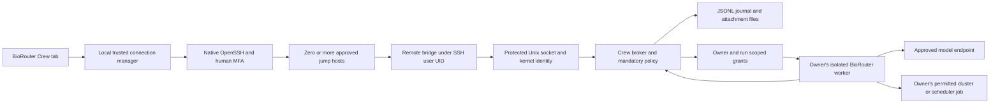

# BioRouter Crew implementation plan

Status: researched design and synthetic feasibility work; Crew is not yet implemented. Research performed September 21, 2026 Pacific / September 22 UTC. Source baseline: `314f3b268c24663a8696dbbbd5aa76a171d0fab8` on `main`. Implementation branch: `codex/biorouter-crew` in `/Users/wgu/.codex/worktrees/biorouter-crew/BioRouter`.

## 1. Recommendation and scope

Build **BioRouter Crew as a native sidebar capability and a policy-aware built-in agent extension**, backed by a small Linux collaboration service reached through normal institutional SSH. Use the existing BioRouter agent runtime through separate, owner-scoped workers. The shared service handles people, teams, rooms, messages, files, permissions, history and audit; it does not execute everyone's tools as one service account.

Favor the user's requested simplicity: native OpenSSH, bounded JSON Lines streams, a broker-owned append-only JSON Lines journal, ordinary attachment files and rebuildable indexes. Human collaboration must work without a model provider, PostgreSQL, Redis, a container platform or a new externally exposed network listener. Additional compute isolation may be required for agents; the chat service itself must not depend on it.

Do not adopt any listed terminal chat project unchanged as the security foundation. `room` is the closest interaction/deployment reference; it is not sufficient proof of trustworthy Unix identity and protected multi-user storage. Matrix is the strongest protocol/platform alternative if reusing an entire collaboration server becomes more important than a small installation. Zulip is the strongest ready-made topic collaboration alternative. Both add a separate account/control plane and still need Crew's owner-agent and data-policy layers. See the [sourced platform comparison](platform-research.md).

The intended first production scope is one institution-approved Linux service host per workspace, tens of concurrent team members and modest message rates. Support multiple independent workspaces in one desktop. Do not introduce federation, automatic cross-workspace mirroring, multi-master storage or an internet chat service in v1. These are design scope decisions, not measured capacity limits.

### User requirements translated into invariants

| Requirement | Invariant |
|---|---|
| One SSH server feels like a Slack workspace | A stable service workspace UUID is discovered after authenticated SSH; aliases and jump paths can reach the same workspace. |
| SSH username is the identity | Broker derives the Unix UID from the kernel, resolves a verified enrolled account, and displays its SSH username. Nickname/avatar never confer authority. |
| Multiple teams and self-created channels | Every registered user may create a team when workspace policy permits; team memberships, invitations and channel memberships are explicit records. |
| Only channel creator removes it | Immutable creator principal authorizes archive/removal; emergency operator quarantine is a separately named, audited action. |
| Human and agent work in the same room | Channel receives human messages and structured, policy-checked agent activity/events. Only an agent's owner may invoke, steer, approve or cancel it. |
| Arbitrary files, images and downloads | Durable opaque attachment objects, resumable transfers and membership checks; unsupported previews remain downloadable. |
| Context from other channels | Search only channels the actor and worker may access; retain provenance and all source restrictions through model calls and outputs. |
| Private/public boundaries always hold | Mandatory server policy, attested worker/model grants and appropriate process/filesystem/network isolation. No local preference can weaken it. |
| MFA and jump gates | Use institutional OpenSSH configuration and interactive authentication, verify every host, and support reauthentication throughout the connection lifecycle. |
| Simple, broadly portable Linux stack | One small service binary, text protocol/storage, files, no required network database or container service for chat. Detect unsupported facilities and refuse the affected feature explicitly. |

## 2. What exists in BioRouter today

Detailed source references and limitations are in [architecture and privacy](architecture-privacy.md) and [SSH and UI integration](ssh-ui-architecture.md). All paths below are relative to the baseline repository.

| Area | Current seam | Crew work |
|---|---|---|
| Sidebar and navigation | `ui/desktop/src/components/BioRouterSidebar/AppSidebar.tsx`, `ui/desktop/src/App.tsx` | Add Crew page, workspace/team/channel navigation and connection status. Allow human chat before provider selection. |
| Agent extensions | `crates/biorouter/src/agents/extension.rs`, `extension_manager.rs` | Register a built-in Crew tool surface with admitted actor/run identity. Reuse MCP transport machinery where appropriate. |
| Local HTTP daemon | `crates/biorouter-server/src/auth.rs`, `routes/` | Add local Crew connection and UI APIs; do not expose the existing single-user daemon as a shared team server. |
| Sessions and streams | `session/session_manager.rs`, `routes/session_events.rs`, `routes/reply.rs` | Keep private owner sessions separate; project authorized events into Crew and use durable room cursors. |
| Privacy and affiliations | `crates/biorouter/src/privacy/` | Preserve classification and affiliation rules; add mandatory multi-user and compartment policy. |
| Agent invocation | `crates/biorouter-acp/src/server.rs` | ACP adapter per owner/compartment; no shared multi-user `Arc<Agent>`. |
| File handling | `routes/shell.rs`, `ui/desktop/src/hooks/useFileDrop.ts` | Reuse guard patterns/UI where suitable; add actual remote binary upload, download and artifact ACLs. |
| SSH | No first-class SSH/SFTP/ProxyJump manager found | Implement native SSH process management, authentication UX, transport, connection registry and failure states. |

Three blockers are substantive new work, not UI wiring:

1. Existing workspace session visibility intentionally allows same-tier local sessions to be controlled without an owner boundary. Add ownership and team/channel authorization before reusing these APIs.
2. The local daemon secret and a supplied provider header are not multi-user authentication or provider attestation. Never expose them as Crew authority.
3. The current shell sandbox permits broad filesystem reads. A public-model agent on a user's protected home can bypass chat policy through file tools. A separate process is insufficient. Public execution in a protected workspace is unavailable until a tested read/egress boundary exists.

## 3. Architecture



The diagram is logical. The initial worker controller runs through the owner's authenticated SSH session on an approved service/task host; expensive tools are submitted to the scheduler. A job on another compute node cannot acquire trustworthy identity by simply sending a UID. Its messages return through the owner controller, or a later approved authenticated relay with scoped grants.

### Components

**Desktop Crew UI:** multiple connections; people, teams, channels, threads, files, agent activity and human approvals. It never handles untrusted remote paths as local paths. Credentials and auth prompts stay in a dedicated trusted surface.

**Local connection manager:** Rust module behind the existing local daemon API, with a narrow Electron main-process adapter for interactive authentication. Own exact SSH child PIDs and app-specific control sockets. Maintain separate transports, caches, policy and workspace identities per connection. Do not change the app's single global backend URL to switch workspaces.

**`biorouter-crew bridge --stdio`:** a fixed-command remote bridge. It relays bounded frames between SSH stdin/stdout and the service Unix socket. It runs under the logged-in Unix user. Human-readable diagnostics go to stderr; banners or invalid bytes on stdout produce a clear framing error. No shell interpolation of message text, room names or file names.

**`biorouter-crew serve`:** small shared broker, installed/supervised by the institution as a dedicated unprivileged service account. It owns storage and the policy configuration. On the same Linux host it obtains `SO_PEERCRED` for each connecting bridge; kernel identity is distinct from a submitted nickname or username. Unix peer credentials are documented in [Linux unix(7)](https://man7.org/linux/man-pages/man7/unix.7.html).

**Owned worker adapter:** private BioRouter session + provider binding + channel projection, admitted by the broker with a short-lived grant. Separate process and configuration per owner and data compartment; untrusted tool processes also require appropriate read and egress confinement. Model credentials remain in the owner's approved credential context, never in the shared channel store.

**Built-in Crew extension:** exposes allowed listing, history/context retrieval, posting, files and owned agent actions to a local or remote BioRouter agent. It talks to the same policy engine as the UI. UI clicks and model-generated requests have different authority; the agent never receives a generic human-control credential.

ACP is useful inside the owned agent adapter; MCP is useful for the tools an agent uses. Neither protocol defines the full team chat authorization and durable storage model. Pin to BioRouter's actual supported versions and negotiate extensions; the [ACP transport specification](https://agentclientprotocol.com/protocol/v1/transports) should not be read as a ready-made collaboration server.

### Service placement and trust

SSH access alone does not authorize installation of a persistent shared daemon on an institutional login node. Production requires the institution to choose a service location, service account, socket group, durable storage, provider destinations, backup policy and supervisor. Use systemd when available; otherwise provide a foreground process contract compatible with the approved supervisor. Do not depend on `systemd --user` lingering, `nohup`, Docker or a compute allocation remaining alive forever.

A personal unprivileged daemon is acceptable for a synthetic prototype where everyone trusts its owner with all content. It is not the production protection boundary for other users' restricted rooms. Root administrators and the host/service operator remain trusted; SSH cannot protect plaintext from a compromised endpoint or an administrator of the service.

No application port must be exposed to the internet. A Unix socket is preferred to localhost TCP because localhost is reachable by other accounts and is not an account-authentication mechanism. If the broker must live on a separate host, authenticate to that host/identity realm through an approved SSH route or deploy an explicitly authenticated relay. Do not forward untrusted UID headers across TCP.

## 4. SSH, MFA and multiple gates

Use the installed OpenSSH first. It already participates in institutional SSH config, key agents, hardware keys, certificates, PAM-backed keyboard-interactive challenges and jump routes. Avoid shipping a partial SSH implementation to simplify the first UI.

Example conceptual configuration, with placeholders rather than an assumption about either supplied server:

```sshconfig
Host crew-gate-a crew-gate-b crew-service
    ForwardAgent no
    ForwardX11 no
    StrictHostKeyChecking yes
    ControlMaster no
    ControlPath none

Host crew-gate-a
    HostName gate-a.institution.example
    User institutional-user

Host crew-gate-b
    HostName gate-b.internal.example
    User second-account

Host crew-service
    HostName collaboration.internal.example
    User cluster-account
    ProxyJump crew-gate-a,crew-gate-b
```

Each host has its own credentials, host-key checks, timeout and possible MFA challenge. OpenSSH supports ordered jump hosts; options for a destination are not automatically the correct configuration for every jump. See the [OpenSSH client manual](https://man.openbsd.org/ssh). The app must respect institutional restrictions on forwarding, exec channels, TTYs and `ForceCommand`; if the approved route cannot run the bridge, show an actionable incompatibility rather than attempting a bypass.

### Authentication state machine

`Disconnected → Resolve trusted profile → Verify host(s) → Await credentials/MFA → Start bridge → Verify workspace and policy → Connected`.

Failures transition to an explicit `Cancelled`, `Host identity changed`, `Authentication failed`, `MFA timed out`, `Route denied`, `Protocol incompatible` or `Reauthentication required` state. Reconnect resumes from a durable cursor only after fresh authorization. Presence changes are independent from message delivery.

Support multi-prompt keyboard-interactive exchanges, Duo push/menu, TOTP, password expiry/change flows, private-key passphrases, FIDO/security-key touch and institution-specific banners. Keyboard-interactive supports multiple exchanges and prompt echo flags; it must not be reduced to one password box. [RFC 4256](https://www.rfc-editor.org/rfc/rfc4256).

Use a dedicated authentication terminal as a compatibility surface; use askpass where the client/platform supports it. Keep authentication interaction separate from the non-PTY protocol stream. On platforms with supported multiplexing, establish a master through the auth surface and then open non-PTY exec channels. Otherwise use a tested persistent exec/askpass adapter. Never silently force BatchMode for a user connection that needs MFA. `BatchMode=yes` is only appropriate to the unattended probes and explicit automation profiles.

Authentication responses must never enter model prompts, chat messages, run event streams, logs, telemetry, saved config or agent-visible screenshots of the auth surface. Sanitize terminal control sequences and phishing-like prompt text; identify the verified endpoint and do not assert a particular hop when OpenSSH's prompt does not establish it. Do not auto-approve repeated push requests or cache OTPs. Cancellation kills only the connection's owned process tree.

Use existing trusted known_hosts or institution host certificates. First-use trust is a visible human/admin enrollment decision; changed keys block. Never default to `StrictHostKeyChecking=no`, strip known_hosts, forward the user's SSH agent through all gates, or ingest an SSH config supplied in a team invitation. User-selected SSH config can contain executable `ProxyCommand`/`Match exec` directives and is trusted local configuration, not inert data.

The example disables inherited multiplexing on every hop. If Crew enables multiplexing, every hop must use an app-owned private control socket keyed by destination, user, route and policy realm. Do not inherit an unrelated user's or pre-existing bastion master. Bound idle persistence and independently enforce maximum authentication age **per hop**. Expiring only the final host can reuse an old bastion's MFA session; close/recreate the affected app-owned jump connections and their dependents. `ControlPersist` is an idle timeout, so an active chat can otherwise keep authentication alive indefinitely. Keepalive is liveness detection, not reauthentication. Effective host checking, delegation restrictions and control-socket policy must apply to all jump hosts, not just final-host command-line options. [OpenSSH configuration manual](https://man.openbsd.org/ssh_config).

A desktop disconnect must not silently cancel previously approved scheduler jobs. Show whether a run is attached, awaiting reauthentication, still executing remotely, or finished. Revoked access stops new work and new result delivery; already launched tools/jobs follow an explicit cancel/contain policy, with owner/operator audit. Long-lived workers cannot renew grants forever after their owner is offboarded.

### Required SSH acceptance matrix

| Scenario | Required outcome | This investigation |
|---|---|---|
| Existing noninteractive known-host access | Authenticated account, clean framed stream | Passed on Narrows and Leo; auth method/fresh-MFA assurance not established |
| Two gate chain, distinct host identities | Native jump routing and final UID binding | AWS fixture report; simulated topology, not institutional gates |
| Keyboard-interactive TOTP/Duo at each hop | Prompt sequence, echo policy, cancellation and timeout | Not yet exercised |
| Passphrase/security-key touch | Trusted UI, no secret persistence | Not yet exercised |
| Expired auth/cert; MFA required on reconnect | Suspend and ask human; no retry storm | Not yet exercised |
| Changed host key | Refuse until trusted rotation procedure | Production UX test pending |
| Forwarding disabled but approved exec available | Stdio bridge works if institution allows it | Requires target configuration fixture |
| Forced SFTP-only or prohibited exec | Refuse Crew bridge with explanation | Requires target configuration fixture |
| Windows/macOS/Linux client differences | Measured auth and process-lifecycle support | Current real-host probes were macOS OpenSSH only |

## 5. Identity, teams and authorization

Authoritative records live on the server. Use immutable opaque IDs; preserve usernames as user-facing identity, not as caller-controlled primary keys.

| Record | Key fields |
|---|---|
| Workspace | UUID, identity realm, enrollment generation, policy version, supported protocol range |
| Principal | UUID, verified UID, canonical username, account generation, status, discoverability |
| Profile | Principal ID, nickname, avatar attachment ID, preferences |
| Team | UUID, creator, name, policy, membership and invitation records |
| Channel | UUID, team ID, immutable creator, name, visibility, data labels, status |
| Membership | Principal/team/channel, role, granted/revoked event, membership epoch |
| Event/message | Event UUID, journal order, channel message ID, actor kind/owner, body, revision, source labels, idempotency key |
| Attachment | Opaque ID, owner/channel, size, digest, media type, display name, labels, upload state |
| Agent/run | Owner principal, worker ID, originating channel, provider-policy ID, input-context manifest, permitted outputs, grant expiry |
| Approval/release | Exact request or payload digest, approving human, destination, labels, expiry, policy version |
| Audit | Actor, operation, object IDs, result, policy version and timestamp, without credentials or unnecessary message bodies |

Enrollment happens only after authenticated connection and acceptance of workspace policy. A user can belong to several teams. User discovery returns enrolled, discoverable accounts permitted by institutional policy; never scrape or publish all OS accounts. An invitation grants no SSH login entitlement and does not create an OS account. It has an inviter, target principal, role, expiry, acceptance state and audit record.

Require individual Unix accounts for individual attribution. If coworkers share one SSH login, the kernel cannot distinguish them; that deployment needs an institution-approved additional personal identity layer before Crew can promise per-person agent ownership.

Distinguish **visibility** (`team-visible`, `invite-only`, DM) from **data classification** (`public-safe`, `restricted` plus institution/project/dataset restrictions). Avoid the ambiguous phrase “public channel” for a room that is merely visible to a team.

| Operation | Default authority |
|---|---|
| Create team | Enrolled human, subject to workspace quota/policy |
| Invite to team | Team creator/admin; invitee accepts |
| Create channel | Team member if team policy permits |
| Invite to restricted channel | Channel creator or explicitly assigned invite manager; invitee must be eligible for the team/data |
| Remove/archive channel | Original creator only; never implicit transfer on departure |
| Read/post/search/download | Active identity, appropriate memberships, object grants and data/device policy |
| Edit own message | Original human author, policy-permitted revision; preserve audit |
| Start/prompt/cancel/change/approve agent | That agent's owner only, through admitted owner action |
| Observe agent | Recipients authorized for that run's published channel projection |
| Emergency quarantine/retention hold | Named operator role, separately audited; does not masquerade as creator deletion |

Creator departure leaves an orphan channel readable under policy and eligible for operator quarantine/retention handling; ownership transfer is deferred until the product explicitly defines a creator-approved transfer rule. Removal hides/archives the room immediately but physical deletion follows retention and legal-hold policy. Deletion does not erase an audit obligation by default.

Membership revocation invalidates subscriptions, uploads, downloads, search results, context snapshots and queued worker grants at their next authorized action. Recheck before delivering each download chunk and before model dispatch. Do not promise to recall already downloaded or model-submitted bytes. Broker identity uses a UID plus enrollment generation because Unix accounts can be recycled; identity realm mappings and offboarding are administrator responsibilities.

## 6. Agent ownership, context and private/public enforcement

### Invocation and activity

Use explicit composer actions: **Message channel** and **Ask my agent**. An admitted owner command creates a run. A coworker's message or `@alice-agent` mention does not. In one channel Alice and Bob may both run their agents; neither can prompt, stop, approve a tool call for, or change the other's agent/model. Shared “team agents” are deferred because they need an explicit owner/delegation model.

Human authority needs a concrete second layer beyond the Unix account. Enroll a desktop/device public key bound to the verified principal through an institution-approved ceremony: an operator-authorized enrollment or an existing enrolled human device with user presence. Bare UID access cannot enroll/replace a human-control key. Keep the signing key in a protected local credential/signer service; use non-exportable keys where supported. The broker issues a nonce for each sensitive approval or authority-changing action, and verifies a human signature over the exact operation, argument/payload digest, workspace, run/channel, policy epoch and expiry. The trusted UI obtains an explicit human gesture; model tool APIs, generic PTY automation and agent-visible IPC cannot invoke the signer. Enrollment, rotation and recovery are audited control-plane operations. Ordinary sessions may receive bounded interaction grants; workers receive separate run-scoped credentials and never a generic human grant. A remote bridge is transport, not proof that its caller is human.

Publish the requested task, intended commands/tool calls, status/progress, shareable output and artifact references as structured events. Keep full owner session state separate. Credential prompts, environment secrets, raw provider internals and hidden reasoning are not indiscriminately broadcast. If results include additional restrictions from another channel, send them only to recipients permitted by all sources; the public room can receive a non-sensitive status when policy allows it.

Workers execute as the invoking user's Unix identity and scheduler allocation, never the broker service account. On Narrows, expensive processing belongs in Slurm rather than an interactive login daemon. The controller records job IDs and exit status, reattaches logs under the same identity, and supports explicit cancellation. No Slurm job was submitted in the feasibility probes.

### Mandatory policy decision

For each operation evaluate:

`identity ∩ membership ∩ object ACL ∩ run capability ∩ source restrictions ∩ destination policy ∩ device/egress policy`.

Any denial wins. Missing or unknown labels/endpoints fail restricted/denied; absent provider metadata is not permission to export. Existing local privacy opt-outs cannot disable Crew enforcement. The broker/approved runner binds a grant to an actual configured provider endpoint and policy version; request fields such as `provider: private` are descriptive, never evidence.

The provider allowlist is per exact deployment and data compartment. An institution-hosted model is not automatically entitled to another institution's data. A commercial deployment may be allowed for specific restricted workloads only by institutional configuration covering its agreements, retention and permitted use. Never infer permission from a vendor brand, private IP address, SSH hostname or a user's toggle.

This rule applies to the whole processing path: main LLM, embeddings, OCR, speech transcription, title generation, summarization, attachment scanning/previews, link unfurls, telemetry, error reporting, plugins and arbitrary tools. Crew's desktop-to-server collaboration traffic stays inside SSH. Server-to-model traffic uses the institution-approved protected endpoint/egress route, usually authenticated TLS inside the approved environment; SSH does not automatically encrypt or authorize that separate leg. If policy requires an SSH tunnel for that leg too, the deployment must provide and validate it.

### Cross-channel context without accidental disclosure

Default context is the current channel's authorized history window plus selected artifacts. Let an owner opt into specific channels or an approved same-workspace search scope. Search filters run before scoring, counts, snippets and pagination; fetch rechecks permissions. Scope ambiguity requires a visible workspace/channel selector, not a guessed post destination.

Record a context manifest of exact source event/file versions and the policy epoch. Derived context and outputs inherit the union of source restrictions. An agent “learning” across channels means authorized retrieval and session context; it does not mean silently training a model, pooling all team memories, or retaining revoked data in a global memory index.

If a private run reads channels A and B, its summary cannot be posted to A unless all A recipients may receive B's information as well. Preserve source-ACL dependencies on the derived event and attachments; evaluate them for **every future reader**, including new members, search, replay and cached-context reuse. Joining A later does not grant B's permissions. Invitations, role changes and visibility changes must not expand access to retained B-derived content; refuse the change or keep that content individually restricted without leaking inaccessible source details. Labels cover text, filenames, images, thumbnails, metrics, search results and embeddings. A copied attachment or paraphrase is not declassification. Cross-workspace context is off by default; explicit selection still must pass both institutions' policies.

Initially prohibit private-to-public export in restricted workspaces. A later controlled release flow can present exact text/files and provenance for human/institutional approval, bound to destination, digest, expiry and policy. Approval of one release never changes the source channel's label or grants standing release rights. Do not reuse a generic first-crossing-per-session consent for PHI.

### Required execution isolation

Same-UID authentication proves an account, not human intent or model clearance. A model-controlled shell running as Alice can otherwise open Alice's Crew socket, home, private cache, SSH control socket or provider credentials. Scoped MCP tokens alone cannot stop that. **Every worker, including private-model workers, must be isolated from human-control keys, enrollment/approval authority and unscoped human sessions.** Broker application admission requires a valid enrolled-device/session credential or a limited worker grant in addition to the kernel account; there is no bare-UID fallback to human authority. The worker API cannot change actor kind or mint/renew a human credential.

Public-mode execution in a protected environment needs an administrator-approved boundary that hides protected filesystem roots and process state, prevents access to human-control transports, and restricts egress. Options include a separately provisioned public-only execution host/account, or tested namespaces/mount restrictions plus privilege/process/network controls. Do not make a newer Linux feature a universal prerequisite: Narrows currently reports kernel 4.18; newer isolation facilities cannot be assumed. [Linux Landlock documentation](https://docs.kernel.org/userspace-api/landlock.html) illustrates why runtime feature detection and a deployment support matrix matter.

If the host cannot enforce the data-read boundary, human Crew chat and private workers that satisfy the separate human-authority, tool-scope and egress requirements can still be supported under institutional policy, while public-model cluster-file execution remains unavailable. If human-authority isolation is unavailable too, support human chat only and withhold agent execution/control integration. These are explicit feature limits, not hidden weakening of the boundary. A same-UID user intentionally running arbitrary software outside Crew remains outside an application-only guarantee; institutional account and endpoint controls are part of the threat model.

## 7. Simple text storage with explicit durability

Suggested service-owned layout:

```text
/var/lib/biorouter-crew/<workspace-id>/
  manifest.json
  policy.json
  journal/000000000001.jsonl
  snapshots/<sequence>.json
  blobs/<opaque-prefix>/<opaque-id>
  uploads/<opaque-id>.part
  derived/                         # disposable search/lookup indexes
  audit-checkpoints/
/run/biorouter-crew/<workspace-id>.sock
```

`manifest.json` establishes storage schema, workspace identity and generation. It is written atomically and durable before accepting enrollment. `policy.json` is operator-controlled; client requests cannot replace it. Members have access to the socket under an approved Unix group but cannot directly read or edit journal/blob directories. Service data uses restrictive permissions and approved encrypted storage/backups; text format does not require world-readable or unencrypted media.

Use **one canonical ordered journal per workspace initially**. A record is a single versioned mutation or atomic batch: sequence, unique event ID, operation, actor, target, timestamp, policy/membership epoch, idempotency information, payload and checksum over defined serialized bytes. Do not duplicate memberships in a second independently committed store. Snapshots and room/search views are derived. A future segmented/partitioned design must preserve authorization ordering explicitly.

### Commit and replay contract

1. Admit and validate bounded input; check actor, labels, quotas, expected object version and idempotency key.
2. Under the one-writer serialization point, recheck current authorization and assign the journal order.
3. Append the entire newline-terminated record, flush and `fsync`. On failure, stop mutation acceptance; never acknowledge a partial write.
4. Update the in-memory view and acknowledge with stable event identity only after durable commit. A crash after commit but before acknowledgement is resolved by the same idempotency key; a reused key with different bytes is a conflict.
5. Replay verifies schema, sequence continuity, checksums and mutation invariants. A demonstrably incomplete final record may be quarantined/truncated under exclusive ownership. A complete record with a bad checksum or interior corruption stops recovery; never skip a membership revocation to make startup succeed.
6. Snapshots use a temp file, flush/fsync, same-filesystem atomic rename and directory fsync. Include the committed journal sequence/digest; keep old generations until recovery and backup verification complete.

The process must have exclusive local ownership of the store and fail if another broker is active. Advisory locking plus permissions is adequate only under the documented trusted-operator, single-host model. No automatic failover to a second host in v1. NFS lock/rename/durability behavior and fencing require validation; text does not make distributed locking safe.

Prefer durable local storage on the approved service host, with institution-managed backups. Narrows HOME is NFS, so do not default there. The probe's `/tmp` filesystem is only a disposable test site, never recommended production storage. If only shared storage is available, an administrator must select a supported single-writer deployment and validate crash/lock/restore semantics before launch. SQLite WAL is also unsuitable as a shared network-filesystem default; its official limitations explicitly identify that constraint. [SQLite WAL documentation](https://www.sqlite.org/wal.html).

A simple in-memory keyword index rebuilt from authorized events is enough for the first deployment. Apply ACL filters before returning results. Optional derived indexes may later improve restart/search time, but canonical recovery must not depend on them. Avoid vector search until provider/embedding permissions and provenance deletion are implemented.

Audit records for reads, downloads, model dispatch, approvals, exports, membership/policy changes and administrative actions must be durable according to policy; if mandatory audit cannot be recorded, deny the action. A checksum chain detects accidents/tampering only relative to a trusted checkpoint, not an administrator who can rewrite the whole store. Restricted production needs protected external checkpoints/backup retention under institutional operations.

Text logs do entail more recovery code than SQLite. This is a deliberate preference tradeoff, not a claim that hand-built journals are intrinsically safer. Keep the journal small and single-writer, test power-loss boundaries, and revisit storage only if those tests or deployment needs justify added machinery.

## 8. Text streaming and attachments

Use one UTF-8 JSON object per line with a small versioned envelope. Illustrative requests, not final public schema:

```json
{"v":1,"request_id":"r1","op":"channel.post","channel_id":"c1","idempotency_key":"m1","body":"Synthetic example"}
{"v":1,"request_id":"r2","op":"channel.subscribe","channel_id":"c1","after_cursor":"opaque-server-issued-cursor"}
{"v":1,"request_id":"r3","op":"attachment.chunk","upload_id":"u1","offset":0,"base64":"AAEC"}
```

Actor, effective clearance and durable order are server-derived. Reject unknown required fields/versions and oversized/invalid UTF-8 frames with actionable errors. The handshake negotiates protocol range, workspace ID, authenticated principal, policy digest, features and limits. Invitations cannot override the expected workspace identity.

Provisional defaults: 1 MiB maximum encoded frame, 256 KiB raw attachment chunk, smaller message-body limits and bounded queue depth. These are tunable design defaults, not benchmark results. Base64's roughly one-third wire overhead is acceptable for a simple text-first version. Files remain binary on disk, not embedded in the journal. Support incremental hashing and constant-size buffers so a multi-GB file does not need to fit in memory.

Subscribe using authorized opaque cursors or channel-scoped sequence positions. Do not expose a global journal counter that leaks activity in inaccessible rooms. Slow consumers get an explicit resync instruction and durable cursor; do not silently drop chat messages. Presence/typing are ephemeral and rate-limited. Prioritize control/events over attachment chunks; use an additional exec channel only when server session limits and auth policy permit it.

Every mutating request has a persisted idempotency key scoped to actor/workspace/operation. This provides retry-safe admission, not magical exactly-once external commands. Agent actions have durable run IDs and explicit pending/started/unknown/completed states; reconnection never blindly repeats a shell command after an uncertain acknowledgement.

Define a retry horizon before journal compaction: retain each operation's key, payload digest and stable result through that horizon and all still-live runs/uploads. An expired key receives an explicit expiry/resolution response rather than being accepted as an unseen mutation. Snapshot/compaction must preserve this deduplication state.

### File lifecycle

1. `attachment.begin`: authorize destination, label, quota and expected size; allocate an opaque upload ID.
2. `attachment.chunk`: verify owner/grant/current policy and offset, write to broker-owned staging, acknowledge durable progress at documented checkpoints.
3. `attachment.commit`: verify length/digest; fsync bytes, rename within the blob filesystem, fsync directory, then append the durable attachment event.
4. Publish the authorized attachment reference only after commit. A crash can leave an orphan blob but must not expose a half-file; sweep orphaned uploads/blobs only after manifest/recovery checks and a grace period.
5. `attachment.read`: authorize every request/range/chunk against current membership and policy. Download via SSH to a user-chosen path with safe overwrite handling and final digest verification.

All kinds of files may be stored subject to institutional quotas/content rules. Render only safe supported previews. Never execute HTML/SVG/scripts or fetch external resources merely because someone posted them. Images/avatars are bounded, sanitized or served without active content; private previews/OCR must stay in approved processing destinations. Use opaque filenames internally; user-supplied names are display metadata. Reject traversal, symlink/hardlink escapes, special files and archive expansion attacks. No public pre-signed object URLs or inline external image URLs for restricted attachments.

For very large datasets offer **shared file reference** separately from **uploaded snapshot**. A reference describes a version/digest and intended target; the recipient/worker accesses it under its own Unix permissions. The broker does not use its service account to read arbitrary submitted paths or change Unix ACLs. An uploaded snapshot is an explicit sharing operation and new protected object. Moving between two SSH workspaces is an explicit policy-checked transfer, never an automatic local download/upload shortcut.

## 9. UI and agent tools

The Crew tab contains a workspace switcher; connection/MFA status; teams; channels/DMs; people; files; and a room timeline. Display `workspace / team / channel`, the verified SSH username, room visibility and data policy independently. Include accessible reconnect/error states and a context-scope picker. Authentication problems must not look like an empty room.

The composer selects ordinary message vs owned-agent invocation. Agent activity cards show owner, model endpoint policy, status, commands and artifacts. Only the owner sees enabled run controls. A room can host parallel runs without sharing their private session state. Human-only collaboration must work before selecting a model provider or enabling agent extensions.

Profiles, nickname/avatar, team memberships, room settings, read position and notification preferences live server-side. Local aliases, trusted connection references, pins, layout and last selection live locally. Secrets use the OS credential facility or institutional SSH agent. Restricted content caching and notification previews are off by default; an institution may permit a scoped encrypted cache with expiry/lock/offboarding behavior. Previously downloaded files are governed by endpoint policy and cannot be remotely “unseen.”

Also gate **local agent session persistence**, not just the Crew UI cache. Existing BioRouter sessions persist tool results/conversations locally; allowing `crew.read` to return restricted content to a local private-model chat could write it into that ordinary session store. Default restricted context delivery to the approved remote worker. Deliver it to a local agent only when the endpoint and the actual session/log/blob/backup persistence paths are approved and protected. A private model choice or disabled Crew offline cache does not establish this. Human rendering on an approved desktop is intentional endpoint access; it does not authorize copying the same content into every local agent store, crash report or plugin.

Suggested tool/command surface:

| Tool | Behavior |
|---|---|
| `crew.list_workspaces`, `crew.list_channels` | Return only already admitted/authorized scopes |
| `crew.read`, `crew.search` | Membership-filtered history with provenance and explicit context scope |
| `crew.post` | Destination-explicit message with same publication policy and configured approval as UI |
| `crew.attach`, `crew.download` | Authorized object transfer, never raw service-account path reads |
| `crew.create_channel`, `crew.invite` | Permissioned mutations through deterministic handlers |
| `crew.run_agent`, `crew.cancel_agent` | Only admitted owned runs, no cross-owner authority |
| `/crew send`, `/crew context`, `/crew files`, `/crew agent` | Human-friendly discovery over the same typed operations |

A local private conversation is not posted simply because a channel is selected. Sharing produces a bounded destination-specific payload; model-generated posting uses narrow grants and any required human approval. A coworker's chat text cannot manufacture a slash-command invocation or an approval event.

## 10. Linux portability and packaging

Use a dedicated small Rust domain/service crate rather than shipping the full Electron app or a Python environment to every cluster. Reuse the repository's Rust/serde patterns. Keep the Python stdlib probes as evidence only. Package a standalone Linux executable for x86_64 and aarch64 with an explicitly tested old-enough glibc floor; explore a musl build only after checking institution identity resolution. Static musl is not a guarantee of SSSD/LDAP/NSS compatibility. Kernel UID plus administrator enrollment is the authority; display-name lookup must match the site's identity system.

`crew doctor` should inspect protocol compatibility, executable architecture/runtime, socket support, UID resolution, selected storage semantics, permissions, supervisor readiness and worker isolation capabilities. Report feature-level outcomes: chat ready, uploads ready, private worker approved, public execution unavailable, and so on. Do not report “HIPAA compliant” from a feature probe.

Support a foreground service with signal handling and explicit config/data/runtime paths; systemd units are an optional installation convenience. Upgrades use verified signed/hash-pinned artifacts, schema compatibility checks, maintenance mode and a restorable backup. Client/server version negotiation supports a bounded rolling-upgrade window. Do not auto-download and execute a binary from a room message or a model tool result.

## 11. Implementation sequence and delivery gates

Effort ranges below are planning estimates, not commitments: roughly 20–32 engineering person-weeks plus institutional/security review, with overlap possible across independent UI/protocol/security lanes. A useful synthetic human-chat preview comes earlier; broad Linux and desktop MFA parity plus protected multi-user agents is the larger scope. Validate estimates after Phase 1.

| Phase | Deliverable | Exit evidence | Approximate effort |
|---|---|---|---|
| 0 — This investigation | Source map, alternatives, SSH probes, isolated worktree, design | Reproducible results with explicit gaps | Completed research artifacts; no product code |
| 1 — Contract and threat model | `crew` record/protocol/policy module; fixture broker; signed deployment assumptions | Independent adversarial review of ownership, privacy, recovery and MFA flows | 2–3 person-weeks |
| 2 — SSH connection foundation | Native process manager, MFA surface, jumps, host trust, reconnect, doctor | Real 2-user/2-hop tests; simulated and actual approved MFA; macOS/Linux/Windows lifecycle matrix | 3–5 person-weeks |
| 3 — Human collaboration | Protected broker, journal, profiles, teams/invites, channels/DMs, timeline, creator-only removal | Unauthorized user/channel tests, crash/replay/idempotency, two desktops and revocation live | 4–6 person-weeks |
| 4 — Files and usability | Resumable files/images, downloads, safe previews, threads/reactions/search/preferences | Large-file interruption, disk-full, digest/path attacks, ACL checks and accessibility | 3–4 person-weeks |
| 5 — Owned agents | Per-user workers, ACP adapter, progress projection, approvals and scheduler integration | Real UID/job ownership, other-user denials, reconnect without duplicate tools | 3–5 person-weeks |
| 6 — Mandatory data boundary | Endpoint policy, provenance, scoped context, constrained tools/egress, restricted caches | Real approved private model and public model with synthetic canaries; no unauthorized outbound bytes | 3–5 person-weeks |
| 7 — Institutional pilot and release | Packaging, operations, backup/restore, migration, monitoring, incident/offboarding procedures | Approved deployment, restore drill, independent review, installed desktop and hosted CI evidence | 2–4 person-weeks |

Security infrastructure starts in Phase 1 and gates every phase. Phase 6 is integration/acceptance completion, not permission to postpone authorization until after implementation. Early phases use synthetic data. A PHI pilot cannot start merely because human chat and model calls work.

### Proposed repository units

- New `crates/biorouter-crew/`: domain types, policy, journal/recovery, broker/bridge and portable CLI. Add dependencies with `cargo add`; do not hand-edit dependency/version files.
- `crates/biorouter/src/agents/crew_extension.rs` plus registry integration: admitted agent operations, no direct unfiltered disk access.
- `crates/biorouter-server/src/routes/crew.rs` and a connection manager module: local UI API and event bridge. Generate OpenAPI with `just generate-openapi`.
- `ui/desktop/src/components/crew/` and Crew hooks/state: navigation, auth, timeline, files, owned agents and accessibility.
- `crates/biorouter-crew/tests/`: actual broker/process/authorization/recovery tests; fixtures use two real Linux UIDs where needed.
- Deployment assets: supervisor example, `crew doctor`, compatibility matrix, packaging/integrity checks and operator docs.

Reviewable PR order: protocol/domain → journal/recovery → broker identity/ACL → SSH/auth → human UI → attachments → owned workers → context/provider isolation → operations/packaging. Split by actual dependency boundaries, not parallel edits of the same registry/router files.

For implementation PRs run targeted meaningful tests and repository-required `cargo fmt`, `./scripts/clippy-lint.sh`, generated-schema checks, desktop lint/tests, version/brand/privacy registries and `just check-everything` before pushing. Update and exercise `biorouter-self-test.yaml` for added capabilities. Independent adversarial review precedes a draft PR. Research-only artifacts in this worktree do not require a full Rust/Electron rebuild and make no claim about one.

## 12. Feasibility evidence and remaining work

See [smoke-test report](feasibility-report.md), [institutional raw results](institutional-host-smoke.json), and [AWS fixture evidence](aws-identity-smoke-report.md). The institutional probes use synthetic bytes and short-lived private temporary directories; they do not install a daemon, submit compute jobs, enumerate users or read patient/research records.

The most important remaining tests are not throughput benchmarks:

1. Real institutional MFA, renewed MFA after expiry, restrictive jump-gate policies and every supported desktop client.
2. Two actual institution users and a site-approved broker service account/storage location; UID/NSS/offboarding behavior and namespace boundaries.
3. Fault injection around journal/blob fsync/rename/ack, storage exhaustion, full restore and unsupported NFS semantics.
4. Concurrent revocation during search, context construction, uploads/downloads and queued/running model work.
5. Public-model attempts to read private files, broker/control sockets, caches, process state and credentials; malicious room text and attachments.
6. Real institution-approved private endpoint routing, no private-to-public provider fallback, and policy on OCR/embeddings/telemetry.
7. Installed macOS/Windows/Linux desktop behavior and packaged remote binary compatibility. Source/unit tests alone are insufficient evidence.

The security target is support for an institution's HIPAA-controlled deployment, not a certification inferred from SSH. HHS identifies access control, auditability, integrity, authentication and transmission safeguards alongside administrative and physical controls. [HHS Security Rule summary](https://www.hhs.gov/hipaa/for-professionals/security/laws-regulations/index.html). Hosting/provider agreements, risk analysis, retention, operational controls and approved endpoints remain deployment decisions; encryption alone does not settle them. [HHS cloud guidance](https://www.hhs.gov/hipaa/for-professionals/special-topics/health-information-technology/cloud-computing/index.html).

### Decisions to settle before a real-data pilot

Institution operator/service host and Unix group; allowed durable storage and encryption; initial provider endpoint/compartment matrix; supported MFA mechanisms and maximum auth age; download/offline-cache policy; retention/backups and recovery objectives; creator-departure workflow; scheduler allocation and worker isolation mode. The plan can proceed through synthetic implementation without assuming answers to these deployment-specific questions.
